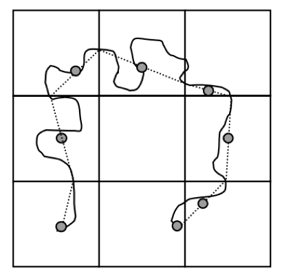
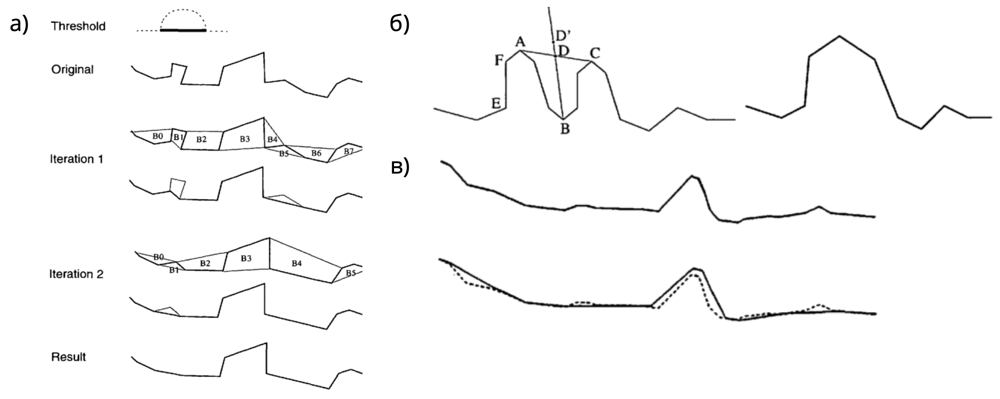
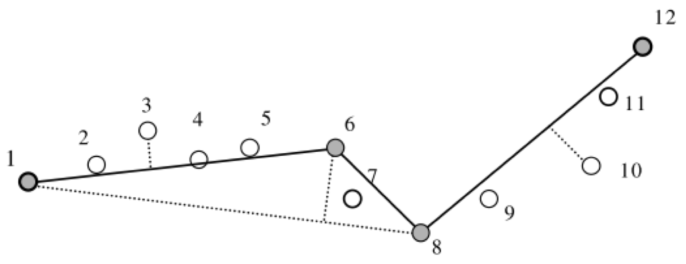
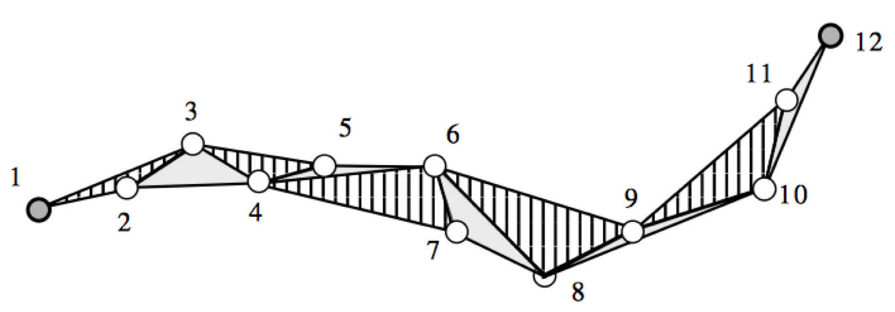
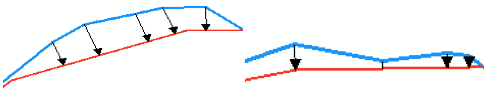

# Генерализация линейных объектов {#lines}

## Геометрическое упрощение {#lines-simpl}

<!-- ### Краткий обзор {#lines-simpl-over} -->

<!-- Для просмотра презентации щелкните на ней один раз левой кнопкой мыши и листайте, используя кнопки на клавиатуре: -->
<!-- ```{r, echo=FALSE} -->
<!-- knitr::include_url('https://tsamsonov.github.io/gen-course/slides/talk6_LineSimplification.html#1', height = '380px') -->
<!-- ``` -->

<!-- > Презентацию можно открыть в отдельном окне или вкладке браузере. Для этого щелкните по ней правой кнопкой мыши и выберите соответствующую команду. -->

### Самостоятельная работа №3 (Автоматизация геометрического упрощения линий) {#lines-simpl-work}

**Цель задания** --- освоение методики геометрического упрощения линий.

**Аннотация**. Необходимо реализовать метод Ли-Оупеншоу для генерализации линий. Для этого в среде Model Builder создается модель геообработки, осуществляющая последовательный запуск инструментов ArcToolbox. После создания инструмента необходимо сравнить результаты работы алгоритма с тем, что получается при обработке линий посредством алгоритма Дугласа-Пейкера, Ванга-Мюллера и Висвалингам-Уайатта. Задание выполняется в ГИС-пакете ArcGIS 10.5.

**Алгоритм Ли-Оупеншоу** [@Li:1992jg] использует «естественный принцип», суть которого заключается в удалении деталей, размер которых менее видимой величины. Для этого на исходное множество линий накладывается регулярная сет ка ячеек с разрешением *d* Участок линии, пересекающий ячейку, имеет точку входа в нее и точку выхода. Этот участок заменяется на середину отрезка, соединяющего две данные точки. Таким образом, удаляются все изгибы, находящиеся внутри ячеек. Принцип работы алгоритма иллюстрирует Рис. \@ref(fig:lio). Видно, что по своему поведению результирующая линия похожа на скользящее среднее.

```{r lio, out.width = "50%", fig.cap="Принцип работы алгоритма Ли-Оупеншоу"}

```

В основе работы **алгоритма Ванга-Мюллера** [@Wang:1998eh] лежит сегментация линий на отдельные изгибы. Изгиб определяется как участок линии, на котором угол ее поворота сохраняет свой знак. Важным аспектом алгоритма является четкий алгоритм вычисления вершины изгиба, которая определяется как точка, имеющая максимальную сумму расстояний до начальной и конечной точки изгиба. Для каждого изгиба в алгоритме Ванга-Мюллера определяется его размер, изолированность, близость и схожесть с соседним изгибом. Изолированные изгибы подвергаются преувеличению. Расположенные рядом схожие изгибы объединяются в один путем слияния вершин и удаления изгиба между ними. Наконец, изгибы малого размера удаляются. Данные операции проиллюстрированы на Рис. \@ref(fig:wang). В ArcGIS метод Ванга-Мюллера реализован в инструменте **Simplify Line** (режим *BEND\_SIMPLIFY*).

```{r wang, out.width = "100%", fig.cap="Элементы алгоритма Ванга-Мюллера: а) удаление; б) объединение; в) преувеличение изгибов"}

```

Алгоритм **Дугласа-Пейкера** [@Douglas:1973if] относится к алгоритмам редуцирования точек и основан на последовательном нахождении узлов линии, образующих максимальное отклонение от стягивающей хорды (Рис. \@ref(fig:douglas)). В ArcGIS метод Дугласа-Пейкера реализован в инструменте **Simplify Line** (режим *POINT\_REMOVE*).

```{r douglas, out.width = "80%", fig.cap="Принцип работы алгоритма Дугласа-Пейкера"}

```

Наконец, **алгоритм Висвалингам-Уайатта** [@Visvalingam:1993hx] относится к алгоритмам редуцирования точек и основан на последовательном удалении точек, углы которых образуют минимальную эффективную площадь (Рис. \@ref(fig:visvalingam)). В ArcGIS данный алгоритм представлен в модификации Жу и Джонса [@zhou:2005], где каждая площадь приобретает различный вес в зависимости от пропорций угла линии и реализован в инструменте **Simplify Line** (режим *WEIGHTED\_AREA*).

```{r visvalingam, out.width = "100%", fig.cap="Принцип работы алгоритма Висвалингам-Уайатта"}

```

#### Часть 1. Автоматизация метода Ли-Оупеншоу {-} 

1. Создайте базу геоданных для результатов генерализации и назначьте ее базой данных по умолчанию для размещения результатов пространственного анализа.

2. Проделайте следующую последовательность операций (жирным шрифтом указаны названия инструментов):

    a. Постройте вокруг исходных линий буфер (**Buffer**), размер которого равен разрешению генерализации (3000 м). В качестве исходных линий используйте слой **Island** в базе геоданных **Test**.
    
    b. Создать сетку (**Create Fishnet**). В качестве образца экстента используйте полученный буфер. Для тестирования используйте размер сетки 3000 м. Тип сетки должен быть полигональный.
    
    c. Найти пересечение сетки и исходных линий (**Identity**). Cлоем источника должен быть слой генерализуемых линий. Слоем *Identity* --- сетка.
    
    d. Превратить линии из составных в обычные (**Multipart to Singlepart**).
    
    e. Найти точки линий, лежащие на границах ячеек (**Feature Vertices to Points**, режим BOTH\_ENDS).
    
    f. Восстановить отрезки, соединяющие эти точки (**Points to Line**), используя идентификатор отрезка (ORIG\_FID).
    
    g. Найти середины отрезков, полученных на шаге e) (**Feature Vertices to Points**, режим MIDPOINT).
    
    h. Восстановить линию из отрезков, полученных на шаге е) (**Unsplit Line**).
    
    i. Разрезать эту линию серединами, полученными на шаге f) (**Split Line At Point**, допуск по расстоянию 100 м).
    
    j. Превратить разрезанные линии из составных в обычные (**Multipart to Singlepart**).
    
    k. Найти конечные точки полученных сегментов линий (**Feature Vertices to Points**, режим BOTH\_ENDS).
    
    l. Восстановить отрезки, соединяющие эти точки (**Points to Line**), используя идентификатор отрезка ORIG\_FID.
    
    m. Восстановить линию из отрезков (**Unsplit Line**).

    > *Примечание*: *шаги g) -- j) нужны для того, чтобы середины соседних отрезков, полученные на шаге f) приобрели общий идентификатор для их соединения*.

3. Создайте модель геообработки "LiOpenshaw Line Simplification".

4. Реализуйте последовательность действий, выполненную на шаге 2, в виде модели геообработки LiOpenshaw. 

5. Вынесите в качестве параметров модели следующие объекты:

    a. Входной слой линий
    
    b. Разрешение сетки по X
    
    c. Разрешение сетки по Y
    
    d. Экстент сетки
    
    e. Выходной слой линий

6. Убедитесь, что для остальных параметров в модели стоит опция *Intermediate* (промежуточный).

7. Протестируйте инструмент на слое **Island**, используя разное разрешение (2-10 км)

8. Изложите ваш опыт создания инструмента в отчете, включая краткое описание среды Model Builder, интерпретацию метода Ли-Оупеншоу в терминах инструмента геообработки, процесс создания модели и оформления ее параметров. Проиллюстрируйте текст снимками экрана.

#### Часть 2. Автоматизация методов оценки геометрической точности и коэффициента относительной извилистости {-}

##### Автоматизация вычисления модифицрованного Хаусдорфова расстояния **MHD** (оценка геометрической точности) {-}

Модель *Modified* *Hausdorff Distance* должна включать следующие этапы.

1. Конвертируйте исходную линию в точки (**Feature vertices to points**).

2. Добавьте в таблицу поле ID, запишите в него значение OBJECTID (**Add Field, Calculate Field**)

3. Добавьте в таблицу поле Sort, запишите в него значение 0 (**Add Field, Calculate Field**). Это будут *начальные* точки векторов смещения.

4. Вычислите расстояние от полученных точек до генерализованной линии (**Near**, с установленной опцией *Location*). Помимо расстояний, полученный слой будет содержать также координаты ближайшей точки.

5. Конвертируйте таблицу в точечный слой на основе полученных координат (**Make XY Event Layer**). Это будут *конечные* точки векторов смещения.

6. Замените значения поля *Sort* в полученном слое на 1 (**Calculate Field)**.

7. Добавьте содержимое полученного слоя к точечному классу, содержащему исходные точки (**Append**).

8. Конвертируйте полученные точки в линии векторов смещения (**Points to Line**). В качестве Line Field используйте поле ID, в качестве Sort Field -- поле Sort.

9. Визуализируйте полученный слой стрелками как на Рис. \@ref(fig:shift).

    ```{r shift, out.width = "100%", fig.cap="Пример визуализации векторов смещения линии"}
    
    ```

    > Чтобы символика присваивалась автоматически по результатам выполнения модели геообработки, необходимо заготовить файл \*.lyr и положить его в туже папку, что и ваша модель. Далее в свойствах итогового класса объектов в Model Builder укажите созданный файл на вкладке *Layer Symbology*.

10. Вычислите среднее расстояние от исходной линии до генерализованной путем осреднения поля _Shape\_Length_ (**Summary Statistics**)

11. Вычислите аналогичным образом обратное расстояние (для этого потребуется генерализованную линию превратить в точки).

12. Получите Модифицированное Хаусдорфово расстояние путем нахождения максимума из полученных значений (**Calculate Value**). Чтобы извлечь значения, используйте функцию **Get Field Value.**

Модель должна включать следующие параметры:

- Исходные линии

- Генерализованные линии

- Выходной класс векторов смещения

##### Автоматизация вычисления коэффициента относительной извилистости (оценка морфологического соответствия) {-}

Создайте новую модель геообработки *Sinuosity*, модифицировав модель генерализации, созданную ранее для алгоритма Ли-Оупеншоу. Вам необходимо внутри каждого квадрата поделить длину исходной линии на длину отрезка, соединяющего точки пересечения с линиями сетки. А затем посчитать среднее из полученных значений (**Summary Statistics**).

##### Отчет {-}

Опишите ваш опыт разработки моделей оценки геометрической точности морфологического соответствия для линий. Сопроводите данный раздел отчета снимками экрана и примерами получаемых результатов 

#### Часть 3. Сравнение алгоритмов Ли-Оупеншоу, Ванга-Мюллера, Дугласа-Пейкера и Висвалингам-Уайатта {-}

Сравните результаты работы вашей модели и инструмента **Simplify Line** в режимах BEND\_SIMPLIFY (алгоритм Ванга-Мюллера), POINT\_REMOVE (алгоритм Дугласа-Пейкера) и WEIGHTED\_AREA (алгоритм Висвалингам-Уайатта).

1. Используя шаг сетки, равный 2 мм в результирующем масштабе (*1:4 000 000*), упростите линию с помощью метода Ли-Оупеншоу.

2. Подберите параметры алгоритмов Дугласа-Пейкера, Ванга-Мюллера и Висвалингам-Уайатта таким образом, чтобы количество результирующих точек в линиях было примерно равно (±5%) количеству точек после генерализации методом Ли-Оупеншоу. Выпишите эти параметры в отчет. Для подсчета количества точек используйте инструмент **Feature Vertices to Points**

3. Рассчитайте модифицированное Хаусдорфово расстояние от оригинальной линии для четырех полученных результатов генерализации

4. Рассчитайте коэффициент относительной извилистости в исходном и результирующем масштабе, используя шаг сетки 5-7 мм в масштабе карты.

5. Сведите в одну таблицу параметры инструментов, а также рассчитанные величины MHD и коэффициента относительной извилистости по каждому алгоритму.

6. Оцените алгоритмы по следующим критериям:

    a. При каких параметрах инструментов количество результирующих узлов линий одинаково?
    
    b. Хаусдорфово расстояние. Насколько эффективно алгоритм использует точки? Какой из алгоритмов дает контур, наиболее близко повторяющий исходную кривую?
    
    c. Относительная извилистость. Насколько сглаженным/угловатым получается изображение? Какой из алгоритмов дает значение извилистости более близкое к оригиналу?
    
    d. Какой метод на ваш взгляд дает наиболее удовлетворительные результаты с точки зрения принципов картографической генерализации и лучше передает морфологию объектов?

7. Сделайте для отчета 4 иллюстрации с мини-легендой, на каждой из которых показан исходный контур и поверх --- его генерализованная версия (по иллюстрации на каждый алгоритм). Разные алгоритмы выделите разными цветами.

8. Изложите в отчете свой опыт сравнительного анализа алгоритмов генерализации.

## Отбор {#lines-select}

### Самостоятельная работа №4 (Автоматизация отбора элементов транспортных сетей) {#lines-network-work}

#### Введение

**Цель задания** --- освоение методики отбора элементов транспортных сетей с использованием алгоритмов на графах

**Аннотация**. Задание посвящено знакомству с методикой автоматизированного отбора дорог для мелкомасштабного картографирования. Необходимо реализовать алгоритм прореживания транспортной сети (отбора линий), основанный  на принципе маршрутной связности населенных пунктов. Дополнительно реализуется расчет условной графической нагрузки для линий. Задание выполняется в среде _Model Builder_ __ArcGIS 10.5__ с модулем _Network Analyst_.

Предлагаемый для реализации алгоритм основан на предположении, что в результирующем масштабе необходимо показывать транспортные коммуникации, по которым проходят кратчайшие маршруты между соседними населенными пунктами. Понятие соседства при решении этой задачи может быть формализовано разоличными способами: по количеству [@krivosheina:2012], либо по смежности [@Schmid:2013wh]. В настоящей работе используется соседство по смежности: соседними считаются населенные пункты, у которых соприкасаются ячейки Вороного. Общая схема алгоритма выглядит следующим обазом:

1. Строится граф дорожной сети.
2. Строится диаграмма Вороного населенных пунктов.
3. Организуется цикл по точкам населенных пунктов:
    - выбирается текущая точка (_центральная_);
    - выбирается относящаяся к центральной точке ячейка Вороного;
    - для выбранной ячейки выбираются смежные с ней (касающиеся по границе);
    - выбираются соответствующие соседним ячейкам точки населенных пунктов;
    - от каждой соседней точки строится маршрут до центральной точки (решается задача _Closest Facility_)
    - линии, по которым прошли маршруты, помечаются флагом.
    
В результате выполнения алгоритма все транспортные коммуникации, которые оказались задействованы в кратчайших маршрутах, будут помечены специальным флагом. Генерализация завершается исключением непомеченных линий (физическое удаление не требуется, достаточно выполнить атрибутивный запрос).
    
#### Часть 1. Подготовка исходных данных {-}

1. Добавьте в исходные слой линий целочисленное поле *Show*, которое будет заполняться флагом отбора.

2. Создайте набор пространственных объектов (**Feature Dataset**) внутри базы геоданных и импортируйте в него класс дорожной сети (_rdslin_).

3. Создайте в слое дорог новое целочисленное поле *Hierarchy* и заполните его значениями:
    - 1 — для автомагистралей и усовершенствованных шоссе
    - 2 — для шоссе
    - 3 — для всех прочих дорог

4. Внутри набора пространственных объектов создайте набор сетевых данных (*Network Dataset*), используя слой *rdslin*. Все параметры оставьте по умолчанию, за исключением:
    - *Elevation Fields* --- None
    - *Driving Directions* --- None
    - *Attributes*: добавить новый атрибут типа *Hierarchy* (**Add**). Далее добавить для него оценщика (**Evaluators**), указать, что оценку необходимо делать по полю **Hierarchy**.

#### Часть 2. Создание моделей геообработки для отбора элементов транспортной сети {-}

Создайте внутреннюю модель геообработки **Road Selection Internal**. В качестве входных данных вводите 5 слоев:

 - исходные точки (**Input Points**),
 - слой диаграммы Вороного (**Input Thiessen Polygons**),
 - исходные линии (**Input Lines**),
 - набор сетевых данных (**Input Network Dataset**)
 - поле видимости (**Show Field**)
 
Реализуйте модель в соответствии со следующей последовательностью действий:

1. Итерировать выбор объектов в слое диаграммы Вороного (*Input Thiessen Polygons*).

2. Выбрать с помощью полигона 1 его соседей, используя правило BOUNDARY\_TOUCHES (**Select By Location**). *Вам понадобится применить операцию дважды, чтобы исключить сам исходный полигон 5а из выборки*.

3. Выбрать точки соседей с помощью полигонов 2, используя правило INTERSECT (**Select By Location**).

4. Создать на основе сетевого набора данных слой поиска ближайших пунктов обслуживания (**Make Closest Facility Layer**). В качестве параметра *Number of Facilities to Find* оставьте 1. Установите режим движения TRAVEL\_FROM*.*

5. Добавить в слой поиска 4 точки соседей 3 (**Add Locations** в режиме *Incidents*)

6. Выбрать текущую точку с помощью полигона 1, используя правило WITHIN (**Select By Location**). Использовать в качестве предусловия результат 5.

7. Добавить в слой поиска текущую точку 6 (**Add Locations** в режиме *Facilities*).

8. Очистить выборку в слое диаграммы Вороного (*Input Thiessen Polygons*). (**Select By Attributes** в режиме CLEAR\_SELECTION). Использовать в качестве предусловия результат 7.

9. Очистить выборку в слое точек (*Input Points*). (**Select By Attributes** в режиме CLEAR\_SELECTION). Использовать в качестве предусловия результат 8.

10. Запустить расчет задачи *Closest Facility* для слоя 7 (**Solve**)

11. Извлечь линии маршрутов *Routes* (**Select Data**) из слоя 10.

12. Выбрать исходные линии (*Input Lines*) полученными маршрутами 11 (**Select By Location**), используя правило `SHARE_A_LINE_SEGMENT_WITH`.

13. Вычислить поле *Show Field* для выбранных линий, используя калькулятор поля (**Calculate Field**). Проставить выделенным линиям значение 1.

14. Очистить выборку в слое линий (Input Lines). (**Select By Attributes** в режиме `CLEAR_SELECTION`).

15. Удалить слой *Closest Facility* 4 (**Delete**). Использовать в качестве предусловия результат 14.

Создайте внешнюю модель геообработки **Road Selection**. В качестве входных слоев используйте:

 - исходные точки (**Input Points**);
 - исходные линии (**Input Lines**);
 - набор сетевых данных (**Input Network Dataset**);
 - поле видимости (**Show Field**).

Реализуйте модель в соответствии со следующей последовательностью действий:

1. Создать диаграмму Вороного точек (**Create Thiessen Polygons**). Разместите диаграмм в памяти компьютера (`in_memory\thiessen`)

2. Создать слой диаграммы Вороного (**Create Feature Layer**)

3. Вызвать модель геообработки **Road Selection Internal,** передав ей все входные слои + слой диаграммы Вороного.

#### Часть 3. Создание модели геообработки для оценки относительной графической нагрузки по линейным объектам {-}

Используя имеющиеся у вас знания и навыки, создайте модель геообработки, которая будет давать оценку относительной графической нагрузки для линейных объектов по ячейкам регулярной сети.

**Относительная графическая нагрузка по линейным объектам** -- суммарная длина линий каждого класса (L~k~) с учетом весовых коэффициентов (w~k~), деленная на площадь ячейки (A):

$$\rho_{L} = \frac{\sum_{k}^{}{w_{k}L_{k}}}{A}$$
Числитель формулы имеет единицы измерения [на местности]{.underline} (км). Знаменатель выражен в единицах измерения [карты]{.underline} ($см^2$). Применительно к линейным объектам относительная графическая нагрузка является аналогом густоты, и также выражается в относительных единицах ($км/см^2$), но учитывает толщину линий в качестве весовых коэффициентов $w$, чтобы придать большую нагрузку ячейкам, где проходят линии высоких классов. Веса $w$ должны быть прямо пропорциональны толщинам линий (или равны им).

**Входные параметры:**

- Линейный слой
- Поле *Size Field*, отвечающее за графический вес линии (толщина линии в миллиметрах).
- Пространственное разрешение сетки (в сантиметрах изображения).
- Масштаб изображения

**Требования к результату:**

Результатом выполнения инструмента должен быть полигональный слой c ячейками регулярной сети, для каждой из которой в поле *Load* записана относительная графическая нагрузка, рассчитанная по вышеприведенной формуле.

**Указания к выполнению:**

В качестве отправной точки можно использовать модель геообработки для оценки относительной графической нагрузки точечных объектов, разработанную в Самостоятельной работе №3. В процессе экспериментальной работы используйте следующие толщины линий (в пикселах):

```{r}
rosstat::include_table('tables/linewidth_params.xlsx', caption = 'Параметры толщины линии')
```


#### Часть 4. Создание и анализ карты транспортной связности районных центров субъекта {-}

Используя разработанные модели отбора и оценки графической нагрузки, выполните заключительную часть работы:

1. Выполните отбор элементов дорожной сети, проходящих через районные центры (poppnt\_dist). Оформите результат в виде карты масштаба 1:8 000 000. Используйте толщины линий 3, 1.5 и 0.75 пункта соответственно. На схеме должны быть подписаны все районные центры, нанесена граница субъекта и оформлена легенда по трем классам дорог.

2. Вычислите условную графическую нагрузку [всех]{.underline} исходных дорог в масштабе 1:1 000 000 (размер квадрата 2х2 см в масштабе карты). Используйте толщины линий 6, 3 и 1.5 пункта соответственно. Оформите картограмму графической нагрузки в масштабе 1:8 000 000.

3. Вычислите условную графическую нагрузку отобранных дорог в масштабе 1:8 000 000 (размер квадрата 2х2 см в масштабе карты). Используйте толщины линий 3, 1.5 и 0.75 пункта соответственно. Оформите картограмму графической нагрузки в масштабе 1:8 000 000.

4. Напишите отчет о проделанной работе, включающий:
    - Описание целей и задач самостоятельной работы
    - Описание идеи алгоритмов отбора элементов дорожной сети и оценки условной графической нагрузки для линейных объектов
    - Процесс создания моделей геообработки и их внешний вид
    - Процесс экспериментальной работы
    - Оценку полученных результатов с точки зрения географической достоверности. Оценка должна включать сравнение исходной и результирующей картины транспортной сети региона визуально и по картограмме условной графической нагрузки. 