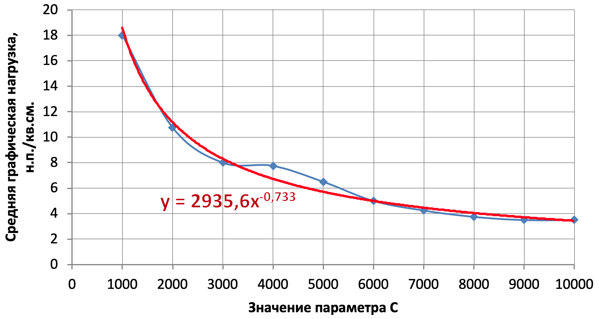
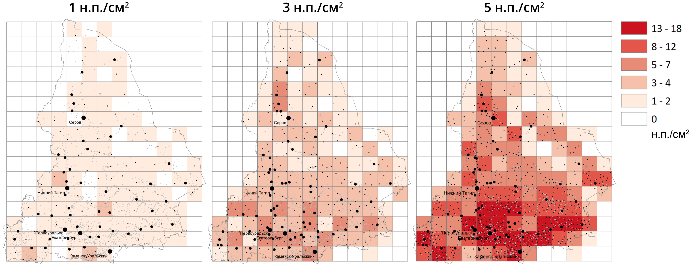

# (APPENDIX) Задания {-}

# Задание №1. Отбор точечных объектов {#points-sel-work}

__Цель задания__ — освоение методики автоматизированного отбора точечных объектов на примере населенных пунктов.

Задачи:

1. Изучить принципы, заложенные в метод отбора (исключения) точек _Settlement Spacing_.
1. Реализовать метод _Settlement Spacing_ в среде __ArcGIS Desktop__ с помощью среды автоматизации процессов геообработки __Model Builder__.
1. Реализовать метод оценки графической нагрузки по сетке регулярных квадратов средствами __Model Builder__.
1. Преобразовать созданные модели в инструменты геообработки Python Toolbox на языке программирования Python.
1. Подготовить слой населенных пунктов субъекта РФ на основе данных _OpenStreetMap_.
1. Осуществить автоматизированный отбор населенных пунктов для масштаба $1:4~000~000$.
1. Сравнить производительность созданных моделей и скриптов.
1. Выполнить численную, графическую и географическую оценку результатов генерализации.

## Реализация алгоритма Settlement Spacing {-}

__Входные параметры:__

1. Точечный слой (_Input Points_).
2. Поле веса точки (_Importance Field_). Выносится в качестве параметра из инструмента __Get Field Value__ (2.2).
3. Поле сохранения точки (_Remain Field_). Выносится в качестве параметра из инструмента __Calculate Field__ (6).
4. Масштабирующий коэффициент (_Scale_). Вводится как свободный параметр типа _Double_.

__Требования к входным параметрам:__

1. Поля, указанные в параметрах _Importance Field_ и _Remain Field_ должны быть уже созданы в слое.
2. Данные должны быть физически отсортированы в порядке увеличения поля `Importance` (чем больше значение этого поля, тем менее важной является точка). Для этого можно использовать инструмент __Sort__.
3. Поле Remain по умолчанию должно быть пустым или заполненным нулями.

Допустимые значения поля _Remain_:

- $0$ — флаг не установлен.
- $1$ — точку необходимо оставить.
- $2$ — точку необходимо убрать.

__Предусловия:__
Необходимо расставить предусловия таким образом, чтобы каждый инструмент __A__, использующий вычисленное значение __B__, выполнялся после того как вычислится __B__.

__Входные данные:__
Тестирование инструмента производится на примере слоя `poppnt_ural` (можно вырезать из него небольшой фрагмент из нескольких десятков точек.

__Результат:__
По результатам выполнения инструмента каждой точке в поле _Remain Field_ должно быть проставлено значение $1$ (оставить) или $2$ (убрать).

__Алгоритм решения задачи:__

1. _Поток 1_

    1.1. Создать слой из точек (__Make Feature Layer__)
    
    1.2. Выбрать точки (уже отобранные + текущая) по атрибутам (__Select Layer by Attributes__). Подсказка: используйте двойное условие, в котором поле `Remain` сравнивается с $1$, а поле `OBJECTID` сравнивается со значением `Value`, полученным на шаге 2.1.

2. _Поток 2_

    2.1. Выбрать текущую точку с помощью итератора (__Iterate Feature Selection__)
    
    2.2. Извлечь значение поля `Importance` (__Get Field Value__)
    
    2.3. Вычислить радиус буферной зоны (__Calculate Value__) как произведение `Importance` (2.2) и входного параметра _Scale_.
    
    2.4. Построить буферную зону, используя вычисленное значение 2.3 (Buffer)

3. Довыбрать (`SUBSET_SELECTION`) буферной зоной (2.4) отобранные точки + текущую (1.2) с помощью пространственного запроса (__Select Layer by Location__). 
        > Внимание: в результате должны остаться только те точки, которые пересекаются буферной зоной!

4. Подсчитать количество отобранных на шаге 3 точек (__Get Count__)
5. Вычислить значение флага отбора точек, используя результат шага 4 (__Calculate Value__). Если выборка содержит 1 точку, то значение флага должно быть равно 1, если больше точек, то оно должно быть равно 2. Подсказка: тип выходного поля сделайте равным Long, но для вычисления используйте логическое выражение, результатом которого будет являться `Ложь (0)` или `Истина (1)`.
6. Вычислите поле `Remain` для текущей точки (2.1), используя значение флага отбора, полученное на шаге 5 (__Calculate Field__).

## Реализация модели оценки условной графической нагрузки {-}

_Условная графическая нагрузка_ – средневзвешенное количество точек на единицу площади, где в качестве веса выступает размер точки, используемый  при ее отображении на карте 

__Входные параметры:__

1. Точечный слой
2. Поле _Size Field_, отвечающее за графический вес точки (диаметр значка).
3. Пространственное разрешение сетки (в метрах)

__Требования к входным данным:__

Поле _Size Field_ должно содержать размеры значков, используемых для визуализации точек. Если значения всех размеров равны $1$, вы получите обычную густоту точек на единицу площади.

Необходимо самостоятельно реализовать модель геообработки, которая:

1. Строит регулярную сетку с заданным разрешением и охватом, покрывающим входной набор точек с небольшим запасом. Подсказка: вам необходимо построить горизонтальный ограничивающий прямоугольник (__Minimum Bounding Geometry__), буферизовать его на величину разрешения сетки (__Buffer__) и подать буфер в качестве экстента в инструмент генерации регулярной сетки (__Create Fishnet__).
2. Подсчитывает суммарный графический вес точек в каждой ячейке и записывает результат в новое поле. Подсказка: вам понадобятся инструменты статистики (__Tabulate Intersection__), и присоединения поля (__Join Field__).
3. Сохраняет полученную сетку в выходной файл.

## Преобразование созданных моделей геообработки в инструменты Python Toolbox {-}

В данной части задания необходимо переписать созданные модели на языке программирования Python и оформить их в виде инструмента геообработки _ArcGIS Python Toolbox_. 

- Первая модель (отбор точек) переписывается совместно с преподавателем в классе.
— Вторая модель (оценка условной графической нагрузки) переписывается самостоятельно.

При выполнении задания в качестве справочника используется [__официальное руководство__](https://desktop.arcgis.com/ru/arcmap/latest/analyze/creating-tools/a-quick-tour-of-python-toolboxes.htm) по созданию инструментов _Python Toolbox_.

## Отбор населенных пунктов для карты масштаба 1:4 000 000 {-}

В данной — заключительной — части задания необходимо произвести отбор населенных пунктов, используя собственные скрипты, а также произвести графическую оценку полученных результатов.

__Алгоритм выполнения задания:__

1. Скачать данные _OSM_ на территорию Субъекта Федерации. _Не следует_ для выполнения работы брать субъекты с малым числом населенных пунктов (Мурманская область, Еврейская АО, Республика Кламыкия и т.п.).

2. Перепроецировать слой `settlement-points` в наилучшую проекцию для выбранной территории

3. Сформировать поля `Importance` и `Size`, используя следующее отображение атрибутов:

```{r, echo = FALSE, message = FALSE, warning = FALSE}
rosstat::include_table('tables/pointsel_params.xlsx', caption = 'Параметры заполнения полей')
```

4. Используя фрагмент данных и значения параметра $С$ (Scale) в диапазоне от $1000$ до $10000$ с шагом $1000$, подобрать регрессионную зависимость вида $y = \alpha x^{-\beta}$ между  значением параметра масштабирования $C$ (Scale) и средней графической нагрузкой ($ед.~на~см^2$) в масштабе $1:4~000~000$. Средняя графическая нагрузка оценивается как среднее значение по всем ненулевым ячейкам регулярной сетки. Размер сетки — $1~см^2$ в результирующем масштабе. 

    > Для $С = 2000, 4000, 8000$ необходимо зафиксировать время работы инструмента, чтобы в дальнейшем сравнить его с временем работы модели геообработки.

    Найденная зависимость должна иметь примерно следующий вид:

    ```{r, echo = FALSE}
    
    ```

5. Для значений параметра $C = 2000, 4000, 8000$ выполнить аналогичные вычисления с применением модели геообработки. Убедиться, что получается аналогичный результат и зафиксировать время выполнения обработки данных.

6. Выполнить отбор населенных пунктов с графической нагрузкой $1$, $3$ и $5$ населенных пункта на $см^2$ для масштаба $1:4~000~000$. Соответствующий параметр $C$ (_Scale_) подберите, используя найденную регрессионную зависимость.

7. Выполнить параметризацию параметра $x$ обобщенного закона _Топфера_ для трёх полученных генерализаций, исходя из предположения, что отношение результирующего и исходного масштаба равно $1:4$.

8. Оформить результаты в виде серии карт, отображающей:
    - границу региона
    - множество исходных точек бледно-серым цветом
    - множество отобранных точек черным цветом соответствующего размера
    - подписи основных населенных пунктов
    - картограмму условной графической нагрузки
  
  Пример серии карт (вы можете упорядочить изображения другим путем — например, по вертикали):
    
```{r, echo = FALSE}

```

## Отчет {-}

Работа оформляется в виде письменного отчета, в котором необходимо изложить все этапы исследования:

- цель и задачи исследования, 
- суть метода отбора точек, 
- суть принципа оценки условной графической нагрузки, 
- суть обобщенного закона Топфера, 
- этапы создания моделей геообработки и их внешний вид, 
- технология создания инструментов Python Toolbox, определения их параметров и типов параметров
- процесс преобразования моделей геообработки в инструменты Python Toolbox, фактические отличия скрипта и модели — какие инструменты переехали в неизменном виде, а что поменялось. 
- описание эксперимента по генерализации, включая:
    - постановку задачи, 
    - нахождение регрессионной зависимости, 
    - сравнение времени работы модели и скрипта, 
    - выполнение отбора, 
    - оценку результатов в графическом (карты условной нагрузки) и численном (параметризация обобщенного закона Топфера) виде.