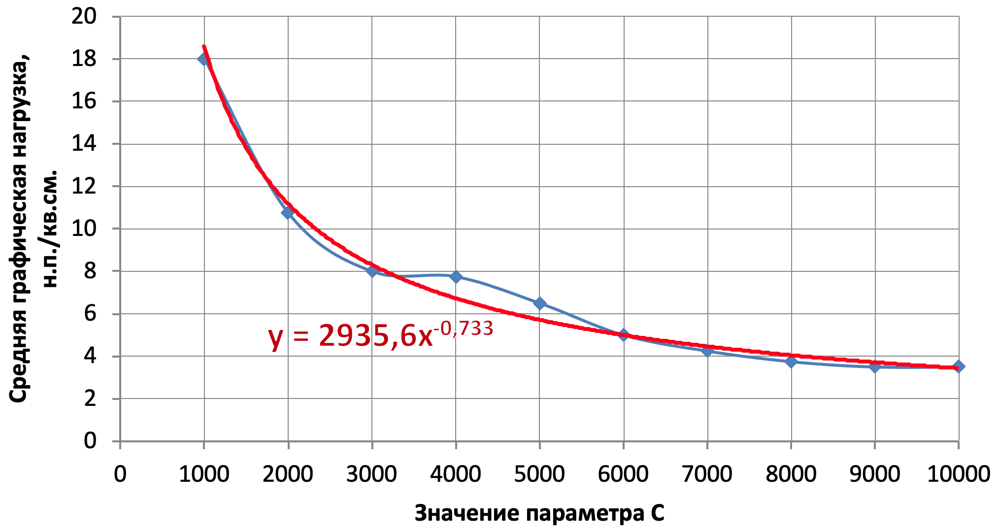

# (APPENDIX) Задания {-}

# Задание №1. Отбор точечных объектов {#points-sel-work}

__Цель задания__ — освоение методики автоматизированного отбора точечных объектов на примере населенных пунктов.

Задачи:

1. Изучить принципы, заложенные в методы отбора (исключения) точек _Settlement Spacing_ (прореживание населенных пунктов) и _Voronoy-based_ (взвешенной эффективной площади).
1. Реализовать метод _Settlement Spacing_ в виде инструмента геообработки Python Toolbox.
1. Подготовить слой населенных пунктов субъекта РФ на основе данных _OpenStreetMap_.
1. Реализовать оценку графической нагрузки в виде инструмента геообработки Python Toolbox.
1. Выполнить параметризацию коэффициента масштабирования для метода _Settlement Spacing_ при графической нагрузке $2$, $4$ и $6$ $см^{-2}$
1. Осуществить автоматизированный отбор населенных пунктов для масштаба $1:4~000~000$.
1. Реализовать метод взвешенной эффективной площади в виде инструмента геообработки Python Toolbox
1. Осуществить автоматизированный отбор населенных пунктов для масштаба $1:4~000~000$, оставив такое же количество населенных пунктов, что и в методе Settlement Spacing.
1. Выполнить численную, графическую и географическую оценку результатов генерализации обоими методами. Сравнить результаты между собой.

При выполнении задания в качестве справочника используется [__официальное руководство__](https://desktop.arcgis.com/ru/arcmap/latest/analyze/creating-tools/a-quick-tour-of-python-toolboxes.htm) по созданию инструментов _Python Toolbox_.

## Реализация алгоритма Settlement Spacing {-}

__Входные параметры:__

1. Точечный слой (_Input Points_).
2. Поле важности точки (_Importance Field_).
3. Поле сохранения точки (_Remain Field_).
4. Масштабирующий коэффициент (_Scale_).

__Входные данные:__
Тестирование инструмента производится на примере слоя `poppnt_ural` (можно вырезать из него небольшой фрагмент из нескольких десятков точек.

__Результат:__
По результатам выполнения инструмента каждой точке в поле _Remain Field_ должно быть проставлено значение $1$ (оставить) или $0$ (убрать).

__Алгоритм решения задачи:__

1. Отсортировать точки в соответствии со значением поля `Importance` так чтобы первыми были точки с наибольшим весом (__Sort__).

2. Добавить в полученный класс пространственных объектов поле _Remain Field_.

3. Создать слой из него (__Make Feature Layer__).

4. Создать обновляющий курсор, который будет ходить по всем точкам пространственных объектов (__`arcpy.da.UpdateCursor`__) в порядке уменьшения важности точки. 

5. Организовать цикл __`for`__ по всем строками итератора, выполнив следующие действия для текущей точки:
    
    4.2. Извлечь значение поля _Importance_ (__Get Field Value__)
    
    4.3. Вычислить радиус буферной зоны (__Calculate Value__) как частное от деления входного параметра _Scale_ и значения поля _Importance_ (чем важнее точка, тем меньше будет радиус зоны).
    
    4.4. Построить буферную зону, используя вычисленное значение 2.3 (__Buffer__).
    
    4.5. Выбрать в слое (3) уже отобранные точки по значению атрибута (__Select Layer by Attributes__).

    4.6. Довыбрать (`SUBSET_SELECTION`) буферной зоной (4.4) отобранные точки (4.5) с помощью пространственного запроса (__Select Layer by Location__). 

    4.7. Подсчитать количество отобранных  точек (__Get Count__).
    
    4.8. Вычислить флаг отбора для текущей точки (2.1), в зависимости от того, сколько точек выбралось на предыдущем шаге.
    
    4.9. Записат результат в поле сохранения точки через курсор.
    
    4.10. Обновить текущую строку (__`updateRow`__) через курсор.

## Реализация модели оценки условной графической нагрузки {-}

_Условная графическая нагрузка_ – средневзвешенное количество точек на единицу площади, где в качестве веса выступает размер точки, используемый  при ее отображении на карте 

__Входные параметры:__

1. Точечный слой.
2. Поле _Size Field_, отвечающее за графический вес точки (диаметр значка).
3. Пространственное разрешение сетки (в метрах).
4. Выходной слой сетки.

__Требования к входным данным:__

Поле _Size Field_ должно содержать размеры значков, используемых для визуализации точек. Если значения всех размеров равны $1$, вы получите обычную густоту точек на единицу площади.

__Алгоритм решения задачи:__

1. Построить регулярную сетку с заданным разрешением и охватом, покрывающим входной набор точек с небольшим запасом. Подсказка: вам необходимо построить горизонтальный ограничивающий прямоугольник (__Minimum Bounding Geometry__), буферизовать его на величину разрешения сетки (__Buffer__) и подать буфер в качестве экстента в инструмент генерации регулярной сетки (__Create Fishnet__).

2. Подсчитать суммарный графический вес точек в каждой ячейке и записывает результат в новое поле. Подсказка: вам понадобятся инструменты статистики (__Tabulate Intersection__), и присоединения поля (__Join Field__).

3. Сохранить полученную сетку в выходной файл.

## Отбор населенных пунктов для карты масштаба 1:4 000 000 {-}

В данной — заключительной — части задания необходимо произвести отбор населенных пунктов, используя собственные скрипты, а также произвести графическую оценку полученных результатов.

__Алгоритм выполнения задания:__

1. Скачать данные _OSM_ на территорию Субъекта Федерации. _Не следует_ для выполнения работы брать субъекты с малым числом населенных пунктов (Мурманская область, Еврейская АО, Республика Калмыкия и т.п.).

    > __Внимание__: субъекты у всех студентов должны быть разные!

2. Перепроецировать слой `settlement-points` в наилучшую проекцию для выбранной территории

3. Сформировать поля `Importance` и `Size`, используя следующее отображение атрибутов:

```{r, echo = FALSE, message = FALSE, warning = FALSE}
knitr::kable(readxl::read_excel('tables/pointsel_params.xlsx'))
# rosstat::include_table('tables/pointsel_params.xlsx', caption = 'Параметры заполнения полей')
```

4. Используя фрагмент данных и значения параметра $С$ (Scale) в диапазоне от $1000$ до $10000$ с шагом $1000$, подобрать регрессионную зависимость вида $y = \alpha x^{-\beta}$ между  значением параметра масштабирования $C$ (Scale) и средней графической нагрузкой ($ед.~на~см^2$) в масштабе $1:4~000~000$. Средняя графическая нагрузка оценивается как среднее значение по всем ненулевым ячейкам регулярной сетки. Размер сетки — $1~см^2$ в результирующем масштабе. 

    Найденная зависимость должна иметь примерно следующий вид:

    ```{r, echo = FALSE}
    
    ```

6. Выполнить отбор населенных пунктов с графической нагрузкой $2$, $4$ и $6$ населенных пункта на $см^2$ для масштаба $1:4~000~000$. Соответствующий параметр $C$ (_Scale_) подберите, используя найденную регрессионную зависимость.

## Реализация алгоритма взвешенной эффективной площади {-}

__Входные параметры:__

1. Входной точечный слой (_Input Points_).
2. Поле важности точки (_Importance Field_).
3. Поле сохранения точки (_Remain Field_).
4. Процент сохраняемых точек (_Selection percentage_).

__Входные данные:__
Тестирование инструмента производится на примере слоя `poppnt_ural` (можно вырезать из него небольшой фрагмент из нескольких десятков точек.

__Результат:__
По результатам выполнения инструмента каждой точке в поле _Remain Field_ должно быть проставлено значение $1$ (оставить) или $0$ (убрать).

__Алгоритм решения задачи:__

1. Добавить поле сохранение точки (__Add Field__).

2. Заполнить поле сохранения точки знаечнием $1$ (__Calculate Field__). По умолчанию все точки сохранены.
    
3. Создать слой для осуществления выборки точек (__Make Feature Layer__).

4. Вычислить общее количество точек во входном слое (__Get Count__).

5. Используя общее число точек и входной процент сохраняемых, вычислить количество точек, которое нужно _убрать_.

6. Создать счётчик убранных точек и инициировать его значением $1$.

7. Создать цикл __`while`__ пока счетчик убранных точек меньше значения, вычисленного на шаге (5). Внутри цикла выполнить следующие шаги:

    7.1. Выбрать в слое (3) точки, у которых значение поля сохранения равно $1$.
    
    7.2. Построить на их основе в оперативной памяти компьютера (`in_memory`) диаграмму Вороного (__Create Thiessen Polygons__) в режиме `ALL` (сохранить все атрибуты).
    
    7.3. Добавить в нее поле геодезической площади (__Add Geometry Attributes__ в режиме `AREA_GEODESIC`).
    
    7.4. Добавить в нее поле для веса точки (__Add Field__).
    
    7.5. Вычислить поле веса как произведение поля важности и геодезической площади `AREA_GEO` (__Calculate Field__). Чтобы правильно написать выражение для вычисления, изучите синтаксис вычисления полей в режиме `PYTHON_9.3` в справке к инструменту.
    
    7.6. Добавьте поле для замораживания ячеек диаграммы Вороного (__Add Field__).
    
    7.7. Заполните созданное поле нулями (__Calculate Field__). По умолчанию все ячейки разморожены.
    
    7.8. Создайте слой для выборки в диаграмме Вороного (7.2) (__Make Feature Layer__).
    
    7.9. Создайте прогресс-бар типа `step` (__`arcpy.SetProgressor`__) со значениями от $0$ до количества отбираемых точек (5).
    
    7.9. Создайте обновляющий курсор (__`arcpy.da.UpdateCursor`__), который будет включать в себя поля сохранения, заморозки и геометрии (всего 3 поля), и ходить по строкам диаграммы Вороного (7.2) в порядке возрастания значений весов (7.4).
    
    7.10. Организуйте цикл __`for`__, который для каждой строки курсора будет выполнять следующие действия:
    
      - Если поле заморозки (7.6) равно $1$, перейти на следующую итерацию цикла.
        
      - Установить надпись прогресс-бара (__`arcpy.SetProgressorLabel`__), которая говорит, что сейчас отбирается i-я точка (6) из общего числа отбираемых (5).
      
      - Записать в поле отбора значение $0$ через курсор.
      
      - Обновить текущую строку (__`updateRow`__) через курсор.
      
      - Выбрать в слое диаграммы Вороного (7.8) ячейки, пересекающиеся с геометрией текущей строки (__Select Layer by Location__).
      
      - Заполните для выбранных ячеек поле заморозки (7.6) значением $1$ (__Calculate Field__).
      
      - Установите значение прогресс-бара (__`arcpy.SetProgressorPosition`__) в текущее положение счетчика отбора (6).
      
      - Увеличите счетчик отбора (6) на единицу.
      
      - Если счетчик отбора (6) стал больше количества отбираемых точек (5), прервите цикл курсора.
      
    7.11. Выберите в слое диаграммы Вороного (7.8) ячейки, у которых значение флага отбора равно $0$ (__Select Layer by Attribute__).
    
    7.12. Выберите в слое точек (3) все точки, у которых значение флага отбора равно $1$ (__Select Layer by Attribute__).
    
    7.13. Довыберите точки, которые пересекаются с выборкой в слое диаграммы Вороного (__Select Layer By Location__ в режиме `SUBSET_SELECTION`).
    
    7.14. Заполните для выбранных точек поле отбора значением $0$ (__Calculate Field__).
    
8. Сбросьте прогресс-бар (__`arcpy.ResetProgressor`__).
    
## Применение алгоритма взвешенной эффективной площади {-}

Используя разработанный инструмент, выполните отбор точек, сохранив процент, аналогичный тому, что был получен в Settlement Spacing при нагрузках $2$, $4$ и $6$.

## Оценка полученных результатов {-}

1. Выполнить параметризацию параметра $x$ обобщенного закона _Топфера_ для трёх полученных генерализаций по каждому из двух алгоритмов, исходя из предположения, что отношение результирующего и исходного масштаба равно $1:40$.

2. Построить карты графической нагрузки для обоих алгоритмов.

2. Оформить результаты в виде серии карт, отображающей:
    - границу региона
    - множество исходных точек бледно-серым цветом
    - множество отобранных точек черным цветом соответствующего размера
    - подписи основных населенных пунктов
    - картограмму условной графической нагрузки
  
  Пример серии карт (вы можете упорядочить изображения другим путем — например, по вертикали):
    
```{r, echo = FALSE}
knitr::include_graphics("slides/OLD/img/talk3/mean_density.png")
```

## Отчет {-}

Работа оформляется в виде письменного отчета, в котором необходимо изложить все этапы исследования:

- цель и задачи исследования, 
- суть метода отбора точек, 
- суть принципа оценки условной графической нагрузки, 
- суть обобщенного закона Топфера, 
- технология создания инструментов Python Toolbox, определения их параметров и типов параметров
- описание эксперимента по генерализации, включая:
    - постановку задачи, 
    - нахождение регрессионной зависимости, 
    - сравнение времени работы модели и скрипта, 
    - выполнение отбора, 
    - оценку результатов в графическом (карты условной нагрузки) и численном (параметризация обобщенного закона Топфера) виде.