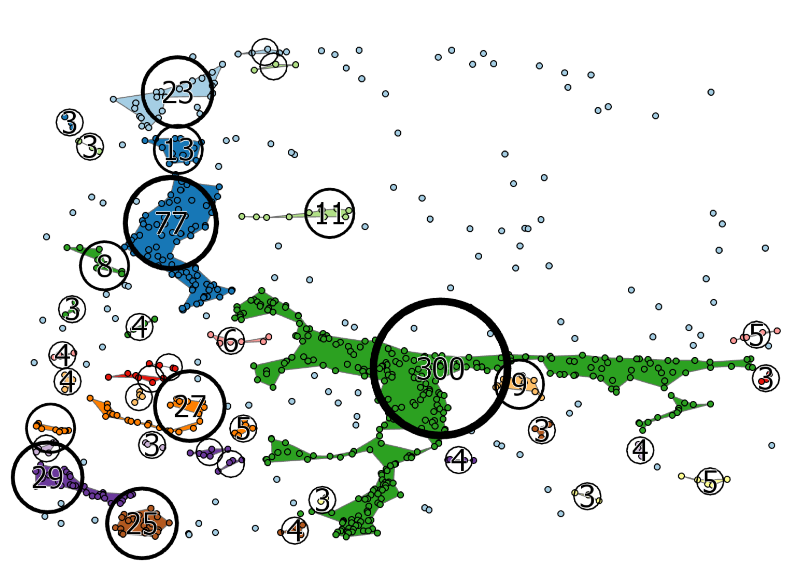

# Задание №2. Кластеризация системы расселения {#points-clust-work}

__Цель задания__ — освоение методов кластеризации и регионизации точек, построения центроидов и оценки качества кластеризации. В качестве метода кластеризации предлагается использовать _DBSCAN_. В качестве метода построения региона — _альфа-оболочку_.

Исходные данные: точки населенных пунктов из Самостоятельной работы №1.

## Изучение работы методов кластеризации и регионизации {-}

На данном этапе необходимо изучить принципы работы метода кластеризации DBSCAN, построения альфа-оболочки и центроида полигона:

1. Метод __DBSCAN__ доступен в виде инструмента Python, приложенного к данному заданию.
2. Метод альфа-оболочки доступен в инструменте __Cartography Tools__ > __Generalization__ > __Aggregate Points__.
3. Центроид полигона можно получить посредством применения инструмента __Data Management Tools__ > __Features__ > __Feature to Polygon__.

Меняя параметры инструментов (расстояния, количество точек), ознакомьтесь с тем, как это влияет на получаемый результат. Оболочки, как и кластеры стройте для набора данных `test`.

## Автоматизация выделения регионов и центроидов кластеров {-}

Необходимо создать инструмент Python Toolbox, который будет принимать на вход слой маркированных точек и выдавать класс пространственных объектов с альфа-оболочками каждого кластера, а также центроидами кластеров

__Параметры инструмента:__

1. Входной слой точек (_Input points_)
2. Название поля, в котором хранятся марки кластеров (_Cluster ID Field_)
3. Расстояние кластеризации (_Сluster distance_)
4. Выходной слой альфа-оболочек (_Output regions feature class_)
5. Выходной слой центроидов (_Output centroids feature class_)

__Требования к результатам:__

1. Каждый регион должен соответствовать своему кластеру и содержать в качестве атрибутов исходный идентификатор и количество точек, входящих в данный кластер.
2. Центроиды кластеров должны быть получены методом `Inside` (внутри)

__Рекомендации по выполнению:__

1. Создайте пустой полигональный классы пространственных объектов для выходных полигонов (`CreateFeatureclass_management(...)`).
2. Извлеките все значения поля, хранящего идентификаторы кластеров в список, используя `arcpy.da.SearchCursor(...)`.
3. Преобразуйте полeченный список в множество (`set(...)`), чтобы оставить в нем только уникальные значения.
4. Создайте слой для входного класса объектов точек (`MakeFeatureLayer_management(...)`).
5. Организуйте цикл по элементам полученного на шаге 3 множества.
6. Выберите точки, номер кластера которых совпадает с переменной цикла — текущим номером кластера (`SelectLayerByAttribute_management`).
7. Для выбранных точек запустите процедуру регионизации (`AggregatePoints_cartography`).  В качестве расстояния кластеризации необходимо указывать удвоенное расстояние, использованное ранее в методе _DBSCAN_. В этом случае оболочки будут соответствовать исходным кластерам.
8. Для полученных регионов кластеров необходимо выполнить операцию объединения (`Dissolve`), так как они могут состоять из нескольких оболочек, касающихся в одной точке.
9. Рассчитайте количество точек в текущем кластере и запишите его в поле _Count_ текущего полигона.
10. Добавьте текущий полигон в выходной полигональный класс.
11. После выполнения цикла конвертируйте полигоны в выходные точки центроидов (`FeatureToPoint_management`).

## Автоматизация расчета критериев качества кластеризации

Необходимо самостоятельно реализовать инструмент, который рассчитывает критерии качества кластеризации: среднее внутрикластерное и межкластерное расстояния, а также их соотношение. Для реализации инструмента необходимо с помощью `arcpy.da.SearchCursor` прочесть координаты и номера кластеров всех точек, рассчитать все попарные расстояния между ними и далее агрегировать полученную информацию в виде искомых показателей.

## Кластеризация системы расселения субъекта {-}

1. Cпроецируйте исходные данные в проекцию, оптимальную для выбранного региона. 
2. Используя созданный инструмент, постройте серию из 5 кластеризаций населенных пунктов выбранного вами субъекта. Количество точек в кластере оставьте постоянным (3), но меняйте значение расстояния кластеризации. Расстояния подберите таким образом, чтобы различия в кластеризации были очевидны и помогали выявлять пространственные группировки разного масштаба.
3. Рассчитайте для каждой кластеризации меры качества: среднее внутрикластерное и межкластерное расстояние, их отношение. Сведите их в таблицу.
4. Для каждого уровня кластеризации подготовьте изображение, включающее: а) исходные точки, б) регионы кластеров, в) центроиды кластеров. Точки и регионы должны быть помечены разными цветами по номерам кластеров. Центроиды должны быть показаны окружностями радиуса, пропорционального количеству входящих точек. 

Пример изображения кластеров:
```{r, out.width = "100%", fig.cap="Пример оформления результатов работы"}

```

Перед вставкой данных карт в отчет добавьте на них элементы географической основы или используйте карту-подложку в виде картографического веб-сервиса.

## Отчет {-}

Напишите отчет о проделанной работе, включающий:

1. Цель и задачи работы.
2. Описание алгоритмов DBSCAN, построения альфа-оболочки и центроида полигона.
3. Описание процесса создания скриптов для выделения регионов и центроидов кластеров, а также расчета критериев качества кластеризации.
4. Серию из 5 карт кластерной структуры системы расселения региона, полученную по результатам кластеризации.
5. Анализ качества кластеризации (согласно рассчитанным критериям).
6. Географический анализ результатов. Насколько реалистично выглядят полученные кластеры, к чему они привязаны? Можно ли выявить полимасштабность организации системы расселения на основе полученных изображений?