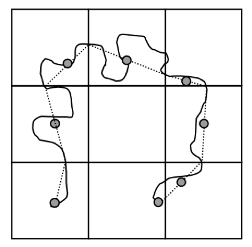

# Задание №3. Геометрическое упрощение линий {#lines-simpl-work}

**Цель задания** --- освоение методики геометрического упрощения линий.

**Аннотация**. Необходимо сравнить эффективность алгоритмов Дугласа-Пейкера, Висвалингам-Уайатта, Ванга-Мюллера и Ли-Оупеншоу при геометрическом урпощении береговых линий. При выполнении работы реализуются инструменты для вычисления коэффициента относительной извилистости и модифицированного расстояния Хаусдорфа.

Алгоритмы Дугласа-Пейкера, Висвалингам-Уайатта и Ли-Оупеншоу берутся из программной библиотеки [cartagen](https://cartagen.readthedocs.io/en/latest/) для языка Python

Алгоритм Ванга-Мюллера используется из дополнительного модуля [Geo Simplification](https://plugins.qgis.org/plugins/geo_sim_processing/) для QGIS.

## Теоретические сведения

### Алгоритмы генерализации

**Алгоритм Ли-Оупеншоу** [@Li:1992jg] использует «естественный принцип», суть которого заключается в удалении деталей, размер которых менее видимой величины. Для этого на исходное множество линий накладывается регулярная сет ка ячеек с разрешением *d* Участок линии, пересекающий ячейку, имеет точку входа в нее и точку выхода. Этот участок заменяется на середину отрезка, соединяющего две данные точки. Таким образом, удаляются все изгибы, находящиеся внутри ячеек. Принцип работы алгоритма иллюстрирует Рис. \@ref(fig:lio). Видно, что по своему поведению результирующая линия похожа на скользящее среднее.

```{r lio, out.width = "50%", echo = FALSE, fig.cap="Принцип работы алгоритма Ли-Оупеншоу"}

```

В основе работы **алгоритма Ванга-Мюллера** [@Wang:1998eh] лежит сегментация линий на отдельные изгибы. Изгиб определяется как участок линии, на котором угол ее поворота сохраняет свой знак. Важным аспектом алгоритма является четкий алгоритм вычисления вершины изгиба, которая определяется как точка, имеющая максимальную сумму расстояний до начальной и конечной точки изгиба. Для каждого изгиба в алгоритме Ванга-Мюллера определяется его размер, изолированность, близость и схожесть с соседним изгибом. Изолированные изгибы подвергаются преувеличению. Расположенные рядом схожие изгибы объединяются в один путем слияния вершин и удаления изгиба между ними. Наконец, изгибы малого размера удаляются. Данные операции проиллюстрированы на Рис. \@ref(fig:wang). В ArcGIS метод Ванга-Мюллера реализован в инструменте **Simplify Line** (режим *BEND\_SIMPLIFY*).

```{r wang, out.width = "100%", echo = FALSE, fig.cap="Элементы алгоритма Ванга-Мюллера: а) удаление; б) объединение; в) преувеличение изгибов"}
knitr::include_graphics("img/wang-muller.png")
```

Алгоритм **Дугласа-Пейкера** [@Douglas:1973if] относится к алгоритмам редуцирования точек и основан на последовательном нахождении узлов линии, образующих максимальное отклонение от стягивающей хорды (Рис. \@ref(fig:douglas)). В ArcGIS метод Дугласа-Пейкера реализован в инструменте **Simplify Line** (режим *POINT\_REMOVE*).

```{r douglas, out.width = "80%", echo = FALSE, fig.cap="Принцип работы алгоритма Дугласа-Пейкера"}
knitr::include_graphics("img/douglas.png")
```

Наконец, **алгоритм Висвалингам-Уайатта** [@Visvalingam:1993hx] относится к алгоритмам редуцирования точек и основан на последовательном удалении точек, углы которых образуют минимальную эффективную площадь (Рис. \@ref(fig:visvalingam)). В ArcGIS данный алгоритм представлен в модификации Жу и Джонса [@zhou:2005], где каждая площадь приобретает различный вес в зависимости от пропорций угла линии и реализован в инструменте **Simplify Line** (режим *WEIGHTED\_AREA*).

```{r visvalingam, out.width = "100%", echo = FALSE, fig.cap="Принцип работы алгоритма Висвалингам-Уайатта"}
knitr::include_graphics("img/visvalingam.png")
```

### Модифицированное расстояние Хаусдорфа

Модифицированное расстояние Хаусдорфа (MHD), широко используется как метрика оценки геометрической точности линий. 

Пусть даны два множества точек $\mathcal{A} = \lbrace a_1,...,a_{N_a} \rbrace$ и $\mathcal{B} = \lbrace b_1,...,b_{N_b} \rbrace$. Тогда среднее расстояние между $\mathcal{A}$ и $\mathcal{B}$ может быть вычислено как $\overline{d}(\mathcal{A},\mathcal{B}) = \frac{1}{N_a}\sum_{a \in \mathcal{A}}d(a,\mathcal{B})$, где $d(a, \mathcal{B}) = \min_{b \in \mathcal{B}}\lVert a - b \rVert$. Аналогично, обратное расстояние между $\mathcal{B}$ и $\mathcal{A}$ вычисляется как $\overline{d}(\mathcal{B},\mathcal{A}) = \frac{1}{N_b}\sum_{b \in \mathcal{B}}d(b,\mathcal{A})$, где $d(b, \mathcal{A}) = \min_{a \in \mathcal{A}}\lVert b - a \rVert$.

Имея прямое и обратное расстоения между $\mathcal{A}$ и $\mathcal{B}$, модифицированное расстояние Хаусдорфа MHD вычисляется как:

  $$
  	MHD(\mathcal{A}, \mathcal{B}) = max\big(\overline{d}(\mathcal{A},\mathcal{B}), \overline{d}(\mathcal{B},\mathcal{A})\big),
  $$

Грубо говоря, MHD есть есть максимальное из средних расстояний от $\mathcal{A}$ к $\mathcal{B}$ и от $\mathcal{B}$ к $\mathcal{A}$. Чем меньше значение MHD, тем интегрально ближе $\mathcal{A}$ и $\mathcal{B}$ друг к другу. Введение этой метрики вдохновлено классическим расстоянием Хаусдорфа (в котором $d(\mathcal{A},\mathcal{B}) = max_{a \in \mathcal{A}} d(a,\mathcal{B})$), которое, как видно из определения, чувствительно к точкам-выбросам, поскольку использует максимальное расстояние вместо среднего.

При оценке геометрической точности в качестве множеств $\mathcal{A}$ и $\mathcal{B}$ используются ребра исходного и генерализованного множеств линий соответственно. 

### Коэффициент относительной извилистости

__Коэффициент извилистости__ — мера извилистости объекта, вычисляемая как отношение длины линии к длине отрезка, соединяющего ее концы. Пусть линия $L$ состоит из $n$ узлов, соединенных ребрами. Тогда коэффициент ее извилистости будет равен:

$$K = \frac{\sum_{i=1}^{n-1} l_{i, i+1}}{l_{1,n}}$$ 

где $l_{i,k}$ — Евклидово расстояние между i-м и k-м узлом линии. 

Коэффициент извилистости зависит от конфигурации сглаживающей, описывающей общую траекторию линии. В предельном случае, когда имеют дело с замкнутой фигурой, величина $К$ не определена, т.к. длина стягивающей хорды равняется нулю. Помимо этого, общая извилистость дает мало информации о характере изгибов линии. Чтобы исправить этим недостатки, предлагается вычислить извилистость для каждого изгиба линии, а затем их осреднить:

$$\overline{K} = \frac{\sum_{j=1}^{m} K_j}{m}$$ 

где $K_j$ — коэффициент извилистости для $k$-го изгиба линии, $m$ — число изгибов

## Часть 1. Автоматизация методов оценки геометрической точности и коэффициента относительной извилистости {-}

### Автоматизация вычисления модифицированного расстояния Хаусдорфа  **MHD** (оценка геометрической точности) {-}

Напишите на языке Python функцию, которая берет на вход два объекта (условно A и B) класса Shapely `LineString` и вычисляет между ними модифицированное расстояние Хаусдорфа.

Общий алгоритм действий в одну сторону (от A к B) должен быть такой:

1. Конвертировать A во множество точек.
2. Вычислить расстояние от каждой точки до B с использованием функции `shapely.distance()`.
3. Осреднить полученные расстояния.

Аналогичным образом надо получить среднее расстояние в обратную сторону (от B к A).

Из двух средних расстояний взять максимальное. 

### Автоматизация вычисления коэффициента относительной извилистости (оценка морфологического соответствия) {-}

Напишите на языке Python функцию, которая берет на вход один объект класса Shapely `LineString` и вычисляет его относительную извилистость.

Общий алгоритм действий должен быть такой:

1. Пройтись по всем точкам линии от первой до последней
2. Для каждой последующей точки определить ее расположение относительно прямой, проходящей через две предыдущие точки ($-1$, $0$ или $1$, см. оператор `side` в лекциях по геоинформатике).
3. Разметить изгибы точками, в которых меняется знак поворота.
4. Вычислить для каждого изгиба его извилистость как отношение его длины к длине базовой линии.
5. Осреднить полученные значения.

### Отчет {-}

Опишите ваш опыт разработки инструментов оценки геометрической точности и морфологического соответствия для линий. Сопроводите данный раздел отчета снимками экрана и примерами получаемых результатов 

## Часть 2. Сравнение алгоритмов генерализации {-}

0. Выберите береговую линию для экспериментов.

1. Используя шаг сетки, равный 2 мм в результирующем масштабе (*1:5 000 000*), упростите линию с помощью метода Ли-Оупеншоу.

2. Подберите параметры алгоритмов Дугласа-Пейкера, Ванга-Мюллера и Висвалингам-Уайатта таким образом, чтобы количество результирующих точек в линиях было примерно равно (±5%) количеству точек после генерализации методом Ли-Оупеншоу. Выпишите эти параметры в отчет.

3. Рассчитайте модифицированное Хаусдорфово расстояние от оригинальной линии для четырех полученных результатов генерализации

4. Рассчитайте коэффициент относительной извилистости для исходной и результирующей линии.

5. Сведите в одну таблицу параметры алгоритмов, а также рассчитанные величины MHD и коэффициента относительной извилистости по каждому алгоритму.

6. Оцените алгоритмы по следующим критериям:

    a. При каких параметрах инструментов количество результирующих узлов линий одинаково?
    
    b. Модоифицированное хаусдорфово расстояние. Насколько эффективно алгоритм использует точки? Какой из алгоритмов дает контур, наиболее близко повторяющий исходную кривую?
    
    c. Относительная извилистость. Насколько сглаженным/угловатым получается изображение? Какой из алгоритмов дает значение извилистости более близкое к оригиналу?
    
    d. Какой метод на ваш взгляд дает наиболее удовлетворительные результаты с точки зрения принципов картографической генерализации и лучше передает морфологию объектов?

7. Сделайте для отчета 4 иллюстрации с мини-легендой, на каждой из которых показан исходный контур и поверх --- его генерализованная версия (по иллюстрации на каждый алгоритм). Разные алгоритмы выделите разными цветами.

8. Изложите в отчете свой опыт сравнительного анализа алгоритмов генерализации.