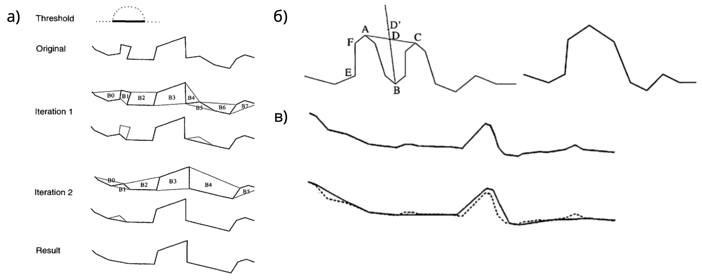

# Задание №3. Геометрическое упрощение линий {#lines-simpl-work}

**Цель задания** --- освоение методики геометрического упрощения линий.

**Аннотация**. Необходимо реализовать метод Ли-Оупеншоу для генерализации линий. Для этого на языке программирования Python создается инструмент Python Toolbox, осуществляющий последовательный запуск инструментов ArcToolbox. Помимо этого релаизуются инструменты для вычисления коэффициента относительной извилистости и модифицированного расстояния Хаусдорфа. После создания инструмента необходимо сравнить результаты работы алгоритма с тем, что получается при обработке линий посредством алгоритма Дугласа-Пейкера, Ванга-Мюллера и Висвалингам-Уайатта. Задание выполняется в ГИС-пакете ArcGIS.

## Теоретические сведения

### Алгоритмы генерализации

**Алгоритм Ли-Оупеншоу** [@Li:1992jg] использует «естественный принцип», суть которого заключается в удалении деталей, размер которых менее видимой величины. Для этого на исходное множество линий накладывается регулярная сет ка ячеек с разрешением *d* Участок линии, пересекающий ячейку, имеет точку входа в нее и точку выхода. Этот участок заменяется на середину отрезка, соединяющего две данные точки. Таким образом, удаляются все изгибы, находящиеся внутри ячеек. Принцип работы алгоритма иллюстрирует Рис. \@ref(fig:lio). Видно, что по своему поведению результирующая линия похожа на скользящее среднее.

```{r lio, out.width = "50%", echo = FALSE, fig.cap="Принцип работы алгоритма Ли-Оупеншоу"}
knitr::include_graphics("img/li-openshaw.png")
```

В основе работы **алгоритма Ванга-Мюллера** [@Wang:1998eh] лежит сегментация линий на отдельные изгибы. Изгиб определяется как участок линии, на котором угол ее поворота сохраняет свой знак. Важным аспектом алгоритма является четкий алгоритм вычисления вершины изгиба, которая определяется как точка, имеющая максимальную сумму расстояний до начальной и конечной точки изгиба. Для каждого изгиба в алгоритме Ванга-Мюллера определяется его размер, изолированность, близость и схожесть с соседним изгибом. Изолированные изгибы подвергаются преувеличению. Расположенные рядом схожие изгибы объединяются в один путем слияния вершин и удаления изгиба между ними. Наконец, изгибы малого размера удаляются. Данные операции проиллюстрированы на Рис. \@ref(fig:wang). В ArcGIS метод Ванга-Мюллера реализован в инструменте **Simplify Line** (режим *BEND\_SIMPLIFY*).

```{r wang, out.width = "100%", echo = FALSE, fig.cap="Элементы алгоритма Ванга-Мюллера: а) удаление; б) объединение; в) преувеличение изгибов"}

```

Алгоритм **Дугласа-Пейкера** [@Douglas:1973if] относится к алгоритмам редуцирования точек и основан на последовательном нахождении узлов линии, образующих максимальное отклонение от стягивающей хорды (Рис. \@ref(fig:douglas)). В ArcGIS метод Дугласа-Пейкера реализован в инструменте **Simplify Line** (режим *POINT\_REMOVE*).

```{r douglas, out.width = "80%", echo = FALSE, fig.cap="Принцип работы алгоритма Дугласа-Пейкера"}
knitr::include_graphics("img/douglas.png")
```

Наконец, **алгоритм Висвалингам-Уайатта** [@Visvalingam:1993hx] относится к алгоритмам редуцирования точек и основан на последовательном удалении точек, углы которых образуют минимальную эффективную площадь (Рис. \@ref(fig:visvalingam)). В ArcGIS данный алгоритм представлен в модификации Жу и Джонса [@zhou:2005], где каждая площадь приобретает различный вес в зависимости от пропорций угла линии и реализован в инструменте **Simplify Line** (режим *WEIGHTED\_AREA*).

```{r visvalingam, out.width = "100%", echo = FALSE, fig.cap="Принцип работы алгоритма Висвалингам-Уайатта"}
knitr::include_graphics("img/visvalingam.png")
```

### Модифицированное расстояние Хаусдорфа

Модифицированное расстояние Хаусдорфа (MHD), широко используется как метрика оценки геометрической точности линий. 

Пусть даны два множества точек $\mathcal{A} = \lbrace a_1,...,a_{N_a} \rbrace$ и $\mathcal{B} = \lbrace b_1,...,b_{N_b} \rbrace$. Тогда среднее расстояние между $\mathcal{A}$ и $\mathcal{B}$ может быть вычислено как $\overline{d}(\mathcal{A},\mathcal{B}) = \frac{1}{N_a}\sum_{a \in \mathcal{A}}d(a,\mathcal{B})$, где $d(a, \mathcal{B}) = \min_{b \in \mathcal{B}}\lVert a - b \rVert$. Аналогично, обратное расстояние между $\mathcal{B}$ и $\mathcal{A}$ вычисляется как $\overline{d}(\mathcal{B},\mathcal{A}) = \frac{1}{N_b}\sum_{b \in \mathcal{B}}d(b,\mathcal{A})$, где $d(b, \mathcal{A}) = \min_{a \in \mathcal{A}}\lVert b - a \rVert$.

Имея прямое и обратное расстоения между $\mathcal{A}$ и $\mathcal{B}$, модифицированное расстояние Хаусдорфа MHD вычисляется как:

  $$
  	MHD(\mathcal{A}, \mathcal{B}) = max\big(\overline{d}(\mathcal{A},\mathcal{B}), \overline{d}(\mathcal{B},\mathcal{A})\big),
  $$

Грубо говоря, MHD есть есть максимальное из средних расстояний от $\mathcal{A}$ к $\mathcal{B}$ и от $\mathcal{B}$ к $\mathcal{A}$. Чем меньше значение MHD, тем интегрально ближе $\mathcal{A}$ и $\mathcal{B}$ друг к другу. Введение этой метрики вдохновлено классическим расстоянием Хаусдорфаа (в котором $d(\mathcal{A},\mathcal{B}) = max_{a \in \mathcal{A}} d(a,\mathcal{B})$), которое, как видно из определения, чувствительно к точкам-выбросам, поскольку использует максимальное расстояние вместо среднего.

При оценке геометрической точности в качестве множеств $\mathcal{A}$ и $\mathcal{B}$ используются ребра исходного и генерализованного множеств линий соответственно. 

### Коэффициент относительной извилистости

__Коэффициент извилистости__ — мера извилистости объекта, вычисляемая как отношение длины линии к длине отрезка, соединяющего ее концы. Пусть линия $L$ состоит из $n$ узлов, соединенных ребрами. Тогда коэффициент ее извилистости будет равен:

$$K = \frac{\sum_{i=1}^{n-1} l_{i, i+1}}{l_{1,n}}$$ 

где $l_{i,k}$ — Евклидово расстояние между i-м и k-м узлом линии. 

Коэффициент извилистости зависит от конфигурации сглаживающей, описывающей общую траекторию линии. В предельном случае, когда имеют дело с замкнутой фигурой, величина $К$ не определена, т.к. длина стягивающей хорды равняется нулю. Чтобы избежать этого, можно вычислить отношение длины линии не к стягивающей, а к сглаживающей, т.е. вычислить _относительную извилистость_. Для этого можно сегментировать линию одним из двух способов: либо сдвигаться на одинаковое значение стягивающей хорды, либо сдвигаться вдоль самой линии с равным шагом. Второй подход вычислительно более эффективен, так как он не требует поиска пересечения с окружностью, а также поиска следующей по ходу линии точки (пересечений может быть несколько в случае извилистой линии). Коэффициент относительной извилистости, вычисляемый при таком подходе, имеет следующий вид:

$$\overline{K} = \frac{\sum_{j=1}^{m} K_j}{m}$$ 

где $K_j$ — коэффициент извилистости для $k$-го сегмента линии, $m$ — число сегментов.

```{r sinuosity, out.width = "100%", echo = FALSE, fig.cap="Подходы к вычислению коэффициента относительной извилистости: а) с фиксированной длиной стягивающей хорды; б) с фиксированной длиной сегмента линии"}
knitr::include_graphics("img/sinuosity.png")
```

> При вычислении относительной извилистости средствами ГИС разбиение линии на сегменты можно заменить разрезанием линии регулярной сеткой ячеек. В этом случае коэффициент $K_j$ будет вычисляться для сегмента линии, попавшего в $j$-й квадрат.

## Часть 1. Автоматизация метода Ли-Оупеншоу {-} 

1. Создайте базу геоданных для результатов генерализации и назначьте ее базой данных по умолчанию для размещения результатов пространственного анализа.

2. Проделайте следующую последовательность операций (жирным шрифтом указаны названия инструментов):

    a. Постройте вокруг исходных линий буфер (**Buffer**), размер которого равен разрешению генерализации (3000 м). В качестве исходных линий используйте слой **Island** в базе геоданных **Test**.
    
    b. Создать сетку (**Create Fishnet**). В качестве образца экстента используйте полученный буфер. Для тестирования используйте размер сетки 3000 м. Тип сетки должен быть полигональный.
    
    c. Найти пересечение сетки и исходных линий (**Identity**). Cлоем источника должен быть слой генерализуемых линий. Слоем *Identity* --- сетка.
    
    d. Превратить линии из составных в обычные (**Multipart to Singlepart**).
    
    e. Найти точки линий, лежащие на границах ячеек (**Feature Vertices to Points**, режим BOTH\_ENDS).
    
    f. Восстановить отрезки, соединяющие эти точки (**Points to Line**), используя идентификатор отрезка (ORIG\_FID).
    
    g. Найти середины отрезков, полученных на шаге e) (**Feature Vertices to Points**, режим MIDPOINT).
    
    h. Восстановить линию из отрезков, полученных на шаге е) (**Unsplit Line**).
    
    i. Разрезать эту линию серединами, полученными на шаге f) (**Split Line At Point**, допуск по расстоянию 100 м).
    
    j. Превратить разрезанные линии из составных в обычные (**Multipart to Singlepart**).
    
    k. Найти конечные точки полученных сегментов линий (**Feature Vertices to Points**, режим BOTH\_ENDS).
    
    l. Восстановить отрезки, соединяющие эти точки (**Points to Line**), используя идентификатор отрезка ORIG\_FID.
    
    m. Восстановить линию из отрезков (**Unsplit Line**).

    > *Примечание*: *шаги g) -- j) нужны для того, чтобы середины соседних отрезков, полученные на шаге f) приобрели общий идентификатор для их соединения*.

3. Создайте набор инструментов Python Toolbox "Line Simplification".

4. Реализуйте последовательность действий, выполненную на шаге 2, в виде инструмента геообработки LiOpenshaw. 

5. Вынесите в качестве параметров инструмента следующие объекты:

    a. Входной слой линий
    
    b. Разрешение сетки по X
    
    c. Разрешение сетки по Y
    
    d. Экстент сетки
    
    e. Выходной слой линий

6. Убедитесь, что для остальных параметров в инструмента стоит опция *Intermediate* (промежуточный).

7. Протестируйте инструмент на слое **Island**, используя разное разрешение (2-10 км)

8. Изложите ваш опыт создания инструмента в отчете, включая интерпретацию метода Ли-Оупеншоу в терминах инструмента геообработки, процесс создания инструмента и оформления его параметров. Проиллюстрируйте текст снимками экрана.

## Часть 2. Автоматизация методов оценки геометрической точности и коэффициента относительной извилистости {-}

### Автоматизация вычисления модифицрованного Хаусдорфова расстояния **MHD** (оценка геометрической точности) {-}

Инструмент Python Toolbox *Modified* *Hausdorff Distance* должty включать следующие этапы.

1. Конвертируйте исходную линию в точки (**Feature vertices to points**).

2. Добавьте в таблицу поле ID, запишите в него значение OBJECTID (**Add Field, Calculate Field**)

3. Добавьте в таблицу поле Sort, запишите в него значение 0 (**Add Field, Calculate Field**). Это будут *начальные* точки векторов смещения.

4. Вычислите расстояние от полученных точек до генерализованной линии (**Near**, с установленной опцией *Location*). Помимо расстояний, полученный слой будет содержать также координаты ближайшей точки.

5. Конвертируйте таблицу в точечный слой на основе полученных координат (**Make XY Event Layer**). Это будут *конечные* точки векторов смещения.

6. Замените значения поля *Sort* в полученном слое на 1 (**Calculate Field)**.

7. Добавьте содержимое полученного слоя к точечному классу, содержащему исходные точки (**Append**).

8. Конвертируйте полученные точки в линии векторов смещения (**Points to Line**). В качестве Line Field используйте поле ID, в качестве Sort Field -- поле Sort.

9. Визуализируйте полученный слой стрелками как на Рис. \@ref(fig:shift).

    ```{r shift, out.width = "100%", fig.cap="Пример визуализации векторов смещения линии"}
    knitr::include_graphics("img/shift-vectors.png")
    ```

    <!-- > Чтобы символика присваивалась автоматически по результатам выполнения модели геообработки, необходимо заготовить файл \*.lyr и положить его в туже папку, что и ваша модель. Далее в свойствах итогового класса объектов в Model Builder укажите созданный файл на вкладке *Layer Symbology*. -->

10. Вычислите среднее расстояние от исходной линии до генерализованной путем осреднения поля _Shape\_Length_ (**Summary Statistics**)

11. Вычислите аналогичным образом обратное расстояние (для этого потребуется генерализованную линию превратить в точки).

12. Получите Модифицированное Хаусдорфово расстояние путем нахождения максимума из полученных значений (**Calculate Value**). Чтобы извлечь значения, используйте функцию **Get Field Value.**

Инструмент должен включать следующие параметры:

- Исходные линии

- Генерализованные линии

- Выходной класс векторов смещения

### Автоматизация вычисления коэффициента относительной извилистости (оценка морфологического соответствия) {-}

Создайте новый инструемнт Python Toolbox *Sinuosity*, модифицировав инструмент генерализации, созданный ранее для алгоритма Ли-Оупеншоу. Вам необходимо внутри каждого квадрата поделить длину исходной линии на длину отрезка, соединяющего точки пересечения с линиями сетки. А затем посчитать среднее из полученных значений (**Summary Statistics**).

### Отчет {-}

Опишите ваш опыт разработки инструментов оценки геометрической точности и морфологического соответствия для линий. Сопроводите данный раздел отчета снимками экрана и примерами получаемых результатов 

## Часть 3. Сравнение алгоритмов Ли-Оупеншоу, Ванга-Мюллера, Дугласа-Пейкера и Висвалингам-Уайатта {-}

Сравните результаты работы вашего инструмента и инструмента **Simplify Line** в режимах BEND\_SIMPLIFY (алгоритм Ванга-Мюллера), POINT\_REMOVE (алгоритм Дугласа-Пейкера) и WEIGHTED\_AREA (алгоритм Висвалингам-Уайатта).

1. Используя шаг сетки, равный 2 мм в результирующем масштабе (*1:4 000 000*), упростите линию с помощью метода Ли-Оупеншоу.

2. Подберите параметры алгоритмов Дугласа-Пейкера, Ванга-Мюллера и Висвалингам-Уайатта таким образом, чтобы количество результирующих точек в линиях было примерно равно (±5%) количеству точек после генерализации методом Ли-Оупеншоу. Выпишите эти параметры в отчет. Для подсчета количества точек используйте инструмент **Feature Vertices to Points**

3. Рассчитайте модифицированное Хаусдорфово расстояние от оригинальной линии для четырех полученных результатов генерализации

4. Рассчитайте коэффициент относительной извилистости в исходном и результирующем масштабе, используя шаг сетки 5-7 мм в масштабе карты.

5. Сведите в одну таблицу параметры инструментов, а также рассчитанные величины MHD и коэффициента относительной извилистости по каждому алгоритму.

6. Оцените алгоритмы по следующим критериям:

    a. При каких параметрах инструментов количество результирующих узлов линий одинаково?
    
    b. Модоифицированное хаусдорфово расстояние. Насколько эффективно алгоритм использует точки? Какой из алгоритмов дает контур, наиболее близко повторяющий исходную кривую?
    
    c. Относительная извилистость. Насколько сглаженным/угловатым получается изображение? Какой из алгоритмов дает значение извилистости более близкое к оригиналу?
    
    d. Какой метод на ваш взгляд дает наиболее удовлетворительные результаты с точки зрения принципов картографической генерализации и лучше передает морфологию объектов?

7. Сделайте для отчета 4 иллюстрации с мини-легендой, на каждой из которых показан исходный контур и поверх --- его генерализованная версия (по иллюстрации на каждый алгоритм). Разные алгоритмы выделите разными цветами.

8. Изложите в отчете свой опыт сравнительного анализа алгоритмов генерализации.