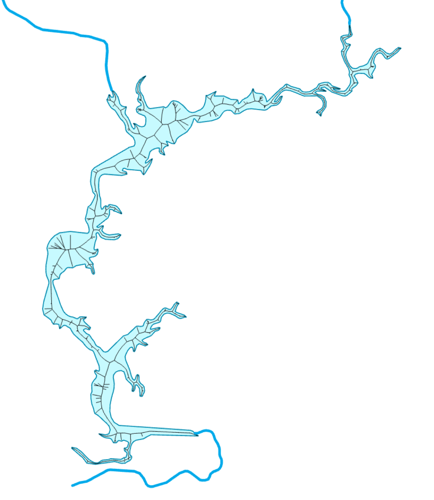
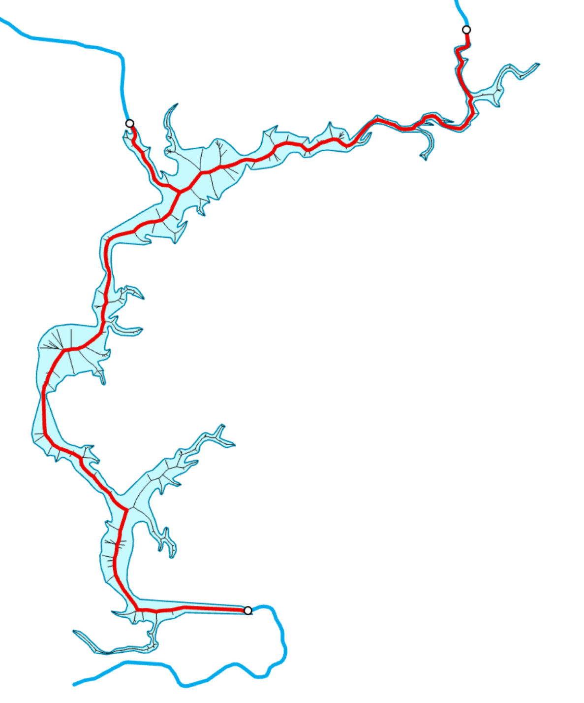

# Задание №5. Скелетизация площадных объектов гидрографии {#polygons-skeleton-work}

**Цель задания** --- освоение методики скелетизации площадных пространственных объектов на примере построения срединной оси водоема.

## Часть 1. Подготовка входных данных {-}

1. Выбрать одно из следующих водохранилищ: Куйбышевское, Камское, Братское, Горьковское.

2. Обрезать набор данных (водохранилище + примыкающие к нему реки) с небольшим запасом.

3. Трансформировать данные в оптимальную проекцию.

## Часть 2. Автоматизация построения скелета фигуры {-}

Данная модель (*Voronoy Skeleton*) должна строить скелет полигонального объекта на основе диаграммы Вороного (Рис. \@ref(fig:skeleton)):

```{r skeleton, out.width = "100%", fig.cap="Скелет полигонального объекта"}

```

**Входные параметры:**

- Полигональный класс пространственных объектов.

- Расстояние уплотнения вершин (по умолчанию 1000 метров).

- Выходной класс линейных пространственных объектов.

**Последовательность действий:**

1. Выполнить уплотнение вершин полигона с шагом 1 км (**Densify**).

2. Конвертировать вершины полигона в точки (**Feature Vertices To Points**).

3. Построить для точек диаграмму Вороного (**Create Thiessen Polygons**).

4. Конвертировать полигоны Вороного в линии (**Polygon to Line**).

5. Создать слой пространственных объектов (**Make Feature Layer**).

6. Выделить линии, ***не*** находящиеся целиком внутри полигона (**Select Layer By Location** в режиме *COMPLETELY\_WITHIN*).

7. Удалить выделенные линии (**Delete Features**).

## Часть 3. Построение сетевой модели данных {-}

1. С использованием полученной на предыдущем этапе модели геообработки постройте скелет выбранного вами водохранилища.

2. На основе полученного скелета создайте сетевой набор данных (_Network Dataset_).

3. Выполните сборку сетевого набора данных (**Build Network Dataset**).

## Часть 4. Автоматизация построения срединной оси фигуры {-}

Данная модель (*Medial Axis Connectivity*) должна на основе скелета фигуры (преобразованного в сетевую модель) и примыкающих линий водотоков получать срединную ось, связывающую точки их впадения/истока (Рис. \@ref(fig:medaxis)):

```{r medaxis, out.width = "100%", fig.cap="Срединная ось площадного объекта"}

```

**Входные параметры:**

- Входной сетевой набор данных (скелет).

- Входной линейный слой (реки).

- Входной полигональный слой (озера/вдхр).

- Расстояние поиска (используется для локализации точек на сетевой модели), по умолчани. Равно 2000 м.

- Среда притягивания (используется для притягивания концов построенных маршрутов к линиям рек). Расстояние так же по умолчанию равно 200 м.

- Выходной класс линейных пространственных объектов.

**Последовательность действий:**

1. Создать слой задачи поиска ближайшего пункта обслуживания (**Make Closest Facility Analysis Layer**).

2. Конвертировать линии гидрографии (*параметр 2*) в конечные вершины (**Feature Vertices to Points**).

3. Создать слой пространственных объектов (**Make Feature Layer**).

4. Выделить вершины, не пересекаемые площадным объектом гидрографии (*параметр 3*) (**Select Layer By Location**).

5. Удалить выделенные вершины (**Delete Features**).

6. Извлечь идентификатор *OBJECTID* для первой точки (**Ger Field Value**).

7. Выбрать первую точку по атрибуту *OBJECTID,* используя полученное на шаге 6 значение (**Select Layer by Attribute**).

8. Добавить выбранную точку в слой 1 в качестве пункта обслуживания (**Add Locations** *--- Facilities*).

9. Инвертировать выборку 7 (**Select Layer by Attribute**).

10. Добавить выбранные точки в слой 1 в качестве событий (**Add Locations** *--- Incidents*).

11. Решить задачу поиска ближайшего пункта обслуживания (**Solve**).

12. Выбрать линии маршрутов (**Select Data** *--- Routes*).

13. Вычислить пересечения внутри слоя маршрутов (**Intersect**).

14. Вырезать полученными линиями участки в маршрутах 12 (**Erase**).

15. Объединить слои 13 и 14 (**Merge**) в выходной класс линейных пространственных объектов.

16. Осуществить притягивание маршрутов к концам линий рек (**Snap** *--- END*), используя параметр 5 (туда так же подается слой рек).

## Часть 5. Построение срединной оси и описание результатов {-}

1. Используя разработанную на предыдущем этапе модель геообработки и полученную ранее сетевую модель скелета, выполните построение срединной оси выбранного водохранилища.

2. Оформите полученные результаты в виде карты с двумя изображениями (лево-право): исходные данные, результат генерализации.

3. Напишите отчет о проделанной работе, включающий:

    a. Цель и задачи работы.

    b. Описание сути изучаемого метода генерализации площадных объектов гидрографии, примеры случаев, когда это бывает необходимо.

    c. Процесс создания моделей геообработки и их внешний вид.

    d. Процесс экспериментальной работы, включая сники экрана промежуточных результатов.

    e. Итоговые карты.

    f. Оценку полученных результатов с точки зрения географической достоверности.