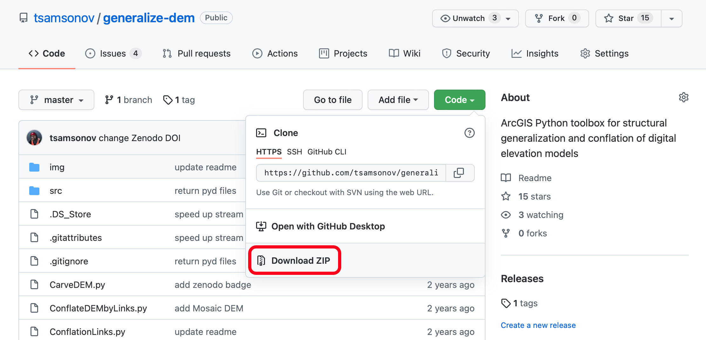

# Задание №6. Генерализация цифровой модели рельефа {#ex-dem}

**Цель задания** --- овладение различными техниками генерализации ЦМР.

В настоящем задании необходимо сравнить два метода мелкомасштабной генерализации ЦМР: глобальная фильтрация и структурная генерализация.

## Автоматизация итерационного сглаживания ЦМР {#ex-dem-iter}

В данной части задания необходимо создать инструмент Python Toolbox, который выполняет последовательное сглаживание цифровой модели рельефа фильтром среднего в несколько проходов с использованием заданных параметров.

__Предварительное чтение:__

1. Синтаксис вызова инструмента [Focal Statistics](http://desktop.arcgis.com/ru/arcmap/10.5/tools/spatial-analyst-toolbox/focal-statistics.htm) средствами языка программирования Python.
1. Создание нового набора инструментов [Python Toolbox](http://desktop.arcgis.com/ru/arcmap/10.5/analyze/creating-tools/creating-a-new-python-toolbox.htm)

__Параметры инструмента:__

1. Входная ЦМР (__Input Raster DEM__)
1. Размер плавающего окна (__Filter size__)
1. Количество итераций (__Number of iterations__)
1. Выходная ЦМР (__Output Raster DEM__)

__Указания к выполнению:__

1. Скачайте [шаблон](http://desktop.arcgis.com/ru/arcmap/10.5/analyze/creating-tools/a-template-for-python-toolboxes.htm) инструмента Python Toolbox.
1. Модифицируйте шаблон, определив в нем необходимые [параметры](http://desktop.arcgis.com/ru/arcmap/10.5/analyze/creating-tools/defining-parameters-in-a-python-toolbox.htm) и их [типы](http://desktop.arcgis.com/ru/arcmap/10.5/analyze/creating-tools/defining-parameter-data-types-in-a-python-toolbox.htm).
1. Выполните редактирование функции `execute()`, включив в нее следующие шаги:

    - [Чтение параметров](http://desktop.arcgis.com/ru/arcmap/10.5/analyze/creating-tools/accessing-parameters-within-a-python-toolbox.htm) инструмента в теле функции (`.valueAsText`).
    - [Копирование](http://desktop.arcgis.com/ru/arcmap/10.3/tools/data-management-toolbox/copy.htm) исходного растра в оперативную память (`Copy_management()`) c путем `in_memory/<raster_name>`.
    - Организация цикла от $0$ до $N-1$, где $N$ — количество итераций (`for i in range(N):`).
    - Внутри цикла — вызов функции [фокальной статистики](http://desktop.arcgis.com/ru/arcmap/10.5/tools/spatial-analyst-toolbox/focal-statistics.htm) с типом фильтра _MEAN_, размером окна, равным ___Filter size___ по обеим осям и именем выходного набора данных таким же, как и входным (`FocalStatistics`).
    - Копирование полученного растра в выходной набор данных (__Output Raster DEM__).

## Сравнение структурной генерализации и глобальной фильтрации ЦМР {#ex-dem-iter}

В данной части задания необходимо выполнить генерализацию фрагмента глобальной ЦМР двумя методами: структурная генерализация и глобальная фильтрация.

__Исходные данные и инструменты:__

1. Закачайте набор инструментов [DEM Generalization](https://github.com/tsamsonov/generalize-dem) и разархивируйте его:
    
    ```{r demgen, out.width = "100%", fig.cap="Инструмент генерализации ЦМР DEM Generalization"}
    
    ```

1. Закачайте фрагмент ЦМР _GEBCO 2019_ размером $10^\circ \times 10^\circ$, используя [веб-интерфейс](https://download.gebco.net/). Для этого включите показ градусной сетки (_Show graticule_), выберите формат _GeoTIFF_ и, используя CTRL + клик, обведите квадрат со сторонами, примерно совпадающими с линиями сетки, кратными 5 градусам:
    
    ```{r gebco-download, out.width = "100%", fig.cap="Загрузка цифровой модели рельефа GEBCO 2019"}
    knitr::include_graphics("img/download-gebco.png")
    ```
    
    На выбор предлагаются фрагменты с центрами в следующих точках:
    - Красное море ($40; 15$);
    - Альпы ($10; 45$);
    - Норвегия ($10; 60$);
    - Южный Каспий ($50; 40$);
    - Центральные Анды ($-70; -15$);
    - Северные Анды ($-75; 5$);
    - Аляска ($-150; 60$);
    - Камчатка ($160; 55$);
    - Австралия ($150; -35$);
    - Калифорния ($-120; 35$)
