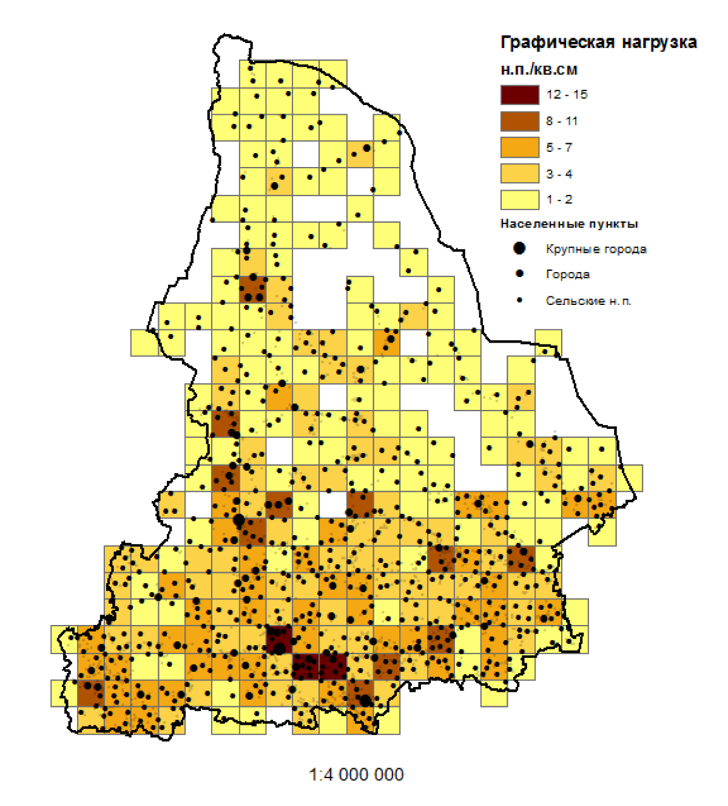

# Генерализация точечных объектов {#points}

## Отбор {#points-sel}

### Краткий обзор

Для просмотра презентации щелкните на ней один раз левой кнопкой мыши и листайте, используя кнопки на клавиатуре:
<iframe src="https://tsamsonov.github.io/gen-course/slides/talk3_PointSelection.html#1" width="672" height="380px"></iframe>

> Презентацию можно открыть в отдельном окне или вкладке браузере. Для этого щелкните по ней правой кнопкой мыши и выберите соответствующую команду.

### Самостоятельная работа №1 {#points-sel-work}

__Цель задания__ — освоение методики автоматизированного отбора точечных объектов на примере населенных пунктов.

Задачи:

1. Изучить принципы, заложенные в метод отбора (исключения) точек _Settlement Spacing_.
2. Реализовать метод _Settlement Spacing_ в среде __ArcGIS Desktop__ с помощью среды автоматизации процессов геообработки __Model Builder__.
3. Реализовать метод оценки графической нагрузки по сетке регулярных квадратов средствами __Model Builder__.
4. Подготовить слой населенных пунктов субъекта РФ на основе данных _OpenStreetMap_.
5. Осуществить автоматизированный отбор населенных пунктов для масштаба $1:4~000~000$.
6. Произвести графическую оценку результатов генерализации.

#### Реализация алгоритма Settlement Spacing {-}

__Входные параметры:__

1. Точечный слой (_Input Points_).
2. Поле веса точки (_Importance Field_). Выносится в качестве параметра из инструмента __Get Field Value__ (2.2).
3. Поле сохранения точки (_Remain Field_). Выносится в качестве параметра из инструмента __Calculate Field__ (6).
4. Масштабирующий коэффициент (_Scale_). Вводится как свободный параметр типа _Double_.

__Требования к входным параметрам:__

1. Поля, указанные в параметрах _Importance Field_ и _Remain Field_ должны быть уже созданы в слое.
2. Данные должны быть физически отсортированы в порядке увеличения поля `Importance` (чем больше значение этого поля, тем менее важной является точка). Для этого можно использовать инструмент __Sort__.
3. Поле Remain по умолчанию должно быть пустым или заполненным нулями.

Допустимые значения поля _Remain_:

- $0$ — флаг не установлен.
- $1$ — точку необходимо оставить.
- $2$ — точку необходимо убрать.

__Предусловия:__
Необходимо расставить предусловия таким образом, чтобы каждый инструмент __A__, использующий вычисленное значение __B__, выполнялся после того как вычислится __B__.

__Входные данные:__
Тестирование инструмента производится на примере слоя `poppnt_ural` (можно вырезать из него небольшой фрагмент из нескольких десятков точек.

__Результат:__
По результатам выполнения инструмента каждой точке в поле _Remain Field_ должно быть проставлено значение $1$ (оставить) или $2$ (убрать).

__Алгоритм решения задачи:__

1. _Поток 1_

    1.1. Создать слой из точек (__Make Feature Layer__)
    
    1.2. Выбрать точки (уже отобранные + текущая) по атрибутам (__Select Layer by Attributes__). Подсказка: используйте двойное условие, в котором поле `Remain` сравнивается с $1$, а поле `OBJECTID` сравнивается со значением `Value`, полученным на шаге 2.1.

2. _Поток 2_

    2.1. Выбрать текущую точку с помощью итератора (__Iterate Feature Selection__)
    
    2.2. Извлечь значение поля `Importance` (__Get Field Value__)
    
    2.3. Вычислить радиус буферной зоны (__Calculate Value__) как произведение `Importance` (2.2) и входного параметра _Scale_.
    
    2.4. Построить буферную зону, используя вычисленное значение 2.3 (Buffer)

3. Довыбрать (`SUBSET_SELECTION`) буферной зоной (2.4) отобранные точки + текущую (1.2) с помощью пространственного запроса (__Select Layer by Location__). 
        > Внимание: в результате должны остаться только те точки, которые пересекаются буферной зоной!

4. Подсчитать количество отобранных на шаге 3 точек (__Get Count__)
5. Вычислить значение флага отбора точек, используя результат шага 4 (__Calculate Value__). Если выборка содержит 1 точку, то значение флага должно быть равно 1, если больше точек, то оно должно быть равно 2. Подсказка: тип выходного поля сделайте равным Long, но для вычисления используйте логическое выражение, результатом которого будет являться `Ложь (0)` или `Истина (1)`.
6. Вычислите поле `Remain` для текущей точки (2.1), используя значение флага отбора, полученное на шаге 5 (__Calculate Field__).

#### Реализация модели оценки условной графической нагрузки {-}

_Условная графическая нагрузка_ – средневзвешенное количество точек на единицу площади, где в качестве веса выступает размер точки, используемый  при ее отображении на карте 

__Входные параметры:__

1. Точечный слой
2. Поле _Size Field_, отвечающее за графический вес точки (диаметр значка).
3. Пространственное разрешение сетки (в метрах)

__Требования к входным данным:__

Поле _Size Field_ должно содержать размеры значков, используемых для визуализации точек. Если значения всех размеров равны $1$, вы получите обычную густоту точек на единицу площади.

Необходимо самостоятельно реализовать модель геообработки, которая:

1. Строит регулярную сетку с заданным разрешением и охватом, покрывающим входной набор точек с небольшим запасом. Подсказка: вам необходимо построить горизонтальный ограничивающий прямоугольник (__Minimum Bounding Geometry__), буферизовать его на величину разрешения сетки (__Buffer__) и подать буфер в качестве экстента в инструмент генерации регулярной сетки (__Create Fishnet__).
2. Подсчитывает суммарный графический вес точек в каждой ячейке и записывает результат в новое поле. Подсказка: вам понадобятся инструменты статистики (__Tabulate Intersection__), и присоединения поля (__Join Field__).
3. Сохраняет полученную сетку в выходной файл.

#### Отбор населенных пунктов для карты масштаба 1:4 000 000 {-}

В данной — заключительной — части задания необходимо произвести отбор населенных пунктов, используя собственные модели геообработки, а также произвести графическую оценку полученных результатов.

__Алгоритм выполнения задания:__

1. Скачать данные _OSM_ на территорию Субъекта Федерации
2. Перепроецировать слой `settlement-points` в наилучшую проекцию для выбранной территории
3. Сформировать поля `Importance` и `Size`, используя следующее отображение атрибутов:

Table: (\#tab:unnamed-chunk-2)Параметры заполнения полей

  PLACE      Importance    Size 
----------  ------------  ------
   City          1          5   
   Town          2          3   
 Village         3          1   
  Hamlet         4          1   
 Locality        5          1   

4. Используя фрагмент данных и значения параметра _Scale_ в диапазоне от $1000$ до $10000$ с шагом $1000$, подобрать регрессионную зависимость между  значением параметра масштабирования Scale и средней графической нагрузкой ($ед.~на~см^2$) в масштабе $1:4~000~000$. Средняя графическая нагрузка оценивается как среднее значение по всем ненулевым ячейкам регулярной сетки. Размер сетки — $1~см^2$ в результирующем масштабе.
5. Выполнить отбор населенных пунктов с графической нагрузкой $1$, $3$ и $5$ населенных пункта на $см^2$ для масштаба $1:4~000~000$. Соответствующий параметр _Scale_ подберите, используя найденную регрессионную зависимость. 
6. Оформить результаты в виде картосхемы, отображающей:
    - границу региона
    - множество исходных точек бледно-серым цветом
    - множество отобранных точек черным цветом соответствующего размера
    - подписи основных населенных пунктов
    - картограмму условной графической нагрузки
    

(\#fig:unnamed-chunk-3)Пример оформления результатов работы

#### Отчет {-}

Работа оформляется в виде письменного отчета, в котором необходимо изложить все этапы исследования:

- цель и задачи исследования, 
- суть метода отбора точек, 
- суть принципа оценки графической нагрузки, 
- этапы создания моделей геообработки и их внешний вид, 
- описание эксперимента по генерализации, включая постановку задачи, нахождение регрессионной зависимости, выполнение отбора.

## Кластеризация и регионизация {#points-clust}

### Краткий обзор

Для просмотра презентации щелкните на ней один раз левой кнопкой мыши и листайте, используя кнопки на клавиатуре:
<iframe src="https://tsamsonov.github.io/gen-course/slides/talk4_PointClustering.html#1" width="672" height="380px"></iframe>

<iframe src="https://tsamsonov.github.io/gen-course/slides/talk5_PointAggregation.html#1" width="672" height="380px"></iframe>

> Презентацию можно открыть в отдельном окне или вкладке браузере. Для этого щелкните по ней правой кнопкой мыши и выберите соответствующую команду.

### Самостоятельная работа №2 {#points-clust-work}

__Цель задания__ — освоение методов кластеризации и регионизации точек, а также построения центроидов. В качестве метода кластеризации предлагается использовать _DBSCAN_. В качестве метода построения региона — _альфа-оболочку_.

Исходные данные: точки населенных пунктов из Самостоятельной работы №1.

#### Изучение работы методов кластеризации и регионизации {-}

На данном этапе необходимо изучить принципы работы метода кластеризации DBSCAN, построения альфа-оболочки и центроида полигона:

1. Метод DBSCAN доступен в виде инструмента Python, приложенного к данному заданию.
2. Метод альфа-оболочки доступен в инструменте __Cartography Tools__ > __Generalization__ > __Aggregate Points__.
3. Центроид полигона можно получить посредством применения инструмента __Data Management Tools__ > __Features__ > __Feature to Polygon__.

Меняя параметры инструментов (расстояния, количество точек), ознакомьтесь с тем, как это влияет на получаемый результат. Оболочки, как и кластеры стройте для набора данных `test`.

#### Автоматизация выделения регионов и центроидов кластеров {-}

Необходимо создать модель геообработки, которая будет принимать на вход слой маркированных точек и выдавать класс пространственных объектов с альфа-оболочками каждого кластера, а также центроидами кластеров

__Параметры инструмента:__

1. Входной слой точек (_Input points_)
2. Название поля, в котором хранятся марки кластеров (_Cluster ID Field_)
3. Расстояние кластеризации (_Сluster distance_)
4. Выходной слой альфа-оболочек (_Output regions feature class_)
5. Выходной слой центроидов (_Output centroids feature class_)

__Требования к результатам:__

1. Каждый регион должен соответствовать своему кластеру и содержать в качестве атрибутов исходный идентификатор и количество точек, входящих в данный кластер.
2. Центроиды кластеров должны быть получены методом `Inside` (внутри)

__Рекомендации по выполнению:__

1. Инструмент должен состоять из двух моделей. Первая модель принимает на вход все параметры и создает пустой полигональный класс пространственных объектов для добавления альфа-оболочек кластеров. Это класс вместе со всеми исходными параметрами передается в другую модель, которая будет наполнять его оболочками для каждого кластера.
2. Для прохода по номерам кластеров используйте итератор типа __Iterate Field Values__ в режиме `Unique Values` (уникальные значения). Сделайте так, чтобы на выходе не создавались кластеры для точек-выбросов (идентификатор -1).
3. Для полученных регионов кластеров необходимо выполнить операцию объединения __Dissolve__, так как они могут состоять из нескольких оболочек, касающихся в одной точке.
4. В качестве расстояния кластеризации необходимо указывать удвоенное расстояние, использованное ранее в методе _DBSCAN_. В этом случае оболочки будут соответствовать исходным кластерам.

#### Кластеризация системы расселения субъекта {-}

1. Cроецируйте исходные данные в проекцию, оптимальную для выбранного региона. 
2. Используя созданный инструмент, постройте серию из 5 кластеризаций населенных пунктов выбранного вами субъекта. Количество точек в кластере оставьте постоянным (3), но меняйте значение расстояния кластеризации. Расстояния подберите таким образом, чтобы различия в кластеризации были очевидны и помогали выявлять пространственные группировки разного масштаба.
3. Рассчитайте для каждой кластеризации меры качества: среднее внутрикластерное и межкластерное расстояние, их отношение. Сведите их в таблицу.
4. Для каждого уровня кластеризации подготовьте изображение, включающее: а) исходные точки, б) регионы кластеров, в) центроиды кластеров. Точки и регионы должны быть помечены разными цветами по номерам кластеров. Центроиды должны быть показаны окружностями радиуса, пропорционального количеству входящих точек. 

Пример изображения кластеров:

(\#fig:unnamed-chunk-6)Пример оформления результатов работы

Перед вставкой данных карт в отчет добавьте на них элементы географической основы или используйте карту-подложку в виде картографического веб-сервиса.

#### Отчет {-}

Напишите отчет о проделанной работе, включающий:

1. Цель и задачи работы.
2. Описание алгоритмов DBSCAN, построения альфа-оболочки и центроида полигона.
3. Описание процесса создания моделей геообработки для выделения регионов и центроидов кластеров.
4. Серию из 5 карт кластерной структуры системы расселения региона, полученную по результатам кластеризации.
5. Анализ качества кластеризации (согласно рассчитанным критериям).
6. Географический анализ результатов. Насколько реалистично выглядят полученные кластеры, к чему они привязаны? Можно ли выявить полимасштабность организации системы расселения на основе полученных изображений?
