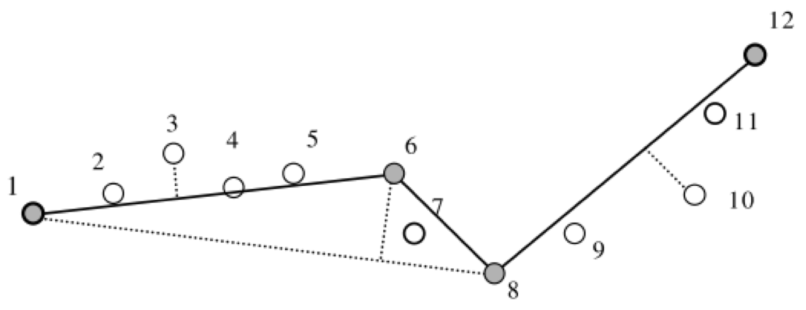

# Генерализация линейных объектов {#lines}

## Геометрическое упрощение {#points-sel}

### Краткий обзор

Для просмотра презентации щелкните на ней один раз левой кнопкой мыши и листайте, используя кнопки на клавиатуре:
<iframe src="https://tsamsonov.github.io/gen-course/slides/talk6_LineSimplification.html#1" width="672" height="380px"></iframe>

> Презентацию можно открыть в отдельном окне или вкладке браузере. Для этого щелкните по ней правой кнопкой мыши и выберите соответствующую команду.

### Самостоятельная работа №3 (Автоматизация геометрического упрощения линий) {#points-sel-work}

#### Введение {-}

**Цель задания** --- освоение методики геометрического упрощения линий.

**Аннотация**. Необходимо реализовать метод Ли-Оупеншоу для генерализации линий. Для этого в среде Model Builder создается модель геообработки, осуществляющая последовательный запуск инструментов ArcToolbox. После создания инструмента необходимо сравнить результаты работы алгоритма с тем, что получается при обработке линий посредством алгоритма Дугласа-Пейкера, Ванга-Мюллера и Висвалингам-Уайатта. Задание выполняется в ГИС-пакете ArcGIS 10.5.

**Алгоритм Ли-Оупеншоу** \[2\] использует «естественный принцип», суть которого заключается в удалении деталей, размер которых менее видимой величины. Для этого на исходное множество линий накладывается регулярная сет ка ячеек с разрешением *d* Участок линии, пересекающий ячейку, имеет точку входа в нее и точку выхода. Этот участок заменяется на середину отрезка, соединяющего две данные точки. Таким образом, удаляются все изгибы, находящиеся внутри ячеек. Принцип работы алгоритма иллюстрирует Рис. \@ref(lio). Видно, что по своему поведению результирующая линия похожа на скользящее среднее.

(\#fig:lio)Принцип работы алгоритма Ли-Оупеншоу

В основе работы **алгоритма Ванга-Мюллера** \[4\] лежит сегментация линий на отдельные изгибы. Изгиб определяется как участок линии, на котором угол ее поворота сохраняет свой знак. Важным аспектом алгоритма является четкий алгоритм вычисления вершины изгиба, которая определяется как точка, имеющая максимальную сумму расстояний до начальной и конечной точки изгиба. Для каждого изгиба в алгоритме Ванга-Мюллера определяется его размер, изолированность, близость и схожесть с соседним изгибом. Изолированные изгибы подвергаются преувеличению. Расположенные рядом схожие изгибы объединяются в один путем слияния вершин и удаления изгиба между ними. Наконец, изгибы малого размера удаляются. Данные операции проиллюстрированы на Рис. \@ref(wang). В ArcGIS метод Ванга-Мюллера реализован в инструменте **Simplify Line** (режим *BEND\_SIMPLIFY*).

(\#fig:wang)Элементы алгоритма Ванга-Мюллера: а) удаление; б) объединение; в) преувеличение изгибов

Алгоритм **Дугласа-Пейкера** \[1\] относится к алгоритмам редуцирования точек и основан на последовательном нахождении узлов линии, образующих максимальное отклонение от стягивающей хорды (Рис. \@ref(douglas)). В ArcGIS метод Дугласа-Пейкера реализован в инструменте **Simplify Line** (режим *POINT\_REMOVE*).

(\#fig:douglas)Принцип работы алгоритма Дугласа-Пейкера

Наконец, **алгоритм Висвалингам-Уайатта** \[3\] относится к алгоритмам редуцирования точек и основан на последовательном удалении точек, углы которых образуют минимальную эффективную площадь (Рис. \@ref(visvalingam)). В ArcGIS данный алгоритм представлен в модификации Жу и Джонса \[5\], где каждая площадь приобретает различный вес в зависимости от пропорций угла линии и реализован в инструменте **Simplify Line** (режим *WEIGHTED\_AREA*).

(\#fig:visvalingam)Принцип работы алгоритма Висвалингам-Уайатта

*Библиография:*

1. *Douglas D. H., Peucker T. K.* Algorithms for the reduction of the number of points required to represent a digitized line or its caricature. // The Canadian Cartographer, 10 (2), 1973, pp. 112--122.

2. *Li Z., Openshaw S.* Algorithms for Automated Line Generalization Based on a Natural Principle of Objective Generalization // International Journal of Geographic Information Systems, 1992, 6,5, pp. 373-389.

3. *Visvalingam, M. and Whyatt, J.D.,* 1993, Line generalisation by repeated elimination of points. Cartographic Journal, 30(1), 46-51.

4. *Wang Z., Muller J.-C.* Line Generalization Based on Analysis of Shape Characteristics // Cartography and Geographic Information Systems, 25, 1998, pp. 3-15.

5. *Zhou S., Jones C.B.* Shape-Aware Line Generalisation With Weighted Effective Area. In: Developments in Spatial Data Handling. Springer, Berlin, Heidelberg, 2005. DOI: 10.1007/3-540-26772-7\_28

#### Часть 1. Автоматизация метода Ли-Оупеншоу {-} 

1. Создайте базу геоданных для результатов генерализации и назначьте ее базой данных по умолчанию для размещения результатов пространственного анализа.

2. Проделайте следующую последовательность операций (жирным шрифтом указаны названия инструментов):

    a. Постройте вокруг исходных линий буфер (**Buffer**), размер которого равен разрешению генерализации (3000 м). В качестве исходных линий используйте слой **Island** в базе геоданных **Test**.
    
    b. Создать сетку (**Create Fishnet**). В качестве образца экстента используйте полученный буфер. Для тестирования используйте размер сетки 3000 м. Тип сетки должен быть полигональный.
    
    c. Найти пересечение сетки и исходных линий (**Identity**). Cлоем источника должен быть слой генерализуемых линий. Слоем *Identity* --- сетка.
    
    d. Превратить линии из составных в обычные (**Multipart to Singlepart**).
    
    e. Найти точки линий, лежащие на границах ячеек (**Feature Vertices to Points**, режим BOTH\_ENDS).
    
    f. Восстановить отрезки, соединяющие эти точки (**Points to Line**), используя идентификатор отрезка (ORIG\_FID).
    
    g. Найти середины отрезков, полученных на шаге e) (**Feature Vertices to Points**, режим MIDPOINT).
    
    h. Восстановить линию из отрезков, полученных на шаге е) (**Unsplit Line**).
    
    i. Разрезать эту линию серединами, полученными на шаге f) (**Split Line At Point**, допуск по расстоянию 100 м).
    
    j. Превратить разрезанные линии из составных в обычные (**Multipart to Singlepart**).
    
    k. Найти конечные точки полученных сегментов линий (**Feature Vertices to Points**, режим BOTH\_ENDS).
    
    l. Восстановить отрезки, соединяющие эти точки (**Points to Line**), используя идентификатор отрезка ORIG\_FID.
    
    m. Восстановить линию из отрезков (**Unsplit Line**).

    > *Примечание*: *шаги g) -- j) нужны для того, чтобы середины соседних отрезков, полученные на шаге f) приобрели общий идентификатор для их соединения*.

3. Создайте модель геообработки "LiOpenshaw Line Simplification".

4. Реализуйте последовательность действий, выполненную на шаге 2, в виде модели геообработки LiOpenshaw. 

5. Вынесите в качестве параметров модели следующие объекты:

    a. Входной слой линий
    
    b. Разрешение сетки по X
    
    c. Разрешение сетки по Y
    
    d. Экстент сетки
    
    e. Выходной слой линий

6. Убедитесь, что для остальных параметров в модели стоит опция *Intermediate* (промежуточный).

7. Протестируйте инструмент на слое **Island**, используя разное разрешение (2-10 км)

8. Изложите ваш опыт создания инструмента в отчете, включая краткое описание среды Model Builder, интерпретацию метода Ли-Оупеншоу в терминах инструмента геообработки, процесс создания модели и оформления ее параметров. Проиллюстрируйте текст снимками экрана.

#### Часть 2. Автоматизация методов оценки геометрической точности и коэффициента относительной извилистости {-}

##### Автоматизация вычисления модифицрованного Хаусдорфова расстояния **MHD** (оценка геометрической точности) {-}

Модель *Modified* *Hausdorff Distance* должна включать следующие этапы.

1. Конвертируйте исходную линию в точки (**Feature vertices to points**).

2. Добавьте в таблицу поле ID, запишите в него значение OBJECTID (**Add Field, Calculate Field**)

3. Добавьте в таблицу поле Sort, запишите в него значение 0 (**Add Field, Calculate Field**). Это будут *начальные* точки векторов смещения.

4. Вычислите расстояние от полученных точек до генерализованной линии (**Near**, с установленной опцией *Location*). Помимо расстояний, полученный слой будет содержать также координаты ближайшей точки.

5. Конвертируйте таблицу в точечный слой на основе полученных координат (**Make XY Event Layer**). Это будут *конечные* точки векторов смещения.

6. Замените значения поля *Sort* в полученном слое на 1 (**Calculate Field)**.

7. Добавьте содержимое полученного слоя к точечному классу, содержащему исходные точки (**Append**).

8. Конвертируйте полученные точки в линии векторов смещения (**Points to Line**). В качестве Line Field используйте поле ID, в качестве Sort Field -- поле Sort.

9. Визуализируйте полученный слой стрелками как на Рис. \@ref(shift).

    

    
    
(\#fig:shift)Пример визуализации векторов смещения линии

    

    > Чтобы символика присваивалась автоматически по результатам выполнения модели геообработки, необходимо заготовить файл \*.lyr и положить его в туже папку, что и ваша модель. Далее в свойствах итогового класса объектов в Model Builder укажите созданный файл на вкладке *Layer Symbology*.

10. Вычислите среднее расстояние от исходной линии до генерализованной путем осреднения поля _Shape\_Length_ (**Summary Statistics**)

11. Вычислите аналогичным образом обратное расстояние (для этого потребуется генерализованную линию превратить в точки).

12. Получите Модифицированное Хаусдорфово расстояние путем нахождения максимума из полученных значений (**Calculate Value**). Чтобы извлечь значения, используйте функцию **Get Field Value.**

Модель должна включать следующие параметры:

- Исходные линии

- Генерализованные линии

- Выходной класс векторов смещения

##### Автоматизация вычисления коэффициента относительной извилистости (оценка морфологического соответствия) {-}

Создайте новую модель геообработки *Sinuosity*, модифицировав модель генерализации, созданную ранее для алгоритма Ли-Оупеншоу. Вам необходимо внутри каждого квадрата поделить длину исходной линии на длину отрезка, соединяющего точки пересечения с линиями сетки. А затем посчитать среднее из полученных значений (**Summary Statistics**).

##### Отчет. Опишите ваш опыт разработки моделей оценки геометрической точности морфологического соответствия для линий. Сопроводите данный раздел отчета снимками экрана и примерами получаемых результатов.

#### Часть 3. Сравнение алгоритмов Ли-Оупеншоу, Ванга-Мюллера, Дугласа-Пейкера и Висвалингам-Уайатта {-}

Сравните результаты работы вашей модели и инструмента **Simplify Line** в режимах BEND\_SIMPLIFY (алгоритм Ванга-Мюллера), POINT\_REMOVE (алгоритм Дугласа-Пейкера) и WEIGHTED\_AREA (алгоритм Висвалингам-Уайатта).

1. Используя шаг сетки, равный 2 мм в результирующем масштабе (*1:4 000 000*), упростите линию с помощью метода Ли-Оупеншоу.

2. Подберите параметры алгоритмов Дугласа-Пейкера, Ванга-Мюллера и Висвалингам-Уайатта таким образом, чтобы количество результирующих точек в линиях было примерно равно (±5%) количеству точек после генерализации методом Ли-Оупеншоу. Выпишите эти параметры в отчет. Для подсчета количества точек используйте инструмент **Feature Vertices to Points**

3. Рассчитайте модифицированное Хаусдорфово расстояние от оригинальной линии для четырех полученных результатов генерализации

4. Рассчитайте коэффициент относительной извилистости в исходном и результирующем масштабе, используя шаг сетки 5-7 мм в масштабе карты.

5. Сведите в одну таблицу параметры инструментов, а также рассчитанные величины MHD и коэффициента относительной извилистости по каждому алгоритму.

6. Оцените алгоритмы по следующим критериям:

    a. При каких параметрах инструментов количество результирующих узлов линий одинаково?
    
    b. Хаусдорфово расстояние. Насколько эффективно алгоритм использует точки? Какой из алгоритмов дает контур, наиболее близко повторяющий исходную кривую?
    
    c. Относительная извилистость. Насколько сглаженным/угловатым получается изображение? Какой из алгоритмов дает значение извилистости более близкое к оригиналу?
    
    d. Какой метод на ваш взгляд дает наиболее удовлетворительные результаты с точки зрения принципов картографической генерализации и лучше передает морфологию объектов?

7. Сделайте для отчета 4 иллюстрации с мини-легендой, на каждой из которых показан исходный контур и поверх --- его генерализованная версия (по иллюстрации на каждый алгоритм). Разные алгоритмы выделите разными цветами.

8. Изложите в отчете свой опыт сравнительного анализа алгоритмов генерализации.
