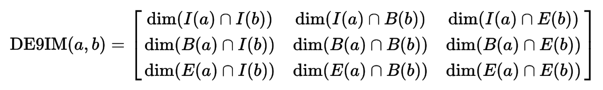
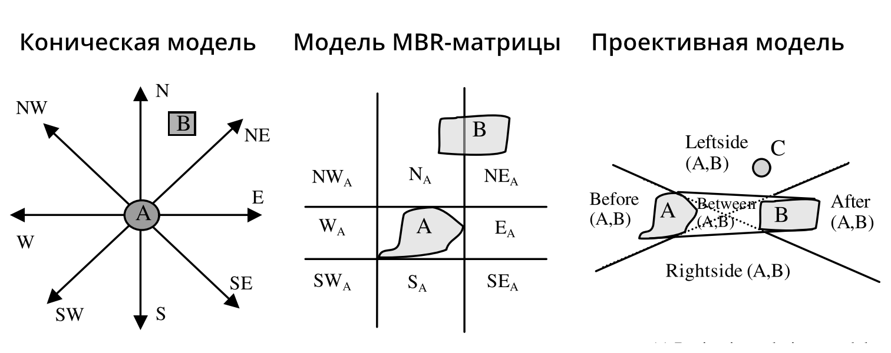

---
presentation:
  width: 1024
  height: 576
  slideNumber: true
---

<!-- slide -->
# Концептуальные модели генерализации

Картографические базы данных. Лекция 2

#### Тимофей Самсонов

[tsamsonov@geogr.msu.ru](tsamsonov@geogr.msu.ru)

<!-- slide -->
# Трансформации в процессе генерализации

- Геометрия

- Отношения

    - *Геометрические*

    - *Топологические*

    - *Порядковые*

- Семантика

- Символика

<!-- slide -->
# Геометрия

Традиционный набор преобразований оперирует на следущем множестве случаев:

| Размерность  | Объекты  | Множества |
|---|---|---|
| **0D** (точки)  |   | v |
| **1D** (линии) | v  | v  |
| **2D** (полигоны) | v  | v  |
| **3D** (поверхности )| v  |  |

<!-- slide -->
# Топологические отношения

<!-- slide -->
# Топологические отношения

Матрица 9 пересечений Эгенхофера:

**Egenhofer, M.J.; Franzosa, R.D.** (1991). "*Point-set topological spatial relations*". Int. J. GIS. 5 (2): 161–174. doi:10.1080/02693799108927841.

<!-- slide -->
# Топологические отношения

Матрица 9 пересечений Клементини:

**Clementini, Eliseo; Di Felice, Paolino; van Oosterom, Peter **(1993). "*A small set of formal topological relationships suitable for end-user interaction*". In Abel, David; Ooi, Beng Chin. Advances in Spatial Databases: Third International Symposium, SSD '93 Singapore, June 23–25, 1993 Proceedings. Lecture Notes in Computer Science. 692/1993. Springer. pp. 277–295. doi:10.1007/3-540-56869-7_16

<!-- slide -->
# Дирекционные отношения

