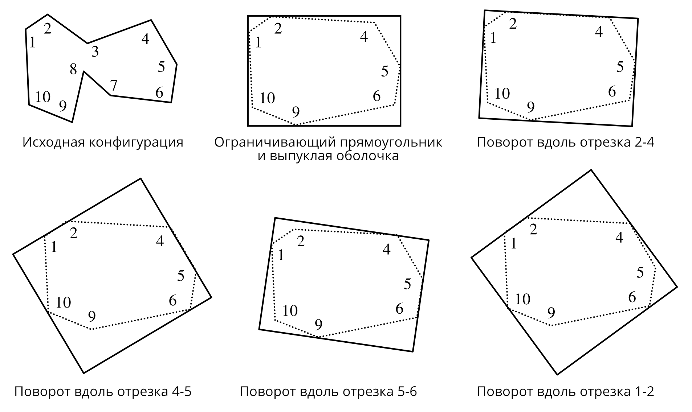

```{r setup, include=FALSE}
knitr::opts_chunk$set(echo = FALSE)
```

## Регионизация точек

**Методы регионизации:**

1. Ограничивающие прямоугольники

2. Выпуклая оболочка

3. Невыпуклые оболочки ( $\alpha$-shape, $\chi$-shape)

---

## Ограничивающий прямоугольник (envelope)

```{r, out.width = "70%", fig.cap=""}

```

- Наиболее простой тип оболочки, который используется в ГИС для описания территориального охвата слоя (*экстент*)

- Для построения в общем случае нужно 4 точки, которые обладают минимальным и максимальным значением координат из всего множества

---

## Выпуклая оболочка (convex hull)

```{r, out.width = "40%", fig.cap=""}

```

- **Выпуклой оболочкой** множества $p$ называется
наименьшее выпуклое множество, содержащее $p$
- Выпуклая оболочка обозначается как $Conv(p)$
- Выпуклая оболочка на плоскости является *пересечением всех полуплоскостей, содержащих* $p$
- Существует несколько алгоритмов построения $Conv(p)$

---

## Выпуклая оболочка

.pull-left[
```{r, out.width = "80%", fig.cap=""}

```
Представьте себе лассо, которое накидывается на множество гвоздей, битых в доску:
```{r, out.width = "40%", fig.cap=""}

```
]

.pull-right[
*Выпуклое множество* в аффинном или векторном пространстве — множество, содержащее вместе с любыми двумя точками соединяющий их отрезок:
```{r, out.width = "100%", fig.cap=""}
knitr::include_graphics("img/talk3/convex_concave.png")
```
]

---

## Алгоритм Джарвиса

.left-60[
1. Найти точку $p_0$ с наименьшим значением координаты $X$. Добавить в результат.

2. Найти точку $p_1$, образующую наименьший угол поворота по часовой стрелке относительно направления оси $Y$. Добавить в результат.

3. Найти все оставшиеся точки выпуклой оболочки $p_i, i = 2..k$, выбирая каждый раз такую точку $p_i$, что угол поворота от $p_{i-2} p_{i-1}$ к $p_{i-2} p_{i-1}$ наименьший. Остановиться, когда $p_i = p_0$
]

.right-40[
```{r, out.width = "100%", fig.cap=""}
knitr::include_graphics("img/talk3/jarvis.png")
```
]

---

## Алгоритм Джарвиса

.pull-left[
```{r, out.width = "100%", fig.cap=""}
knitr::include_graphics("img/talk3/jarvis.gif")
```
]

.pull-right[
**Jarvis, R. A.** (1973). On the identification of the convex hull of a finite set of points in the plane. _Information Processing Letters_, 2: 18–21. doi:10.1016/0020-0190(73)90020-3.
]

---

## MBR

**Минимальный по площади ограничивающий прямоугольник** (*minimum bounding rectangle,  MBR*) является наименьшим по площади среди всех прямоугольников, охватывающих данное множество точек

.pull-left[
```{r, out.width = "90%", fig.cap=""}
knitr::include_graphics("img/talk3/mbr.png")
```
]

.pull-right[
Согласно теореме Фримана-Шапиро *одна из сторон MBR должна касаться выпуклой оболочки*.

.small[**Freeman, H.; Shapira, R.** (1975), *Determining the minimum-area encasing rectangle for an arbitrary closed curve*. Communications of the ACM, 18: 409–413, MR 0375828, doi:10.1145/360881.360919.]
]

---

## Алгоритм Rotating Calipers

Поворачиваем ограничивающий прямоугольник, совмещая его с одной из сторон выпуклой оболочки. Из них выбираем минимальный по площади.

.left-column[
.small[**G.T.Toussaint** (1983). *Solving geometric problems with the rotating calipers*. Proceedings of IEEE MELECON'83, Athens, Greece, May 1983, pp. A10. 02/1-4.]

]

.right-column[
```{r, out.width = "85%", fig.cap=""}

```
]

---

## Альфа-оболочка

**Альфа-оболочка ( $\alpha$-shape)** — объединение треугольников в триангуляции Делоне, имеющих размеры больше заданного.

.left-column[
.small[**Edelsbrunner H, Kirkpatrick D, Seidel R **(1983) *On the shape of a set of points in the plane*. IEEE Transactions on Information Theory, 29:551–559]
]

.right-column[
```{r, out.width = "70%", fig.cap=""}
knitr::include_graphics("img/talk3/ashape.png")
```

_Объединяемые треугольники входят в площадную компоненту альфа-комплекса._
]

---

## Альфа-комплекс

**Альфа-комплекс ( $\alpha$-complex)**  подмножество триангуляции Делоне, включающее узлы, а также ребра и треугольники, существующие при заданном радиусе диска $r= 1/\alpha$ (при $\alpha > 0$).

```{r, out.width = "75%", fig.cap=""}
knitr::include_graphics("img/talk3/acomplex.png")
```

- При увеличении радиуса диска происходит образование и исчезновение циклов.

- При $\alpha = 0$ объединение треугольников альфа-комплекса совпадает с *выпуклой оболочкой* множества точек.

---

## Типы альфа-комплексов

.pull-left[
**Стандартный**
```{r, out.width = "100%", fig.cap=""}

```
]

.pull-right[
**Взвешенный**
```{r, out.width = "100%", fig.cap=""}

```
]
