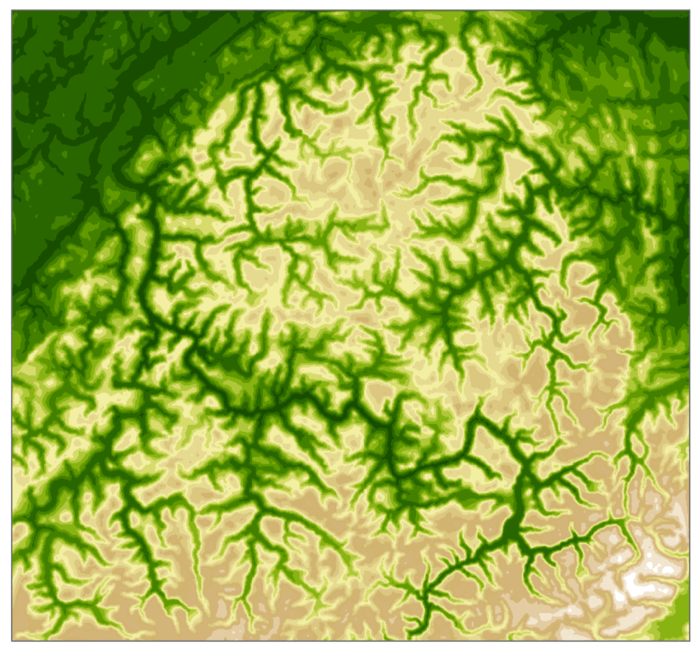

```{r setup, include=FALSE}
knitr::opts_chunk$set(echo = FALSE)
```

## Глобальные цифровые модели рельефа

```{r, out.width = "70%", fig.cap=""}

```

---

## Мелкомасштабные ЦМР

```{r, out.width = "70%", fig.cap=""}

```

---

## Проблемы качества существующих ЦМР

```{r, out.width = "70%", fig.cap=""}

```

---

## Проблемы качества существующих ЦМР

Избыточное соотношение детализации и разрешения (detail/resolution)

```{r, out.width = "80%", fig.cap=""}

```

---

## Проблемы качества существующих ЦМР

Избыточное соотношение детализации и разрешения (detail/resolution)

```{r, out.width = "80%", fig.cap=""}

```

---

## Проблемы качества существующих ЦМР

Избыточное соотношение детализации и разрешения (detail/resolution)

```{r, out.width = "80%", fig.cap=""}
knitr::include_graphics("img/talk8/gmted_4.png")
```

---

## Проблемы качества существующих ЦМР

Низкое качество моделей обзорного разрешения

```{r, out.width = "80%", fig.cap=""}

```

---

## Мелкомасштабная генерализация ЦМР

```{r, out.width = "60%", fig.cap=""}

```

.small[_Leonowicz A.M., Jenny B., Hurni L._ __Automatic generation of hypsometric layers for small-scale maps__ // Comput. Geosci., 2009. Vol. 35, № 10. P. 2074–2083.]

---

## Требования к изображению рельефа в мелких масштабах

- Сохранение на карте форм (положительных и отрицательных), имеющих размеры больше установленной величины или типичных для изображаемого ландшафта;
- Сохранение географического подобия изображаемых форм путем выделения характерных особенностей их рисунка;
- Получение наглядности в изображении обобщенных форм, т.е. создание впечатления их выпуклости, объемности;
- Сохранение определенной степени точности местоположения и высоты крупных форм.

> _Заруцкая И. П._ __Методы составления рельефа на гипсометрических картах__. — М.: Изд-во геодезической литературы, 1958. — 216 с.

---

## Требования к алгоритмам генерализации ЦМР

1. Максимальная степень автоматизации. 
1. Эффективность в широком диапазоне масштабов. 
1. Адаптируемость к характеристикам рельефа. 
1. Оперирование непосредственно ЦМР. 
1. Возможность анализа результатов. 
1. Возможность сдвигов и преувеличений форм, основанных на распознавании 
1. Основных орографических элементов и отдельных форм рельефа (для значительной генерализации)

> _Weibel R._ __An Adaptive Methodology for Automated Relief Generalization__ // Proc. AutoCarto 8, Balt. Maryland, USA. 1987. P. 42–49.

---

## Генерализация сеточных ЦМР

1. Передискретизация
1. Агрегирование
1. лобальная фильтрация
1. Структурная генерализация
1. Адаптивная фильтрация 
1. Спектральная декомпозиция

---

## Структурная генерализация

.pull-left[
```{r, out.width = "100%", fig.cap=""}

```
]

.pull-right[
В разработанном методе используется структурный подход к  генерализации, в котором упрощенная поверхность восстанавливается на основе триангуляции тальвегов и водоразделов различного порядка
]

---

## Исходная ЦМР

```{r, out.width = "75%", fig.cap=""}

```

---

## Триангуляция по структурным линиям

```{r, out.width = "75%", fig.cap=""}

```

---

## Триангуляция по структурным линиям

```{r, out.width = "65%", fig.cap=""}

```

---

## Триангулированная поверхность

```{r, out.width = "75%", fig.cap=""}

```

---

## Расширение долин и междуречий

```{r, out.width = "75%", fig.cap=""}

```

---

## Исходная ЦМР

```{r, out.width = "75%", fig.cap=""}

```

---

## Расширение долин и междуречий

.pull-left[
```{r, out.width = "80%", fig.cap=""}

```
]

Адаптировано с Leonowicz, Jenny & Hürni (2009)

- Используется только для пост-процессинга
- Области водоразделов также расширяются
- Производится гладкое взвешивание на основе растров евклидовых расстояний в качестве весовых функций
- MIN and MAX-фильтры используются вместо квартилей

---

## Исходная ЦМР

```{r, out.width = "75%", fig.cap=""}

```

---

## Долинная ЦМР — MIN filter

```{r, out.width = "75%", fig.cap=""}

```

---

## Междуречная ЦМР — MAX filter

```{r, out.width = "75%", fig.cap=""}

```

---

## Тальвеги

```{r, out.width = "75%", fig.cap=""}

```

---

## Евклидово расстояние до тальвегов

```{r, out.width = "75%", fig.cap=""}

```

---

## Веса долин

```{r, out.width = "75%", fig.cap=""}

```

---

## Веса междуречий

```{r, out.width = "75%", fig.cap=""}

```

---

## Веса склонов

```{r, out.width = "75%", fig.cap=""}
knitr::include_graphics("img/talk8/wid07_slopes.png")
```

---

## Взвешенная сумма

```{r, out.width = "75%", fig.cap=""}

```

---

## Расширение (вид в профиль)

```{r, out.width = "50%", fig.cap=""}

```

---

## Генерализованная ЦМР

```{r, out.width = "75%", fig.cap=""}

```

---

## Расширение (D = 1000 м)

```{r, out.width = "75%", fig.cap=""}

```

---

## Расширение (D = 3000 м)

```{r, out.width = "75%", fig.cap=""}

```

---

## Сравнение: ETOPO1 и генерализованная GMTED2010

```{r, out.width = "100%", fig.cap=""}

```

---

## 1:2 500 000: ETOPO1

```{r, out.width = "50%", fig.cap=""}

```

---

## 1:2 500 000: Генерализованная ЦМР

```{r, out.width = "50%", fig.cap=""}

```

---

## Глобальные модели HYPSO

- Разрешение 0.5′, 1′, 2.5′, 5′, 10′ (размер ячейки порядка 1, 2, 5, 10, 20 км)

- На основе модели GMTED2010 0.5′

- Для получения применена технология тайлового процессинга с разбиением исходных ЦМР на ячейки размером 2048×2048 пикселов

- Корректная обработка маски морских территорий

---

## Набор инструментов DEM Generalization для ArcGIS

.pull-left[
```{r, out.width = "70%", fig.cap=""}

```
]

.pull-right[
```{r, out.width = "75%", fig.cap=""}

```
]

---

## https://github.com/tsamsonov/generalize-dem

```{r, out.width = "65%", fig.cap=""}

```

---

## Генерализация по ячейкам 2048х2048 px

200 ячеек, время обработки одной ячейки — 10 мин.

```{r, out.width = "70%", fig.cap=""}

```

---

## Перекрытие ячеек

Используется для устранения краевых эффектов

```{r, out.width = "70%", fig.cap=""}

```

---

## Генерализация по перекрывающимся ячейкам

Используется для устранения краевых эффектов

```{r, out.width = "70%", fig.cap=""}

```

---

## Пример HYPSO05

.pull-left[
```{r, out.width = "85%", fig.cap=""}

```
]

.pull-right[
```{r, out.width = "85%", fig.cap=""}

```
]

---

## GMTED2010

```{r, out.width = "75%", fig.cap=""}

```

---

## HYPSO05

```{r, out.width = "75%", fig.cap=""}

```

---

## Генерализация изолиний (Ai, 2007)

.pull-left[
```{r, out.width = "100%", fig.cap=""}

```
]

.pull-right[
[1] Триангуляция каждой горизонтали. Построение иерархии изгибов

[2] Отбираются только те изгибы, чья глубина превышает допуск. Строятся тальвеги.
]

```{r, out.width = "70%", fig.cap=""}

```
---

## Генерализация изолиний

.pull-left[
[3]. Классификация тальвегов по длине. Выделение коротких тальвегов
```{r, out.width = "100%", fig.cap=""}
knitr::include_graphics("img/talk8/ai_lengths.png")
```
]

.pull-right[
[4]. Удаление долин путем спрямления участков горизонталей над долинами
```{r, out.width = "100%", fig.cap=""}

```
]

---

## Трехмерный алгоритм Дугласа-Пейкера (Fei et al., 2008)

```{r, out.width = "80%", fig.cap=""}

```

---

## Трехмерный алгоритм Дугласа-Пейкера (Fei et al., 2008)

```{r, out.width = "80%", fig.cap=""}

```

---

## Генерализация триангуляционных ЦМР

- __Алгоритмы детализации__ работают снизу вверх. Строится оболочка для всех точек, далее в нее добавляются узлы в порядке уменьшения ошибки про высоте.
- __Алгоритмы опустошения__ (децимации) работают снизу вверх. Из полного множества точки удаляются в порядке увеличения ошибки по высоте

```{r, out.width = "75%", fig.cap=""}

```

---

## Генерализация батиметрии (Peters et al., 2014)

Допустимо только занижать глубины (делать их более мелкими)

```{r, out.width = "75%", fig.cap=""}

```

---

## Генерализация батиметрии (Peters et al., 2014)

.pull-left[
Производится переоценка значения в точке методом естественного соседа (Natural Neighbor). Полученное значение сохраняется только если оно больше исходного.

.small[_Peters, Ravi, Hugo Ledoux, and Martijn Meijers._ 2014. __A Voronoi-Based Approach to Generating Depth-Contours for Hydrographic Charts.__ Marine Geodesy 37 (2): 145–66.]
]

.pull-right[
```{r, out.width = "100%", fig.cap=""}

```
]

---

## Генерализация батиметрии (Peters et al., 2014)

```{r, out.width = "100%", fig.cap=""}

```

.small[_Peters, Ravi, Hugo Ledoux, and Martijn Meijers._ 2014. __A Voronoi-Based Approach to Generating Depth-Contours for Hydrographic Charts.__ Marine Geodesy 37 (2): 145–66.]


