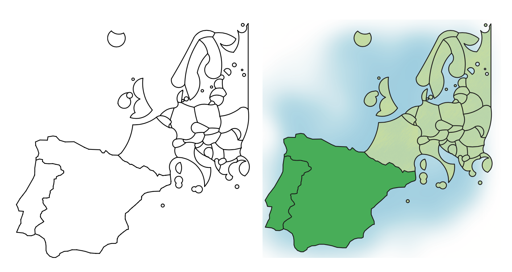

```{r setup, include=FALSE}
knitr::opts_chunk$set(echo = FALSE)
```

<!-- ## Карты -->

<!-- ```{r, out.width = "95%", fig.cap=""} -->
<!--  -->
<!-- ``` -->

<!-- --- -->

<!-- ## Карты -->

<!-- ```{r, out.width = "95%", fig.cap=""} -->
<!--  -->
<!-- ``` -->

<!-- --- -->

<!-- ## Аэрокосмические снимки -->

<!-- ```{r, out.width = "90%", fig.cap=""} -->
<!-- knitr::include_graphics("img/talkxx/msu.png") -->
<!-- ``` -->

<!-- --- -->

<!-- ## Трехмерные модели -->

<!-- ```{r, out.width = "120%", fig.cap=""} -->
<!-- knitr::include_graphics("img/talkxx/3d.png") -->
<!-- ``` -->

<!-- --- -->

<!-- ## Картографические анимации -->

<!-- <video width="640" height="480"> -->
<!-- <source src="img/talkxx/carbon.mp4" type="video/mp4"> -->
<!-- </video> -->

<!-- --- -->

<!-- ## Виртуальные модели -->

<!-- <video width="640" height="480"> -->
<!-- <source src="img/talkxx/vr.mp4" type="video/mp4"> -->
<!-- </video> -->

<!-- --- -->

<!-- ## Геоизображение -->

<!-- .large[__Геоизображение__ — это модель земных (планетных) объектов или процессов, представленная в графической образной форме.]  -->

<!-- Модель геоизображения должна быть: -->

<!-- - .red[_пространственно-временная_]: рассматривает изображаемые объекты и явления в географической среде -->
<!-- - .green[_масштабная_]: позволяет выполнять оценки местоположения, размеров и т.д. -->
<!-- - .blue[_генерализованная_]: показывает не всё, что _можно_, а всё, что _нужно_ -->

<!-- --- -->

<!-- ## Картографические геоизображения -->

<!-- __.red[Карта]__ — это математически определенное, уменьшенное, генерализованное изображение поверхности Земли, другого небесного тела или космического пространства, показывающее расположенные или спроецированные на них объекты в принятой системе условных знаков. -->

<!-- __.blue[С элементами схематизации]__: -->
<!-- - схематизированные карты -->
<!-- - схемы и карты потоков -->
<!-- - анаморфированные карты -->
<!-- - картоиды -->

<!-- --- -->

## Схематизация

__Схематизация__ — это геометрическое упрощение объектов карты, при котором местоположение, форма или направление объектов ограничиваются допустимыми вариантами. 

```{r, out.width = "80%", fig.cap=""}
knitr::include_graphics("img/talkxx/schemat.png")
```

.vsmall[Buchin, K., Meulemans, W., Renssen, A.V., Speckmann, B., 2016. Area-Preserving Simplification and Schematization of Polygonal Subdivisions. ACM Transactions on Spatial Algorithms and Systems 2, 1–36. https://doi.org/10.1145/2818373]

---

## Схематизация

```{r, out.width = "100%", fig.cap=""}

```

```{r, out.width = "100%", fig.cap=""}
knitr::include_graphics("img/talkxx/antarctica.png")
```

.vsmall[Buchin, K., Meulemans, W., Renssen, A.V., Speckmann, B., 2016. Area-Preserving Simplification and Schematization of Polygonal Subdivisions. ACM Transactions on Spatial Algorithms and Systems 2, 1–36. https://doi.org/10.1145/2818373]

---

## Схематизация

```{r, out.width = "100%", fig.cap=""}
knitr::include_graphics("img/talkxx/australia.png")
```

.vsmall[Buchin, K., Meulemans, W., Renssen, A.V., Speckmann, B., 2016. Area-Preserving Simplification and Schematization of Polygonal Subdivisions. ACM Transactions on Spatial Algorithms and Systems 2, 1–36. https://doi.org/10.1145/2818373]

---

## Схематизация

Замена отрезков дугами окружностей

```{r, out.width = "100%", fig.cap=""}

```

.vsmall[van Goethem, A., Meulemans, W., Speckmann, B., Wood, J., 2015. Exploring Curved Schematization of Territorial Outlines. Visualization and Computer Graphics, IEEE Transactions on 21, 889–902. https://doi.org/10.1109/TVCG.2015.2401025]

---

## Схематизация

Схематизация дугами окружностей

.left-60[
```{r, out.width = "90%", fig.cap=""}

```
]

.right-40[
```{r, out.width = "100%", fig.cap=""}

```
.vsmall[van Goethem, A., Meulemans, W., Speckmann, B., Wood, J., 2015. Exploring Curved Schematization of Territorial Outlines. Visualization and Computer Graphics, IEEE Transactions on 21, 889–902. https://doi.org/10.1109/TVCG.2015.2401025]
]

---

## Фокус-контекст

Схематизация может использоваться для выделения самых важных объектов (фокуса) на карте
```{r, out.width = "95%", fig.cap=""}

```
.vsmall[van Dijk, T., van Goethem, A., Haunert, J.-H., Meulemans, W., Speckmann, B., 2013. Accentuating focus maps via partial schematization, in: Proceedings of the 21st ACM SIGSPATIAL International Conference on Advances in Geographic Information Systems - SIGSPATIAL’13, pp. 428–431. https://doi.org/10.1145/2525314.2525452]

---

## Фокус-контекст

Степень схематизации может увеличиваится при удалении от объекта-фокуса
```{r, out.width = "90%", fig.cap=""}
knitr::include_graphics("img/talkxx/germany_focus.png")
```
.vsmall[van Dijk, T., van Goethem, A., Haunert, J.-H., Meulemans, W., Speckmann, B., 2013. Accentuating focus maps via partial schematization, in: Proceedings of the 21st ACM SIGSPATIAL International Conference on Advances in Geographic Information Systems - SIGSPATIAL’13, pp. 428–431. https://doi.org/10.1145/2525314.2525452]

---

## Карты-бусы (necklace maps)

Схематизация взаимного положения объектов позволяет устранить перекрытия между символами

```{r, out.width = "90%", fig.cap=""}

```
.vsmall[Speckmann, A., Verbeek, K., 2010. Necklace maps. IEEE Transactions on Visualization and Computer Graphics 16, 881–889. https://doi.org/10.1109/TVCG.2010.180]

---

## Карты-бусы (necklace maps)

Местоположение каждой диаграммы может быть вычислено по радус-вектору или сектору

```{r, out.width = "90%", fig.cap=""}

```
.vsmall[Speckmann, A., Verbeek, K., 2010. Necklace maps. IEEE Transactions on Visualization and Computer Graphics 16, 881–889. https://doi.org/10.1109/TVCG.2010.180]

---

## Карты-бусы (necklace maps)

Результат визуализации будет различным:

```{r, out.width = "90%", fig.cap=""}

```
.vsmall[Speckmann, A., Verbeek, K., 2010. Necklace maps. IEEE Transactions on Visualization and Computer Graphics 16, 881–889. https://doi.org/10.1109/TVCG.2010.180]

---

## Карты-бусы (necklace maps)

Размещение в два яруса и вдоль кривой:

.pull-left[
```{r, out.width = "90%", fig.cap=""}

```
]
.pull-right[
```{r, out.width = "90%", fig.cap=""}

```
]
.vsmall[Speckmann, A., Verbeek, K., 2010. Necklace maps. IEEE Transactions on Visualization and Computer Graphics 16, 881–889. https://doi.org/10.1109/TVCG.2010.180]

---

## Карты-бусы (necklace maps)

Для оптимизации графической нагрузки можно использовать не полные окружности, а их дуги:

```{r, out.width = "90%", fig.cap=""}
knitr::include_graphics("img/talkxx/necklace-usa.png")
```
.vsmall[Speckmann, A., Verbeek, K., 2010. Necklace maps. IEEE Transactions on Visualization and Computer Graphics 16, 881–889. https://doi.org/10.1109/TVCG.2010.180]

---

## Карты-бусы (necklace maps)

Не все объекты нуждаются в таких диаграммах. Карта количества медалей на Олимпиаде-2010 в Ванкувере:

```{r, out.width = "90%", fig.cap=""}

```
.vsmall[Speckmann, A., Verbeek, K., 2010. Necklace maps. IEEE Transactions on Visualization and Computer Graphics 16, 881–889. https://doi.org/10.1109/TVCG.2010.180]

---

## Стенокарты (stenomaps)

__.green[Стенография]__ — способ письма посредством особых знаков и целого ряда сокращений, дающий возможность быстро записывать устную речь 

```{r, out.width = "75%", fig.cap=""}

```

---

## Стенокарты (stenomaps)

Можно ли представить сложный контур на карте простым росчерком пера?

```{r, out.width = "50%", fig.cap=""}
knitr::include_graphics("img/talkxx/france-glyphs.png")
```
.vsmall[van Goethem, A., Reimer, A., Speckmann, B., Wood, J., 2014. Stenomaps: Shorthand for shapes. IEEE Trans. Visual. Comput. Graphics 20, 2053–2062. https://doi.org/10.1109/TVCG.2014.2346274]

---

## Стенокарты (stenomaps)

Стенографический символ можно рассматривать как один из уровней генерализации объекта:
```{r, out.width = "90%", fig.cap=""}

```
Основой для построения такого символа является медианная ось объекта и ее конечные точки:
```{r, out.width = "90%", fig.cap=""}

```
.vsmall[van Goethem, A., Reimer, A., Speckmann, B., Wood, J., 2014. Stenomaps: Shorthand for shapes. IEEE Trans. Visual. Comput. Graphics 20, 2053–2062. https://doi.org/10.1109/TVCG.2014.2346274]

---

## Стенокарты (stenomaps)

Соотношение границы, медианной оси и позвоночника (backbone) полигона:

```{r, out.width = "100%", fig.cap=""}

```
.vsmall[van Goethem, A., Reimer, A., Speckmann, B., Wood, J., 2014. Stenomaps: Shorthand for shapes. IEEE Trans. Visual. Comput. Graphics 20, 2053–2062. https://doi.org/10.1109/TVCG.2014.2346274]

---

## Стенокарты (stenomaps)

```{r, out.width = "100%", fig.cap=""}

```

.vsmall[van Goethem, A., Reimer, A., Speckmann, B., Wood, J., 2014. Stenomaps: Shorthand for shapes. IEEE Trans. Visual. Comput. Graphics 20, 2053–2062. https://doi.org/10.1109/TVCG.2014.2346274]

---

class: center, inverse
background-image: url("img/talkxx/stenomaps-res2.png")

---

## Карты потоков

Карты потоков нуждаются в специальных алгоритмах схематизации маршрутов перемещения

```{r, out.width = "90%", fig.cap=""}

```
.vsmall[Jenny, B., Stephen, D.M., Muehlenhaus, I., Marston, B.E., Sharma, R., Zhang, E., Jenny, H., 2018. Design principles for origin-destination flow maps. Cartography and Geographic Information Science 45, 62–75. https://doi.org/10.1080/15230406.2016.1262280]

---

## Карты потоков

Основные принципы создания карт потоков

```{r, out.width = "100%", fig.cap=""}
knitr::include_graphics("img/talkxx/flow-principles.png")
```

.vsmall[Jenny, B., Stephen, D.M., Muehlenhaus, I., Marston, B.E., Sharma, R., Zhang, E., Jenny, H., 2018. Design principles for origin-destination flow maps. Cartography and Geographic Information Science 45, 62–75. https://doi.org/10.1080/15230406.2016.1262280]

---

## Карты потоков

Натяжение отрезка перемещения под действием невидимой пружины

```{r, out.width = "90%", fig.cap=""}

```
.vsmall[Jenny, B., Stephen, D.M., Muehlenhaus, I., Marston, B.E., Sharma, R., Zhang, E., Jenny, H., 2017. Force-directed layout of origin-destination flow maps. International Journal of Geographical Information Science 31, 1521–1540. https://doi.org/10.1080/13658816.2017.1307378]

---

## Карты потоков

Взаимное действие сил отталкивания

```{r, out.width = "75%", fig.cap=""}

```
.vsmall[Jenny, B., Stephen, D.M., Muehlenhaus, I., Marston, B.E., Sharma, R., Zhang, E., Jenny, H., 2017. Force-directed layout of origin-destination flow maps. International Journal of Geographical Information Science 31, 1521–1540. https://doi.org/10.1080/13658816.2017.1307378]

---

## Карты потоков

Ограничение кривизны линии прямоугольником с пропорциями 1:2

```{r, out.width = "60%", fig.cap=""}

```
.vsmall[Jenny, B., Stephen, D.M., Muehlenhaus, I., Marston, B.E., Sharma, R., Zhang, E., Jenny, H., 2017. Force-directed layout of origin-destination flow maps. International Journal of Geographical Information Science 31, 1521–1540. https://doi.org/10.1080/13658816.2017.1307378]

---

## Карты потоков

Ограничение кривизны линии прямоугольником с пропорциями 1:2

```{r, out.width = "80%", fig.cap=""}

```
.vsmall[Jenny, B., Stephen, D.M., Muehlenhaus, I., Marston, B.E., Sharma, R., Zhang, E., Jenny, H., 2017. Force-directed layout of origin-destination flow maps. International Journal of Geographical Information Science 31, 1521–1540. https://doi.org/10.1080/13658816.2017.1307378]

---

## Карты потоков

Перемещение контрольной точки по спирали для устранения пересечений

```{r, out.width = "80%", fig.cap=""}

```
.vsmall[Jenny, B., Stephen, D.M., Muehlenhaus, I., Marston, B.E., Sharma, R., Zhang, E., Jenny, H., 2017. Force-directed layout of origin-destination flow maps. International Journal of Geographical Information Science 31, 1521–1540. https://doi.org/10.1080/13658816.2017.1307378]

---

## Потоки на картах-бусах

Два метода схематизации можно объединить в один:

```{r, out.width = "50%", fig.cap=""}

```
.vsmall[Speckmann, A., Verbeek, K., 2010. Necklace maps. IEEE Transactions on Visualization and Computer Graphics 16, 881–889. https://doi.org/10.1109/TVCG.2010.180]

---

## Распределительные карты потоков

Показывают перемещение из одного источника во множество целей

```{r, out.width = "80%", fig.cap=""}

```
.vsmall[Sun, S., 2018. A spatial one-to-many flow layout algorithm using triangulation, approximate Steiner trees, and path smoothing. Cartography and Geographic Information Science 1–17. https://doi.org/10.1080/15230406.2018.1437359]

---

## Распределительные карты потоков

Расчетный каркас для распределения потоков

```{r, out.width = "90%", fig.cap=""}

```
.vsmall[Sun, S., 2018. A spatial one-to-many flow layout algorithm using triangulation, approximate Steiner trees, and path smoothing. Cartography and Geographic Information Science 1–17. https://doi.org/10.1080/15230406.2018.1437359]

---

## Распределительные карты потоков

Минимальное остовное дерево (задача Штейнера)

```{r, out.width = "80%", fig.cap=""}

```
.vsmall[Sun, S., 2018. A spatial one-to-many flow layout algorithm using triangulation, approximate Steiner trees, and path smoothing. Cartography and Geographic Information Science 1–17. https://doi.org/10.1080/15230406.2018.1437359]

---

### Решение задачи Штейнера

Алгоритм Крускала

```{r, out.width = "60%", fig.cap=""}

```

.vsmall[https://upload.wikimedia.org/wikipedia/commons/0/01/MST_Kruskal.gif]

---

## Распределительные карты потоков

Пример — исходные данные

```{r, out.width = "75%", fig.cap=""}

```
.vsmall[Sun, S., 2018. A spatial one-to-many flow layout algorithm using triangulation, approximate Steiner trees, and path smoothing. Cartography and Geographic Information Science 1–17. https://doi.org/10.1080/15230406.2018.1437359]

---

## Распределительные карты потоков

Стандартное распределение потоков

```{r, out.width = "75%", fig.cap=""}

```
.vsmall[Sun, S., 2018. A spatial one-to-many flow layout algorithm using triangulation, approximate Steiner trees, and path smoothing. Cartography and Geographic Information Science 1–17. https://doi.org/10.1080/15230406.2018.1437359]

---

## Распределительные карты потоков

Распределение потоков с высоким весом суши

```{r, out.width = "75%", fig.cap=""}

```
.vsmall[Sun, S., 2018. A spatial one-to-many flow layout algorithm using triangulation, approximate Steiner trees, and path smoothing. Cartography and Geographic Information Science 1–17. https://doi.org/10.1080/15230406.2018.1437359]

---

## Распределительные карты потоков

Исходные данные с дополнительными точками

```{r, out.width = "75%", fig.cap=""}

```
.vsmall[Sun, S., 2018. A spatial one-to-many flow layout algorithm using triangulation, approximate Steiner trees, and path smoothing. Cartography and Geographic Information Science 1–17. https://doi.org/10.1080/15230406.2018.1437359]

---

## Распределительные карты потоков

Распределение потоков с дополнительными точками

```{r, out.width = "75%", fig.cap=""}

```
.vsmall[Sun, S., 2018. A spatial one-to-many flow layout algorithm using triangulation, approximate Steiner trees, and path smoothing. Cartography and Geographic Information Science 1–17. https://doi.org/10.1080/15230406.2018.1437359]

---

## Распределительные карты потоков

Дополнительные точки и высокий вес суши

```{r, out.width = "75%", fig.cap=""}

```
.vsmall[Sun, S., 2018. A spatial one-to-many flow layout algorithm using triangulation, approximate Steiner trees, and path smoothing. Cartography and Geographic Information Science 1–17. https://doi.org/10.1080/15230406.2018.1437359]

---

## Распределительные карты потоков

Спиральные деревья

```{r, out.width = "75%", fig.cap=""}

```
.vsmall[Buchin, K., Speckmann, B., Verbeek, K., 2011. Flow Map Layout via Spiral Trees. IEEE Transactions on Visualization and Computer Graphics 17, 2536–2544. https://doi.org/10.1109/TVCG.2011.202]

---

## Распределительные карты потоков

Пакетирование заготовок

```{r, out.width = "75%", fig.cap=""}

```
.vsmall[Nocaj, A., Brandes, U., 2013. Stub Bundling and Confluent Spirals for Geographic Networks, in: Wismath, S., Wolff, A. (Eds.), Graph Drawing. Springer International Publishing, Cham, pp. 388–399. https://doi.org/10.1007/978-3-319-03841-4_34]

---

## Распределительные карты потоков

Дерево Штейнера

```{r, out.width = "75%", fig.cap=""}

```
.vsmall[Buchin, K., Speckmann, B., Verbeek, K., 2011. Flow Map Layout via Spiral Trees. IEEE Transactions on Visualization and Computer Graphics 17, 2536–2544. https://doi.org/10.1109/TVCG.2011.202]

---

## Распределительные карты потоков

Импорт продуктов в Великобританию

```{r, out.width = "100%", fig.cap=""}

```
.vsmall[D. Phan, L. Xiao, R. Yeh, P. Hanrahan, and T. Winograd. Flow map layout. In Proc. IEEE Symposium on Information Visualization (INFOVIS ’05), pages 219–224, 2005]

---

class: inverse

## Анаморфозы (cartograms)

На картах-анаморфозах объекты масштабируются в зависимости от величины показателя

> Показатель должен быть __экстенсивным__, то есть _суммироваться_ по территории, а не _осредняться_.

```{r, out.width = "100%", fig.cap=""}
knitr::include_graphics("img/talkxx/roser-cartogram.png")
```

---

class: center, inverse
background-image: url("img/talkxx/roser-cartogram.png")
background-position: center
background-size: contain

## Растровые анаморфозы

---

class: center, inverse
background-image: url("img/talkxx/roser-cartogram.png")
background-position: center
background-size: 200%

---

## Векторные анаморфозы

Картографические — получаются на основе преобразования координат

```{r, out.width = "90%", fig.cap=""}

```
.vsmall[[http://www.ncgia.ucsb.edu/projects/Cartogram_Central/types.html]()]

---

## Векторные анаморфозы

Схематичные — получаются заменой площадей простыми фигурами

```{r, out.width = "90%", fig.cap=""}
knitr::include_graphics("img/talkxx/cartograms2.png")
```
.vsmall[[http://www.ncgia.ucsb.edu/projects/Cartogram_Central/types.html]()]

---

## Фокальные анаморфозы

Позволяют избирательно увеличивать объекты в соответствии с их важностью
```{r, out.width = "80%", fig.cap=""}

```
.vsmall[van Dijk, T., van Goethem, A., Haunert, J.-H., Meulemans, W., Speckmann, B., 2013. Accentuating focus maps via partial schematization, in: Proceedings of the 21st ACM SIGSPATIAL International Conference on Advances in Geographic Information Systems - SIGSPATIAL’13, pp. 428–431. https://doi.org/10.1145/2525314.2525452]

---

## Фокальные анаморфозы

Позволяют избирательно увеличивать объекты в соответствии с их важностью
```{r, out.width = "80%", fig.cap=""}

```
.vsmall[van Dijk, T., van Goethem, A., Haunert, J.-H., Meulemans, W., Speckmann, B., 2013. Accentuating focus maps via partial schematization, in: Proceedings of the 21st ACM SIGSPATIAL International Conference on Advances in Geographic Information Systems - SIGSPATIAL’13, pp. 428–431. https://doi.org/10.1145/2525314.2525452]

---

## Картоиды

__.red[Картоиды]__ — идеализированные (абстрактные) теоретико-картографические модели, схематически отражающие  конфигурацию, пространственную структуру и связи геосистем.

> .blue[Иногда между картоидами и анаморфозами не прооводят разницы, хотя на самом деле принципы их построения существенно различны, и используются они для разных целей.]

---

## Картоиды

__Поляризованный ландшафт__ (по Б.Б.Родоману) — иллюстрирует общие закономерности расположения функциональных зон культурного ландшафта
```{r, out.width = "80%", fig.cap=""}

```

---

## Идеальный материк

Географические пояса, зональные типы ландшафтов  и почвенно-геохимические поля
```{r, out.width = "80%", fig.cap=""}

```
.vsmall[по А.М.Рябчикову и М.А.Глазовской]

---

## Картографические геоизображения

__.red[Карта]__ — это математически определенное, уменьшенное, генерализованное изображение поверхности Земли, другого небесного тела или космического пространства, показывающее расположенные или спроецированные на них объекты в принятой системе условных знаков.

__.blue[С элементами схематизации]__:
- схематизированные карты
- схемы и карты потоков
- анаморфированные карты
- картоиды