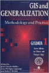
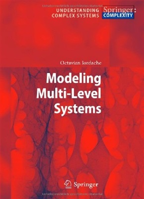
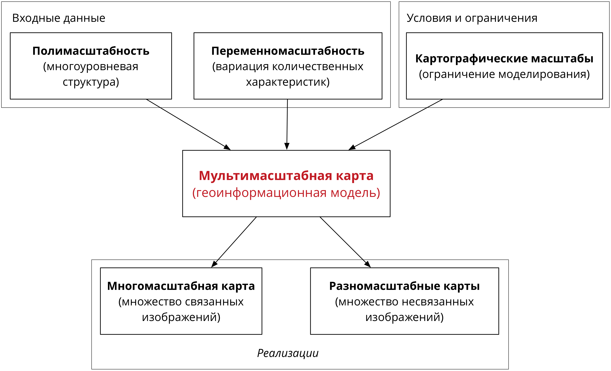
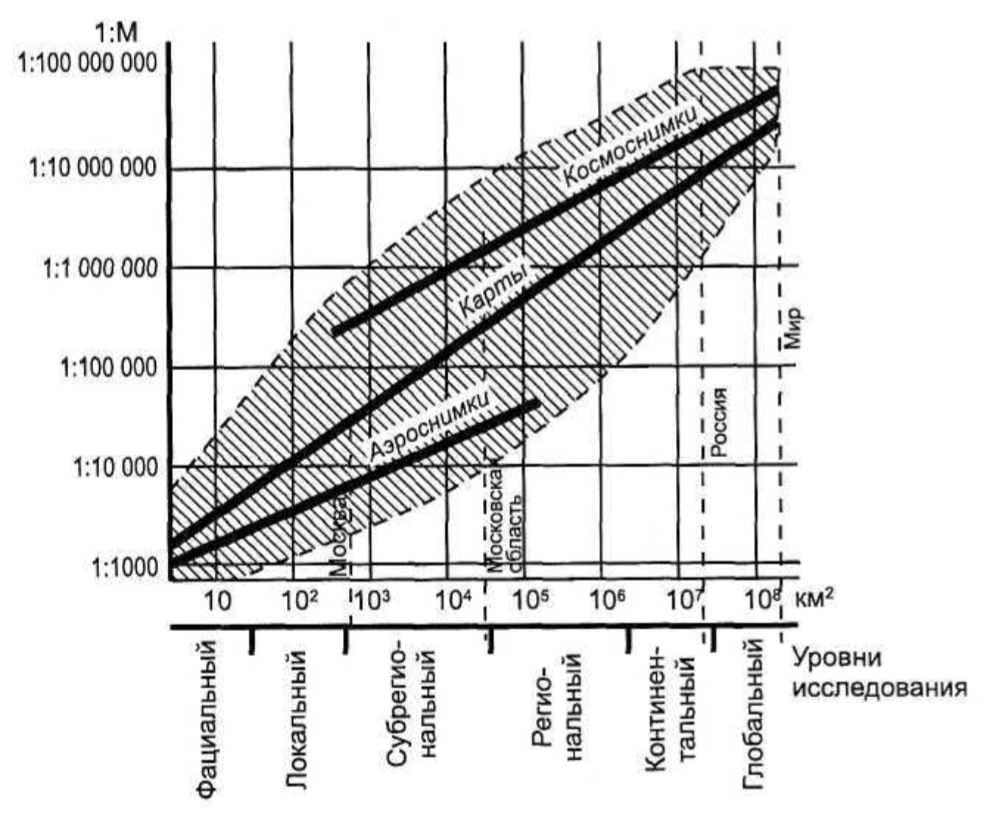
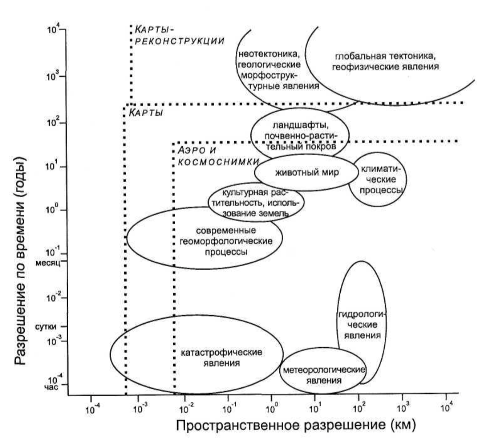
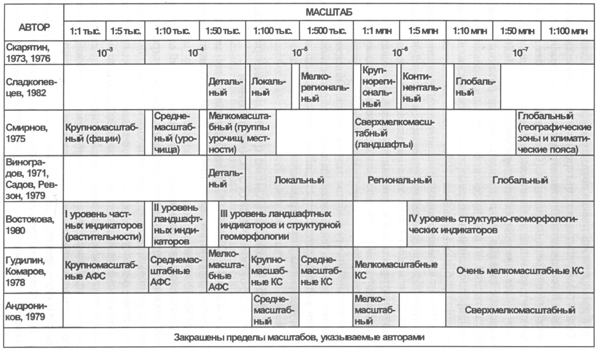

---
presentation:
  width: 1024
  height: 576
  slideNumber: true
---

<!-- slide -->
# Сложность, иерархия и масштаб

Картографические базы данных. Лекция 1

**Тимофей Самсонов**
tsamsonov@geogr.msu.ru

<!-- slide -->

# Программа курса

1. Сложность, иерархия и масштаб как свойства реального мира и концепции структурирования знаний

1. Теоретические и математические основы генерализации

1. Концептуальные модели и типология операторов генерализации

1. Алгоритмы геометрической генерализации

1. Алгоритмы семантической генерализации

1. Теория картографических баз данных

1. Организация производственных процессов в национальных картографических агентствах

1. Мультимасштабное картографирование

<!-- slide -->

# Практические работы

1. Две практические работы по OpenStreetMap (побригадно)

2. Шесть практических работ по генерализации (индивидуально)

3. Доклад по национальным картографическим агентствам (побригадно)

**Допуск к экзамену**: сданные практические работы + выполненный доклад

<!-- slide -->

# Экзамен

В каждом билете 3 вопроса:

1. Теория картографической генерализации, КБД и мультимасштабного картографирования

2. Методы и алгоритмы картографической генерализации

3. Данные *OpenStreetMap*

<!-- slide -->

# Литература
## 1991

**Buttenfield, B.P. and McMaster, R.B.** (Eds.) *Map Generalization: Making Rules for Knowledge Representation.* New York: Longman. (1st Printing, 1991; 2nd Printing 1994 Longman Scientific; 3rd printing 1999 Internet-Print-on-Demand: Wiley & Sons).

<!-- slide -->

# Литература
## 1995

***
__Muller, J-C., Lagrange, J.-P. & Weibel, R.__ (eds.). *GIS and Generalization: Methodology and Practice.* London: Taylor & Francis, 1995.

<!-- slide -->

# Литература
## 2006

<!-- { width=50% } -->

***
**Li, Z.** *Algorithmic foundation of multi-scale spatial representation*. CRC Press, 2006. 281 p.

<!-- slide -->

# Литература
## 2007

***
**Mackaness, W. A., Ruas, A. & Sarjakoski, L. T.**  (eds.)
*Generalisation of Geographic Information: Cartographic Modelling and Applications.* Amsterdam: Elsevier, 2007, 370 p.

<!-- slide -->

# Литература
## 2014

***
**Burghardt D., Duchene C. and Mackaness W.** (eds.). *Abstracting Geographic Information in a Data Rich World.* Lecture Notes in Geoinformation and Cartography series, Springer-Verlag, Berlin, Germany, 2014

<!-- slide -->

# Сложность, иерархия и масштаб как свойства реального мира и концепции структурирования знаний

<!-- slide -->

# Сложность

Согласно определению в Большом толковом словаре русского языка (Кузнецов, 2014) понятие **сложности** допускает следующие трактовки:
- Состоящий из нескольких частей, элементов;
- Обладающий многообразными и противоречивыми качествами, свойствами;
- Характеризуемый совокупностью многих переплетающихся явлений, признаков, отношений и т.п.;
- Затейливый, замысловатый по строению, форме;
- Представляющий затруднения для понимания, решения, осуществления и т.п.; трудный.

<!-- slide -->

# Сложность

**Сложность** есть *неотъемлемое свойство окружающего мира* — не только в природе, но также в обществе. Различные ритуалы неизменно добавляют сложности в нашу жизнь, но в месте с этим они составляют смысл и ощущение принадлежности к культуре. При этом вещи, которые мы хорошо понимаем, уже не кажутся нам сложными (Norman, 2010)

***
**Norman D.A.**  *Living With Complexity*. MIT Press, 2010, 312 p.

<!-- slide -->

# Donald Norman

**Дональд Артур «Дон» Норман** (англ. Donald Norman; род. 25 декабря 1935) — американский учёный в области когнитивистики, дизайна и пользовательской инженерии, преподаватель и соучредитель и консультант Nielsen Norman Group, автор книг *The Design of Everyday Things* и *Living with Complexity*.

<!-- slide -->

# Сложность

Понимание сложности меняется в зависимости от прикладной области. В ряде исследований принята точка зрения, что сложность не представляет из себя абсолютную категорию, а есть относительная характеристика, которая зависит от уровня наблюдений и абстракции. В этих исследованиях подчеркивается, что оценка сложности зависит от задачи и инструментов, доступных для ее решения (Iordache, 2011)

***
**Iordache O.**  *Modeling Multi-Level Systems*. Berlin, Heidelberg: Springer. 2011. 232 p. DOI: 10.1007/978-3-642-17946-4.

<!-- slide -->

# Сложность

Существует множество подходов к работе со сложностью: от тренировок навыков до применения специальных моделей и устройств. *Хороший дизайн способен снизить сложность, однако не путем ее уменьшения, а путем грамотного управления ею* (Norman, 2010).

**Закон сохранения сложности программных систем**:

> Cуммарная сложность системы постоянна: если действия пользователя становятся проще, скрытая за кулисами сложность возрастает.

Сформулирован Ларри Теслером, вице-президентом компаний Apple, Amazon и Yahoo в 1990-2000-х гг. Закон Теслера отражает парадокс жизни: *чтобы сделать нашу жизнь более простой мы нуждаемся во все более сложных инструментах* (Norman, 2010).

<!-- slide -->

# Larry Tesler

**Ларри Теслер** (англ. Lawrance Gordon Tesler, род. 24 апреля 1945 года) — Информатик, работающий в области взаимодействия человека и компьютера. Известен тем, что ввел в оборот комбинацию клавиш **Ctrl+c**, **Ctrl+v**, а также разработкой языка программирования **Object Pascal**. Теслер работал в *Xerox PARC, Apple Computer, Amazon и Yahoo!*

<!-- slide -->

# Простота

Простота как категория, противоположная сложности, бывает двух типов: *воспринимаемая* и *операционная* (Norman, 2010).

1. **Воспринимаемая** простота связана с внешним видом вещи, количеством и разнообразием ее управляющих элементов.
2. **Операционная** простота связана с использованием вещи.

*Мастерская* --- типичный пример системы инструментов с высокой воспринимаемой простотой, но низкой операционной:

<!-- slide -->

# Комплексные vs. синтетические карты

В картографии дихотомия между воспринимаемой и операционной простотой наглядно прослеживается при сравнении комплексных и синтетических карт:

Карта | Воспринимаемая | Операционная
----- | -------------- | ------------
Комплексная  |  Низкая | Высокая
Синтетическая  | Высокая | Низкая  

- **Комплексная** --- отражает несколько явлений, которые совмещены в общей системе координат. Визуально такая карта может быть загроможденной объектами, однако смысл каждого объекта понятен и можно визуально оценить пространственную корреляцию в их размещении.

- **Синтетическая** --- выглядят просто, поскольку для их составления несколько явлений уже были сопоставлены, и путем синтеза их сущности выделены границы, описывающие их совместное распределение. Сложны в интерпретации.

<!-- slide -->

# Сложные системы

Часто говорят о том, что картографическая модель является отражением сложных систем, которые созданы природой и человеком и существуют в географическом пространстве.

**Сложная система** — это система, состоящая из множества взаимодействующих составляющих (подсистем), вследствие чего сложная система приобретает новые свойства, которые отсутствуют на подсистемном уровне и не могут быть сведены к свойствам подсистемного уровня (Лоскутов, Михайлов, 2007). Появление таких свойств в системах называется *эмерджентностью*. Например, можно говорить о том, что эмерджентным свойством почвы является ее плодородие.

Конкретную систему можно охарактеризовать, определив такие ее параметры, как: *набор элементов, структура, набор возможных состояний и поведение* (Арманд, 1975).

***
**Арманд А.Д.**. *Информационные модели природных комплексов* (под ред. В. С. Преображенского). 1975. Москва: “Наука”. 128 с.

<!-- slide -->

# Параметры системы

- **Элементы** системы характеризуются тем, что на воздействие других частей они реагируют как нечто целое.  В зависимости от уровня, на котором производится исследование, его детальности, за элементы можно принять подсистемы различного порядка (Арманд, 1975)

- **Структура** системы --- это комплекс реально существующих связей между элементами, который объединяет их в систему.

- **Состояние** системы есть состояние всех ее элементов. В зависимости от характера изменения состояний элементов во времени и пространстве выделяют *дискретные* и *непрерывные* системы (Арманд, 1975).

- **Поведение** системы есть порядок закономерного перехода ее из одного состояния в другое, обсуловленный свойствами ее элементов и структуры. Различают зависимое поведение системы, обусловленное изменяющимися внешними условиями, и самодвижение, которое происходит при неизменном состоянии среды (Арманд, 1975).

<!-- slide -->

# Иерархичность систем

Ключевым свойством сложных систем является их *само-структурирование* на уровни состояний, каждый из которых характеризуется некоторой степенью гомогенности (Iordache, 2011).

Для описания и моделирования многоуровневой структуры в науке часто используется **иерархический подход**. Пригожин (1980, 1989) показал, что системы, далекие от равновесия способны самоорганизовываться иерархическим путем.

Сложная система организует себя путем прыжка из равновесного состояния с небольшим числом иерархических уровней к другому равновесному состоянию с большим числом иерархических уровней. Результирующие структуры, стабильные в пространстве  времени, носят название **диссипативных структур** (Nicolis and Prigogine, 1989).

Каждый уровень иерархии обладает своим собственным пространственным и временным масштабом. Процессы на более низких уровнях иерархии протекают быстрее, чем процессы более высокого уровня.

<!-- slide -->

# Иерарахия

**Иерархия** представляет собой способ организации знаний, основанный на *транзитивном, асимметричном* отношении соподчиненных категорий (Tversky, 1989).

* Бинарное отношение $R$ на множестве $X$ называется *транзитивным*, если для любых трёх элементов множества $a$, $b$, $c$ выполнение отношений $aRb$ и $bRc$ влечёт выполнение отношения $aRc$.
*  Бинарное отношение $R$ на множестве $X$ называется *асимметричным*, если для каждой пары элементов множества $a, b$ одновременное выполнение отношений $aRb$ и $bRa$ невозможно.

В современном мире иерархический подход чрезвычайно распространен в задачах исследования, моделирования и проектирования как способ *концептуализации* сложных систем.

***
**Концептуальная модель** — это подстилающая структура понимания, которую хранит человек относительно того, как что-либо функционирует. Концептуальные модели помогают нам транслировать сложную физическую реальность в работоспособные, понятные ментальные концепты (Norman, 2010).

<!-- slide -->

# Структура иерархии

Согласно принципам иерархической концепции организации знаний, на каждом уровне вводятся свои представления о системе и элементах. Элемент $k$-го уровня является системой для уровня $k-1$ (Гаврилова, Хорошевский, 2001).

В иерархическом дереве система является *суперординатной* единицей по отношению к элементу. В противоположность этому элемент является *субординатной* единицей по отношению к системе (Tversky, 1989).

***

**Гаврилова, Т.А., Хорошевский, В.Ф.**, 2000. *Базы знаний интеллектуальных систем*, Санкт-Петербург: Питер.

**Tversky, B.**, 1989. *Parts, partonomies, and taxonomies*. Developmental Psychology, 25(6), pp.983–995. DOI: 10.1037/0012-1649.25.6.983.

<!-- slide -->

# Построение иерархии

Продвижение от уровня к уровню имеет строгую направленность, определяемую стратегией проектирования --- **нисходящей (дедуктивной)** с последовательной декомпозицией объектов и процессов сверху вниз или **восходящей (индуктивной)** с постепенным обобщением понятий и увеличением степени абстрактности описаний снизу вверх.

Основанием для прекращения агрегирования и дезагрегирования является *полное использование словаря терминов*, которым пользуется эксперт, при этом число уровней является значимым фактором успешности структурирования (Гаврилова, Хорошевский, 2001)

***

**Гаврилова, Т.А., Хорошевский, В.Ф.**, 2000. *Базы знаний интеллектуальных систем*, Санкт-Петербург: Питер.

<!-- slide -->

# Типы иерархий

Не все иерархии одинаковы по своей природе. Реализацией иерархического упорядочения вещей является *древовидная структура*, а это означает, что иерархии можно классифицировать в зависимости от принципа, который пололжен в основу древовидного членения. Распространенными являются следующие:

Принцип построения  | Название иерархии  
--|--
*Общее --- частное*  |  Таксономия
*Целое --- часть*  |  Партономия
*Родитель --- потомок*  |  Генеология
*Ведущий --- подчиненный*  |  Субордономия

* **Таксономия** выводится в рамках *индуктивной* стратегии проектирования, которая основана на сравнении нескольких объектов и синтезе абстрактных свойств, обобщающих их характеристики.

* **Партономия** выводится из одного объекта *дедуктивным* путем и представляет собой аналитическую операцию.

<!-- slide -->

# Теория иерархии

При построении иерархической модели предполагается, что она отражает реальную структуру некого физического явления. Изучением иерархии как свойства физической реальности занимается **теория иерархии**.

Согласно этой теории природа разбивает себя в виде иерархической системы, как с вертикальной организацией уровней, так и с горизонтальной структурой так называемых *холонов* (Levin, 1992)

Загадочное слово "холон" впервые появилось в книге Атура Кёстлера «Ghost In The Machine» (Koestler, 1967) по теоретической психологии. Слово имеет греческое происхождение и состоит из двух корней: *holos* — целое, *on* — часть. Таким образом, под холоном понимается нечто, что *само по себе является целостным образованием, но при этом входит составной частью в нечто более крупное*. Взаимодействия внутри холонов сильнее, чем между холонами, точно также как взаимодействие между холонами одного уровня сильнее межуровневого взаимодействия.

***

**Levin, Simon. A.**, 1992. *The Problem of Pattern and Scale in Ecology*. Ecology, 73(6), pp.1943–1967.

**Koestler, Arthur**, 1967. *The Ghost in the Machine*. Penguin Group. ISBN 0-14-019192-5.

<!-- slide -->

# От иерархии к масштабу

Бесконечное разнообразие структур систем, встречающихся в природе, а также отличия их характеристик при рассмотрении на различных иерархических уровнях, приводят возникновению понятия **масштаба** как свойства, характеризующего мощность структурного уровня.

<!-- slide -->

# Масштаб

В Большом толковом словаре русского языка понятие **масштаба** определяется как:

1. *Отношение отрезка линии к изображаемой им действительной длине* (на чертеже, плане, карте и т.п.). М. сто километров в сантиметре. Сделать план местности в масштабе один к тысяче. // Специальная линейка с делениями, позволяющая выполнять чертежи, планы и т.п. в определённых условных размерах; деления на такой линейке. Линейка с масштабом. Работать с масштабом. Чертить по масштабу.

2. Разг. *Об отношении величины, роли, значения и т.п. кого-, чего-л. к величине, роли, значению и т.п. кого-, чего-л. аналогичного, подобного*. Актёры разного масштаба. Сравнить по масштабу два города. Изучить м. цен и заработной платы.

3. *Степень значения, влияния и т.п. кого-, чего-л. в чём-л*. Завод областного масштаба. Деятель местного масштаба. Музыкант крупного масштаба.

4. *Величина измерения чего-л.; мера*. Расстояние, пройденное им, может быть измерено масштабом в сотни километров. В масштабе времени - этот срок небольшой. Измерять масштабами в десятки кубометров.

<!-- slide -->

# Аспекты понятия масштаба

* Понятия "иерархический уровень" и "масштаб" часто отождествляются;

* Понятия "крупный" и "мелкий масштаб" имеют разный смысл в картографии и географических науках

* Масштаб исследований часто навязывается нам возможностями восприятия, либо технологическими или логистическими ограничениями

* Количественная характеристика масштаба может быть связана также не с параметрами объектов, а с их *числом*

* В информатике существует *проблема масштабирования*: то, что рассчитано на небольшое количество вариантов, часто оказывается неработоспособным, когда их число возрастает (Norman, 2010)

* Масштаб возникает как следствие сложности и иерархичности:

<!-- slide -->
# Проблема масштаба и иерархии в географии

<!-- slide -->
# Проблема масштаба и иерархии в географии

* В Науках о Земле принято иметь дело с *операционными масштабами процессов*, при этом считая масштабы вложенными друг в друга и привязанными к объектам определенного ранга.

* Масштабы, которыми оперируют географы, могут пересекаться. Например, административная иерархия субъектов может пересекаться с экономическим зонированием на регионы и территориально-промышленные комплексы. В таком случае речь идет уже о *гетерархии*, или сосуществовании пересекающихся и взаимодействующих иерархических структур (McMaster, Sheppard, 2004).

***
**Sheppard, E. & McMaster, R.B.** eds., 2004. *Scale and Geographic Inquiry*, Malden, MA, USA: Blackwell Publishing Ltd. Available at: http://doi.wiley.com/10.1002/9780470999141.

<!-- slide -->
# Проблема масштаба и иерархии в географии
Американский геоморфолог Джонатан Филлипс считает, что исследование проявлений масштаба в науках о Земле преследует четыре основных цели (Phillips, 1999):

1. Идентификация и измерение диапазонов и пространственных и временных масштабов, а также характерных операционных масштабов различных процессов;

1. Согласование масштабов процессов с масштабами наблюдений и измерений;

1. Проблемы размерности и подобия, связанные с установлением диапазонов масштабов, в пределах которых отношения между объектами остаются постоянными и могут быть применены прямые правила апскейлинга (перехода на более крупный масштаб) и даунскейлинга (перехода на более мелкий масштаб);

1. Операционные проблемы связывания масштабов, возникающие при изучении отношений, которые варьируются от масштаба к масштабу и требуют применения мультимасштабного анализа.

***
**Phillips J.D.**, 1999. *Earth Surface Systems: Complexity Order and Scale*, Malden, MA, USA: Blackwell Publishing Ltd. 1999.

<!-- slide -->
# Аспекты использования масштаба в географии
* Для характеризации географического явления обычно требуется несколько масштабов

* Масштабы часто дискретизируются, и выделяются микро-, мезо- и макро-уровни, специфичные для конкретной области приложений.

* В социально-экономической географии пространство часто рассматривается как сущность, индуцированная отношениями между объектами и проходящими между ними процессами.

В целом, в гуманитарной географии наблюдается тренд к смещению от понимания масштабов как априори заданных величин к социальному, экономическому и политическому построению масштаба. Масштаб явления рассматривается как социальная конструкция, при этом он становится размытым в пространстве и времени (McMaster, Sheppard, 2004)

***
**Sheppard, E. & McMaster, R.B.** eds., 2004. *Scale and Geographic Inquiry*, Malden, MA, USA: Blackwell Publishing Ltd. Available at: http://doi.wiley.com/10.1002/9780470999141.

<!-- slide -->
# Значимость и влияние масштабов

МакМастер и Шеппард выделяют четыре аспекта, которые важны в этом контексте (McMaster, Sheppard, 2004):
1. Значимость каждого масштаба не является предопределенной постоянной величиной и может меняться;
2. Влияние масштабов может быть как прямым, так и обратным: мелкие масштабные уровни могут влиять на более крупные масштабы;
3. Масштабы не обязательно являются пространственно вложенными, в социальной среде субъект может искать поддержки за пределами вмещающей единицы;
4. Требует более детальной разработки идея горизонтального разделения масштабов на непрерывные единицы определенного размера (или разрешения).

***
**Sheppard, E. & McMaster, R.B.** eds., 2004. *Scale and Geographic Inquiry*, Malden, MA, USA: Blackwell Publishing Ltd. Available at: http://doi.wiley.com/10.1002/9780470999141.

<!-- slide -->
# Проблема модифицируемой территориальной единицы

MAUP --- Modifiable Areal Unit Problem

* Одна из центральных проблем пространственной статистики. Сформулирована в 30-е годы ХХ века при изучении влияния расчетной сетки территориальных единиц на значение коэффициента корреляции  (Gehlke, Biehl, 1934)

* Детальный анализ проблемы ИТЕ проведен в работах Оупеншоу (Openshaw, Taylor, 1979; Openshaw, 1984)

***
**Gehlke, C. E.; Biehl, K.** (March 1934). *Certain effects of grouping upon the size of the correlation coefficient in census tract material*. Journal of the American Statistical Association. 29 (185A): 169–170. doi:10.2307/2277827

**Openshaw, Stan** (1984). The modifiable areal unit problem. Norwick: Geo Books. ISBN 0860941345. OCLC 12052482

<!-- slide -->
# Проявления масштаба

1. Полимасштабность

2. Переменномасштабность

3. Мультимасштабность

4. Многомасштабность

5. Разномасштабность

<!-- slide -->
# Проявления масштаба

<!-- slide -->
# Многоуровневые классификации в географических науках

* Каждая географическая наука имеет собственные представления о многоуровневой структуре изучаемых явлений.

* Эти представления выражаются в различных классификациях, которые построены на принципах иерархичности и многоуровневости.

* Эти принципы не идентичны друг другу. Любая иерархия многоуровнева, но не любая многоуровневая структура имеет иерархическое строение.

> В зависимости от наличия или отсутствия иерархических свойств в классификации при картографировании должны применяться разные методы картографической генерализации и визуализации

<!-- slide -->
# Многоуровневые классификации в географических науках

* **Почвоведение**: ствол, отдел, тип, подтип, род, вид, разновидность и разряд

* **Ландшафтоведение**: фация, урочище, местность и ландшафт

* **Геоботаника**: ряд *фитоценомер* включает 11 уровней, начиная с фитоценозов и ассоциаций и заканчивая типами и свитами типов растительности.

* **Метеорология**: масштабы процессов глобальный, синоптический, мезо, конвективных облаков и микро

* **Океанология**: временные масштабы изменчивости океанологических полей: мелкомасштабные, мезомасштабные, синоптическая изменчивость, сезонные колебания, междугодичная, внутривековая, междувековая изменчивость

* **Гидрология**: порядковые классификации рек

* **Социально-экономическая география**: АТД, промышленные районы, транспортные районы, системы расселения.

<!-- slide -->
# Систематизация масштабов в географии

Для картографии как науки, интегрирующей своим методом различные дисциплины географии, особую роль играет систематизация географических масштабов и их сопоставление с масштабами картографическими.

* *Cуществование характерных пространственно-временных соотношений, обнаруживаемых при изучении, картографировании, мониторинге природных и социально-экономических явлений, объективно установлено многими исследователями, столкнувшимися с проблемой совместимости геоизображений, вводимых в интегральные ГИС, либо с оценкой жательности, разрешающей способности и временных диапазоны данных дистанционного зондирования и картографических материалов*

* *Опыт применения геоизображений в науках о Земле свидетельствует о том, что в территориальном аспекте каждому уровню научного или практического исследования соответствfет некоторый оптимальный диапазон масштабов карт и снимков*

***
**А.М.Берлянт**. Геоиконика. 1996.

<!-- slide -->
# Поле масштабов геоизображения

***
**А.М.Берлянт**. Геоиконика. М. 1996.

<!-- slide -->
# Поле пространственно-временных масштабов

***
**А.М.Берлянт**. Теория геоизображений. М. 2006.

<!-- slide -->
# Названия масштабов

***
**Кравцова В. И.** *Генерализация аэрокосмического изображения: континуальные и дискретные снимки*. — Изд-во Моск. ун-та М, 2000. — С. 256.

<!-- slide -->
# Сложность, иерархия и масштаб

Картографические базы данных. Лекция 1

**Тимофей Самсонов**
tsamsonov@geogr.msu.ru
