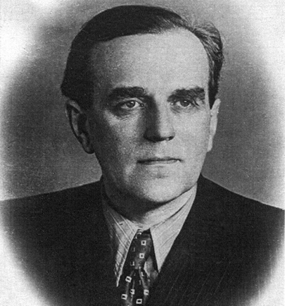
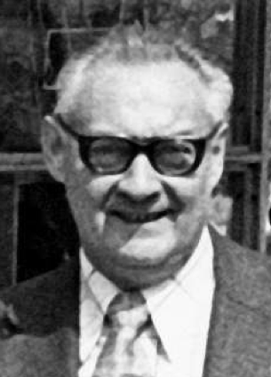
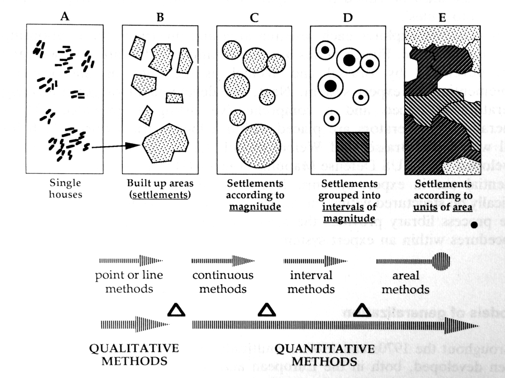
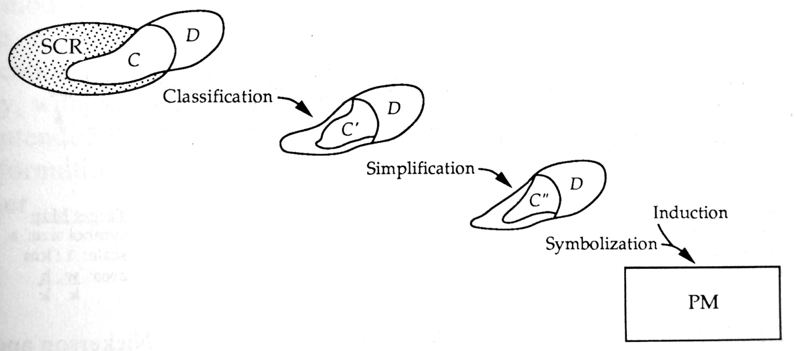
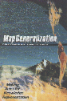

```{r setup, include=FALSE}
knitr::opts_chunk$set(echo = FALSE)
```


## Открытие генерализации

.left-column[
```{r, out.width = "200px", fig.cap="Eckert Friedrich Eduard Max. 10.4.1868 Chemnitz - 26.12.1938 Aachen"}
knitr::include_graphics("img/talk2/eckert.png")
```
]

.right-column[
.large[Первенство в выделении генерализации как особого метода в картографии принадлежит немецкому картографу Максу Эккерту (1921).]

„Die Kartenwissenschaft. Forschungen und Grundlagen zu einer Kartographie als Wissenschaft“ (1921/25)

]

---

## Модель Салищева

.left-column[
```{r, out.width = "100%", fig.cap="Константин Салищев (1903-1988)"}

```
]

.right-column[

.large[Впервые виды генерализации были тщательно изучены и систематизированы К.А.Салищевым]

- __Salistschew, K. A.__, (1967) _Einführung in die Kartographie. 2nd ed_., Geographisch-Kartographische Anstalt Gotha, Leipzig: VEB Hermann Haack.

- __Salichtchev, K. A.__, (1976) _History and Contemporary Development of Cartographic Generalization_, In: International Yearbook of Cartography. Bonn: Kirschbaum, pp. 158–172.

]

---

## Модель Салищева

1939 — «__Основы картоведения__». Параграф «О генерализации карт» (80-83). .red[Общие рассуждения о генерализации, нет классификации]

1947 — «__Составление и редактирование карт__». Глава «Картографическая генерализация» (76-150). .red[Систематизированы виды, факторы генерализации. Множество примеров генерализации конкретных явлений (реки, озера, горизонтали, населенные пункты и т.д.)].

1955 — «__Картография__» (соавт. А.В.Гедымин) Параграф «Картографическая генерализация» (15-22). .red[Систематизированы виды, факторы генерализации. Выделен баланс геометрической точности и содержательного соответствия].

1966 — «__Картография__» Глава «Картографическая генерализация» (91-107). .red[Обобщена генерализация явлений разной локализации]

---

## Картоведение (1976)

.left-column[
```{r, out.width = "100%", fig.cap="1982, 1990 — 2-е и 3-е издание"}
knitr::include_graphics("img/talk2/cartov.png")
```
]

.right-column[
__Систематическое изложение модели генерализации:__
- Сущность и факторы
- Влияние знаков
- Генерализация явлений разной локализации
- Математическое обоснование

__Виды генерализации:__ 
- Отбор
- Геометрическая генерализация
- Обобщение характеристик (качественных и количественных)
- Переход от простых понятий к сложным
]

---

## Картоведение (1976)

.left-column[
```{r, out.width = "100%", fig.cap="1982, 1990 — 2-е и 3-е издание"}
knitr::include_graphics("img/talk2/cartov.png")
```
]

.right-column[

### Черты модели Салищева

- Высокий уровень абстракции (виды генерализации)

- Концептуализация на уровне явлений, а не отдельных объектов

- Учет взаимного влияния способов изображения и генерализации

- Дополнительный процесс отбора подписей

- Геометрическая точность и содержательная верность

]

---

## Модели генерализации

.left-column[
```{r, out.width = "200px", fig.cap="Lech Ratajski (1921-1977)"}

```
]

.right-column[
.large[Польский картограф Лех Ратайский предлагал разделять качественную и количественную генерализацию]

__Ratajski, L.__, (1967) _Phenomenes des points de generalisation_, International Yearbook of Cartography, 7, 143–151.

]

---

## Модель Ратайского

.left-column[
__Ratajski, L.__, (1967) _Phenomenes des points de generalisation_, International Yearbook of Cartography, 7, 143–151.
]

.right-column[
```{r, out.width = "650px", fig.cap=""}

```
]

---

## Модели генерализации

.left-column[
```{r, out.width = "200px", fig.cap="Joel L. Morrison, Professor Emeritus, Ohio State University"}
knitr::include_graphics("img/talk2/Morrison.png")
```
]

.right-column[

.large[Американский картограф Джоэл Моррисон предложил модель генерализации, основанную на теории множеств]

__Morrison, J. L.__, (1974) _A theoretical framework for cartographic generalization with emphasis on the process of symbolization_, International Yearbook of Cartography, 14, 115–127.

]

---

## Модель Моррисона

.left-column[
__Morrison, J. L.__, (1974) _A theoretical framework for cartographic generalization with emphasis on the process of symbolization_, International Yearbook of Cartography, 14, 115–127.
]

.right-column[
```{r, out.width = "800px", fig.cap=""}

```
]

---

## Литература

### 1991

.left-column[
```{r, out.width = "150px"}

```
]

.right-column[
**Buttenfield, B.P. and McMaster, R.B.** (Eds.) *Map Generalization: Making Rules for Knowledge Representation.* New York: Longman. (1st Printing, 1991; 2nd Printing 1994 Longman Scientific; 3rd printing 1999 Internet-Print-on-Demand: Wiley & Sons).
]

---

## Литература

### 1995

.left-column[
```{r, out.width = "150px"}
knitr::include_graphics("img/talk2/t1_gen1995.png")
```
]

.right-column[
**Muller, J-C., Lagrange, J.-P. & Weibel, R.** (eds.). *GIS and Generalization: Methodology and Practice.* London: Taylor & Francis, 1995.
]

---

## Литература

### 2006

.left-column[
```{r, out.width = "150px"}
knitr::include_graphics("img/talk2/t1_gen2006.png")
```
]

.right-column[
**Li, Z.** *Algorithmic foundation of multi-scale spatial representation*. CRC Press, 2006. 281 p.
]

---

## Литература

### 2007

.left-column[
```{r, out.width = "150px"}
knitr::include_graphics("img/talk2/t1_gen2007.png")
```
]

.right-column[
**Mackaness, W. A., Ruas, A. & Sarjakoski, L. T.**  (eds.)
*Generalisation of Geographic Information: Cartographic Modelling and Applications.* Amsterdam: Elsevier, 2007, 370 p.
]

---

## Литература

### 2014

.left-column[
```{r, out.width = "150px"}
knitr::include_graphics("img/talk2/t1_gen2014.png")
```
]

.right-column[
**Burghardt D., Duchene C. and Mackaness W.** (eds.). *Abstracting Geographic Information in a Data Rich World.* Lecture Notes in Geoinformation and Cartography series, Springer-Verlag, Berlin, Germany, 2014
]

---

## Литература

### 2019

.left-column[
```{r, out.width = "150px"}
knitr::include_graphics("img/talk2/t1_gen2019.png")
```
]

.right-column[
**Yan H.** *Description Approaches and Automated Generalization Algorithms for Groups of Map Objects* Singapore: Springer-Singapore, 2019, 228 p.
]

