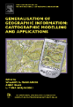
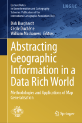

```{r setup, include=FALSE}
knitr::opts_chunk$set(echo = FALSE)
```

## Литература

### 1991

.left-column[
```{r, out.width = "150px"}

```
]

.right-column[
**Buttenfield, B.P. and McMaster, R.B.** (Eds.) *Map Generalization: Making Rules for Knowledge Representation.* New York: Longman. (1st Printing, 1991; 2nd Printing 1994 Longman Scientific; 3rd printing 1999 Internet-Print-on-Demand: Wiley & Sons).
]

---

## Литература

### 1995

.left-column[
```{r, out.width = "150px"}
knitr::include_graphics("img/talk2/t1_gen1995.png")
```
]

.right-column[
**Muller, J-C., Lagrange, J.-P. & Weibel, R.** (eds.). *GIS and Generalization: Methodology and Practice.* London: Taylor & Francis, 1995.
]

---

## Литература

### 2006

.left-column[
```{r, out.width = "150px"}
knitr::include_graphics("img/talk2/t1_gen2006.png")
```
]

.right-column[
**Li, Z.** *Algorithmic foundation of multi-scale spatial representation*. CRC Press, 2006. 281 p.
]

---

## Литература

### 2007

.left-column[
```{r, out.width = "150px"}

```
]

.right-column[
**Mackaness, W. A., Ruas, A. & Sarjakoski, L. T.**  (eds.)
*Generalisation of Geographic Information: Cartographic Modelling and Applications.* Amsterdam: Elsevier, 2007, 370 p.
]

---

## Литература

### 2014

.left-column[
```{r, out.width = "150px"}

```
]

.right-column[
**Burghardt D., Duchene C. and Mackaness W.** (eds.). *Abstracting Geographic Information in a Data Rich World.* Lecture Notes in Geoinformation and Cartography series, Springer-Verlag, Berlin, Germany, 2014
]

---

## Литература

### 2019

.left-column[
```{r, out.width = "150px"}
knitr::include_graphics("img/talk2/t1_gen2019.png")
```
]

.right-column[
**Yan H.** *Description Approaches and Automated Generalization Algorithms for Groups of Map Objects* Singapore: Springer-Singapore, 2019, 228 p.
]

