<!-- slide -->
# Генерализация множеств точечных объектов

Картографические базы данных. Лекция 3

**Тимофей Самсонов**
[tsamsonov@geogr.msu.ru](tsamsonov@geogr.msu.ru)

<!-- slide -->
# Генерализация множеств точечных объектов

**Методы генерализации**

1. Отбор
1. Кластеризация
1. Регионизация

**Аспекты**

1. Параметризация алгоритмов
1. Оценка результатов

<!-- slide -->
# Кластеризация точек

<!-- slide -->
# Алгоритмы кластеризации
1. К средних
2. ISODATA
3. Иерархическая кластеризация
3. Плотностная кластеризация (DBSCAN/OPTICS)

\+ Оценка качества кластаризации

<!-- slide -->
# Метод К средних

1. Установить количество кластеров $K$
2. Выбрать случайным образом $K$ точек в качестве центров кластеров
3. Определить для каждой точки ближайший центр кластера
4. Рассчитать новый центр кластера на основе координат его точек
5. Повторять шаги 3-4, до тех пор пока центры кластеров не перестанут менять свое местоположение.

**Steinhaus H.** (1956). *Sur la division des corps materiels en parties.* Bull. Acad. Polon. Sci., C1. III vol IV: 801—804.

**Lloyd S.** (1957). *Least square quantization in PCM’s.* Bell Telephone Laboratories Paper.

**MacQueen J.** (1967). *Some methods for classification and analysis of multivariate observations.* In Proc. 5th Berkeley Symp. on Math. Statistics and Probability, pages 281—297.

<!-- slide -->
# Метод К средних
Пример с четырьмя кластерами:

{width=600px}

[http://shabal.in/visuals/kmeans/](http://shabal.in/visuals/kmeans/)

<!-- slide -->
# Метод К средних

**Свойства метода**

Метод К средних стремится минимизировать суммарное квадратичное отклонение точек кластеров от центров этих кластеров:
  $$
  V = \sum_{i=1}^{k} \sum_{x_j \in S_I} (x_j - \mu_i)^2
  $$
где $k$ --- число кластеров, $S_i$ --- полученные кластеры, $\mu_i$ --- центры кластеров (центры масс векторов этих кластеров)

**Однако**: не гарантируется достижение глобального минимума суммарного квадратичного отклонения $V$, а только одного из локальных минимумов.

<!-- slide -->
# Метод К средних

**Свойства метода**

Все точки результирующих кластров лежат в пределах ячеек диаграммы Вороного для центров этих кластеров:

{width=400px}

[https://moderndata.plot.ly/voronoi-diagrams-in-plotly-and-r/](https://moderndata.plot.ly/voronoi-diagrams-in-plotly-and-r/)

<!-- slide -->
# Метод К средних

**Свойства метода**

Результат зависит от выбора исходных центров кластеров, их оптимальный выбор неизвестен:

{width=700px}

{width=700px}

[E.M. Mirkes, K-means and K-medoids applet. University of Leicester, 2011.](http://www.math.le.ac.uk/people/ag153/homepage/KmeansKmedoids/Kmeans_Kmedoids.html)

<!-- slide -->
# Метод К средних

**Свойства метода**

Алгоритм хорошо выделяет только разнесенные в пространстве кластеры выпуклой формы. Пример неудачной кластеризации:

{width=500px}

<!-- slide -->
# Метод К средних

**Свойства метода:**

1. Не гарантируется достижение глобального минимума суммарного квадратичного отклонения $V$, а только одного из локальных минимумов.

2. Результат зависит от выбора исходных центров кластеров, их оптимальный выбор неизвестен.

3. Алгоритм хорошо выделяет только кластеры выпуклой формы.

4. Метод может выявлять только заданное количество кластеров, но не их естественное число.

<!-- slide -->
# Метод ISODATA

**ISODATA** означает *Iterative Self-Organizing Data Analysis Technique Algorithm*

Метод начинает работу с одного кластера и выполняет рекурсивное разделение множества вдоль его наиболее протяженной оси до тех пор пока все внутрикластерные расстояния не будут в пределах заданного допуска.

**Ball, Geoffrey H., Hall, David J.** (1965) *Isodata: a method of data analysis and pattern classification* Stanford Research Institute, Menlo Park,United States. Office of Naval Research. Information Sciences Branch

<!-- slide -->
# Метод ISODATA

**Алгоритм:**

1. Установить допустимые значения стандартных отклонений $\sigma_x^{max}$ и $\sigma_y^{max}$.
3. Распределить точки по $k$ стартовым кластерам со случайными центрами. Допустимо принять $k=1$, тогда местоположение кластера не имеет значения.
3. Для каждого кластера вычислить значения выборочного среднего $\mu_x, \mu_y$ и стандартного отклонения $\sigma_x$ и $\sigma_y$ координат по осям $X$ и $Y$.
4. Найти максимальное значение $\sigma$ среди всех вычисленных на данный момент. Если это значение больше соответствующего ему допуска $\sigma_x^{max}$ или $\sigma_y^{max}$, разбить этот кластер на два подкластера, используя разделение по $\mu_x$ или $\mu_y$.
5. Распределить точки по новым кластерам с центрами в $\mu_x$ и $\mu_y$.
5. Повторять шаги 3-4, пока во всех кластерах значения $\sigma_x$ и $\sigma_y$ на станут меньше соответствующих значений $\sigma_x^{max}$ и $\sigma_y^{max}$.

<!-- slide -->
# Метод ISODATA

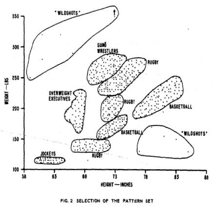{width=450px}

<!-- slide -->
# Метод ISODATA

{width=500px}

<!-- slide -->
# Метод ISODATA

{width=500px}

<!-- slide -->
# Метод ISODATA

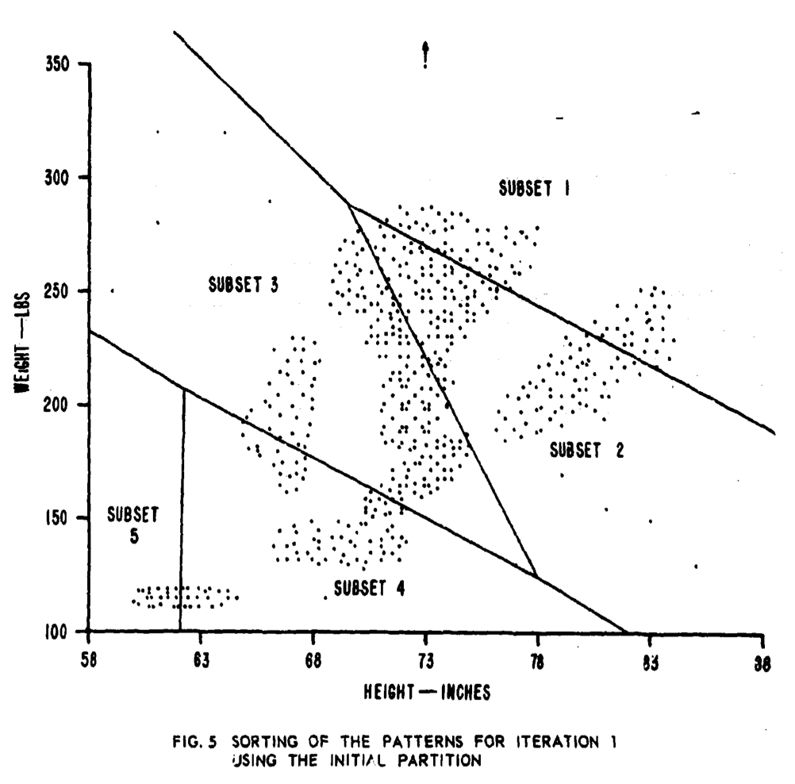{width=500px}

<!-- slide -->
# Метод ISODATA

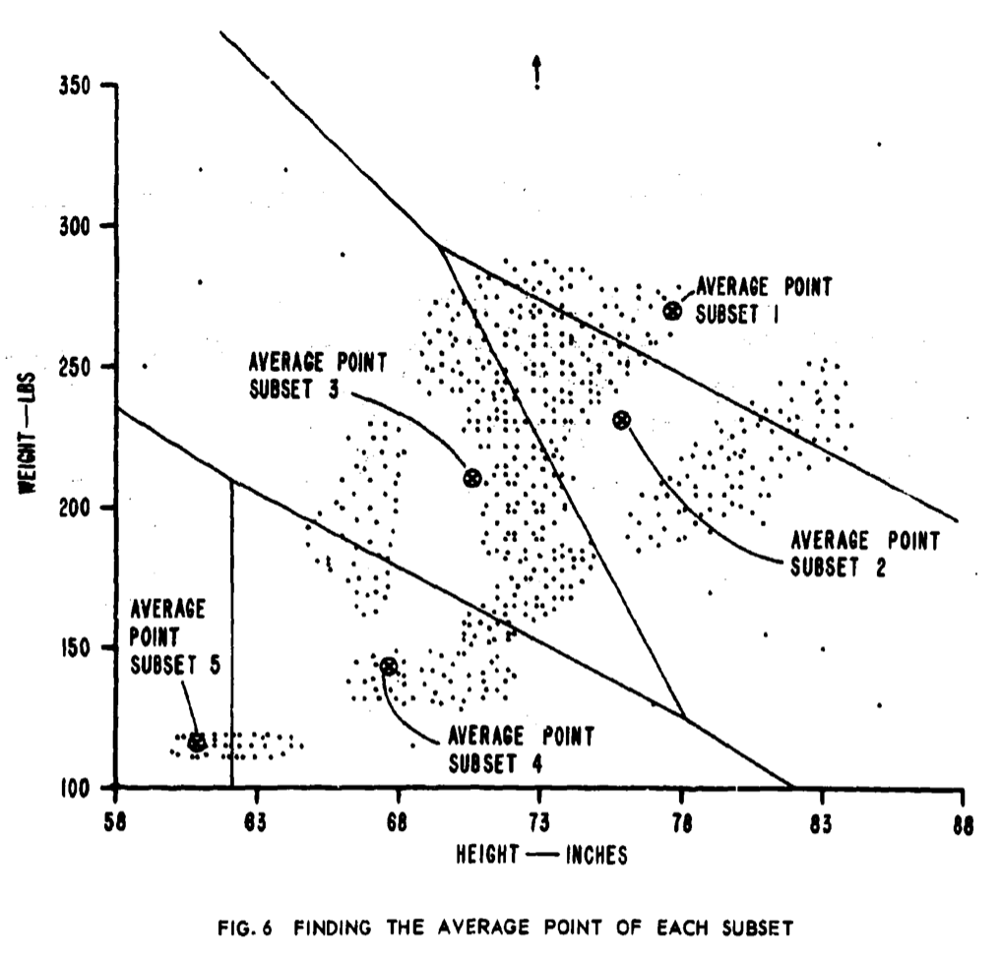{width=500px}

<!-- slide -->
# Метод ISODATA

{width=500px}

<!-- slide -->
# Метод ISODATA

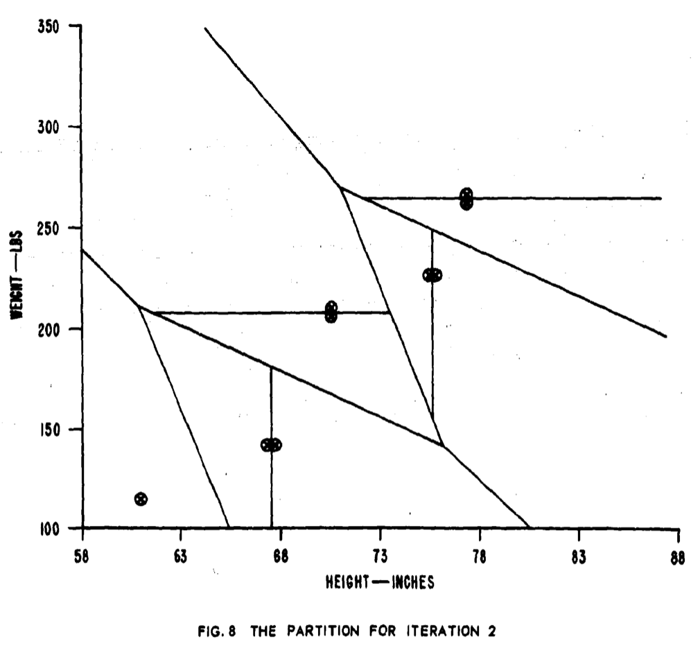{width=500px}

<!-- slide -->
# Метод ISODATA

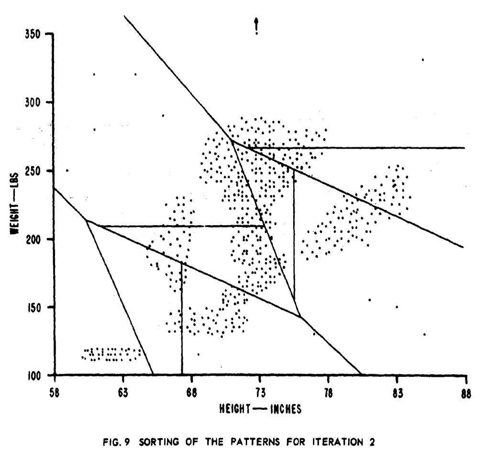{width=500px}

<!-- slide -->
# Метод ISODATA

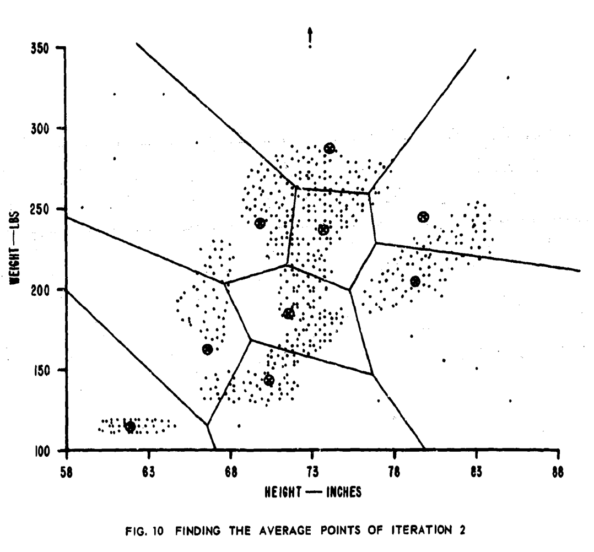{width=500px}

<!-- slide -->
# Метод ISODATA

{width=500px}

<!-- slide -->
# Метод ISODATA

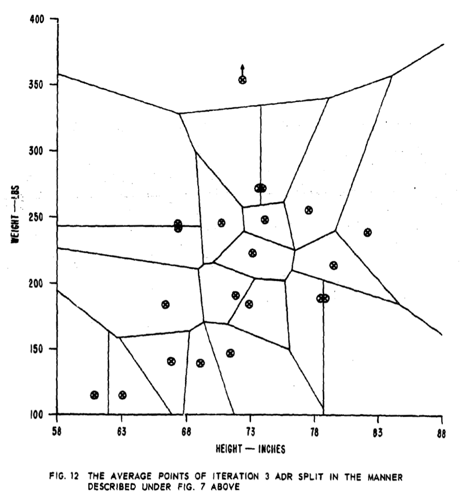{width=500px}

<!-- slide -->
# Метод ISODATA

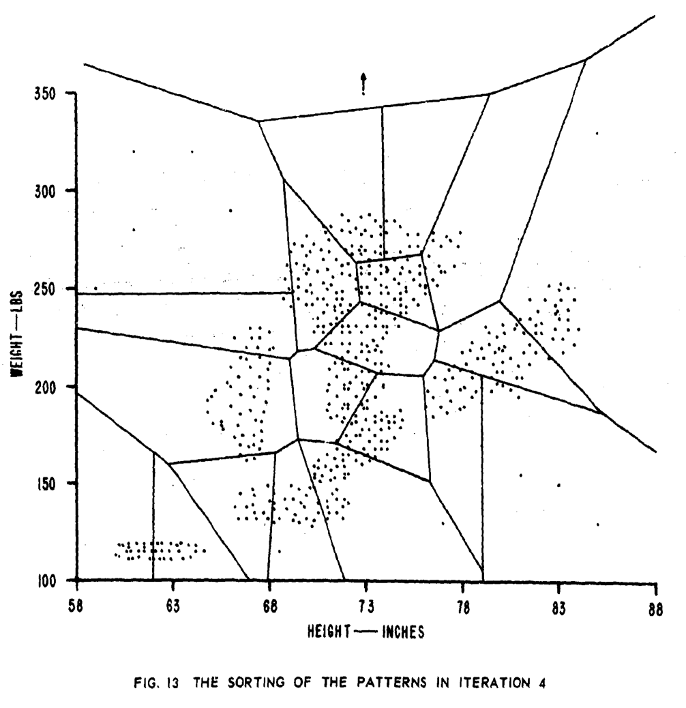{width=500px}

<!-- slide -->
# Метод ISODATA

{width=500px}

<!-- slide -->
# Метод ISODATA

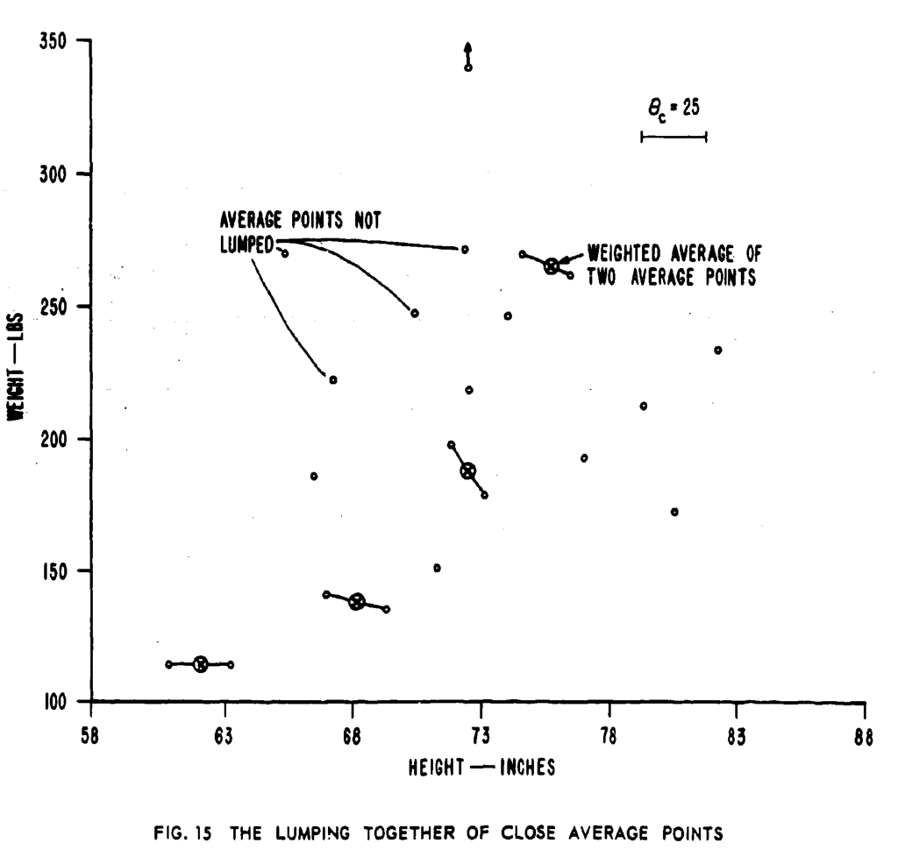{width=500px}

<!-- slide -->
# Метод ISODATA

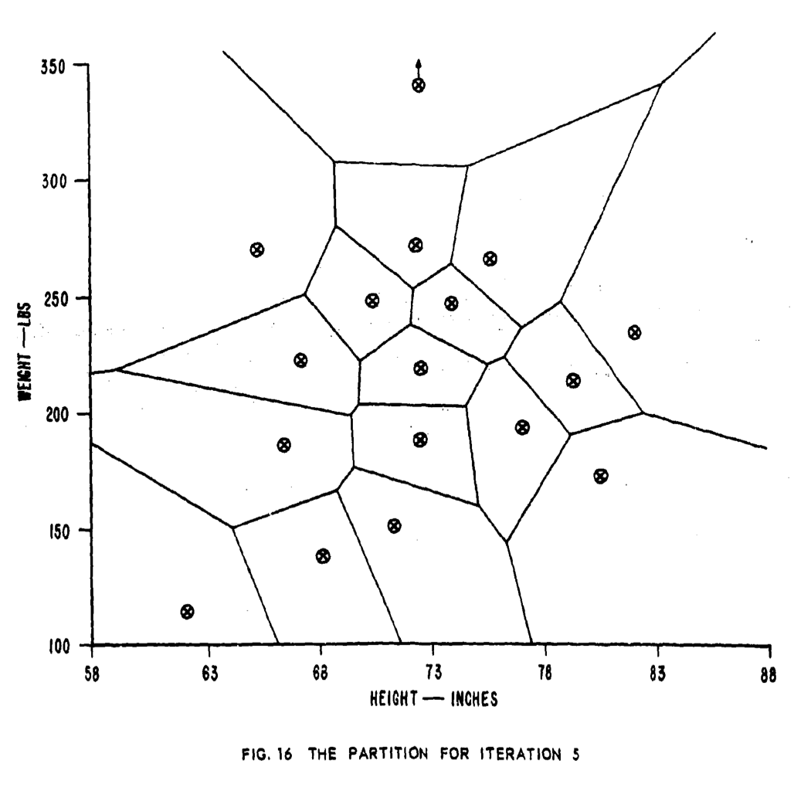{width=500px}

<!-- slide -->
# Метод ISODATA

{width=500px}

<!-- slide -->
# Метод ISODATA

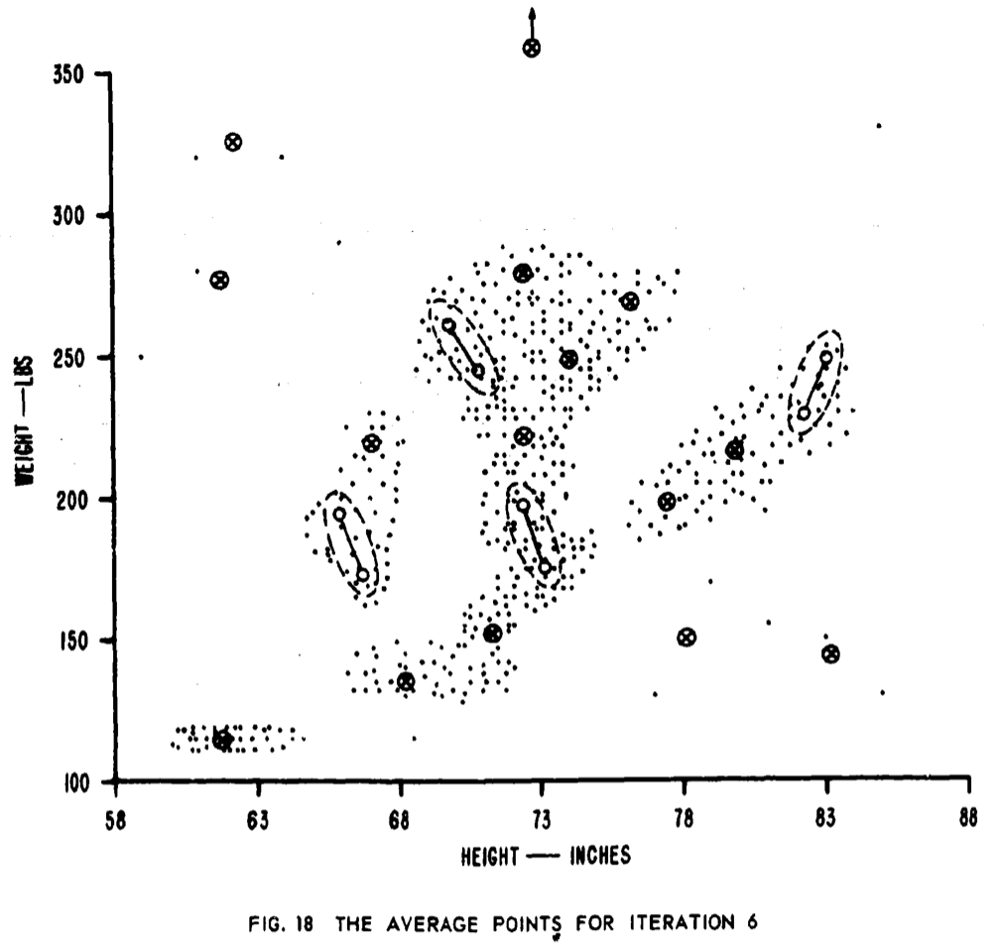{width=500px}

<!-- slide -->
# Метод ISODATA

{width=500px}

<!-- slide -->
# Метод ISODATA

**По сравнению с К средних:**

1. Не обязательно задавать количество кластеров.

2. Более робастный метод вычисления итоговых кластеров.

3. Точно так же хорошо справляется только с изометричными кластерами.

<!-- slide -->
# Вычисление центров кластеров

**Возможны различные варианты:**

{width=500px}

<!-- slide -->
# Регионизация точек

<!-- slide -->
# Регионизация точек

**Методы регионизации:**

1. Ограничивающие прямоугольники
2. Выпуклая оболочка
3. Невыпуклые оболочки ($\alpha$-shape, $\chi$-shape)
