```{r setup, include=FALSE}
knitr::opts_chunk$set(echo = FALSE)
```

## Генерализация множеств точечных объектов

.pull-left[
.red[**Методы генерализации**]

1. Отбор

1. Кластеризация

1. Регионизация

]

.pull-right[

.blue[**Аспекты**]

1. Вспомогательные геометрические структуры

1. Параметризация алгоритмов

1. Оценка результатов

]

---

## Триангуляция Делоне и диаграмма Вороного

**Триангуляция** (на плоскости) — это разбиение фигуры на треугольники.

.pull-left[
Под триангуляцией множества точек понимается *триангуляция их выпуклой оболочки*, в которой сами точки являются вершинами треугольников.

> В *триангуляции Делоне* окружность, описанная вокруг каждого треугольника, не содержит других точек этого множества

]

.pull-right[

```{r, out.width = "80%", fig.cap=""}
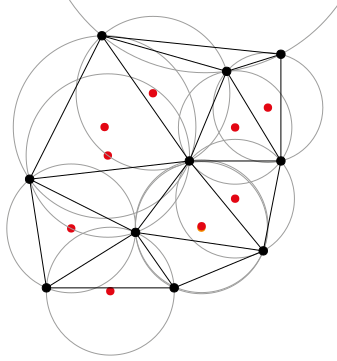
```

<!-- **Delaunay, Boris** (1934). *Sur la sphère vide*. Bulletin de l'Académie des Sciences de l'URSS, Classe des sciences mathématiques et naturelles. 6: 793–800. -->

]

---

## Триангуляция Делоне и диаграмма Вороного

**Диаграмма Вороного** конечного множества точек $S$ на плоскости представляет такое разбиение плоскости, при котором каждая область этого разбиения образует множество точек, более близких к одному из элементов множества $S$, чем к любому другому элементу множества.

.pull-left[
- строится на основе серединных перпендикуляров к сторонам треугольников

- взаимно однозначна триангуляции Делоне множества точек
]

.pull-right[
```{r, out.width = "60%", fig.cap=""}
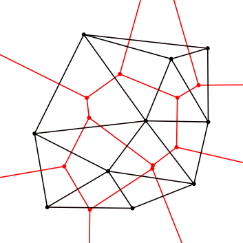
```
<!-- **Voronoi, Georgy** (1908). *Nouvelles applications des paramètres continus à la théorie des formes quadratiques*. Journal für die Reine und Angewandte Mathematik. 133 (133): 97–178. doi:10.1515/crll.1908.133.97. -->
]

---

## Диаграмма Вороного

.pull-left[

Диаграмма Вороного представляет из себя способ моделирования конкурентных зон

]

.pull-right[

```{r, out.width = "100%", fig.cap=""}
knitr::include_graphics("img/talk3/voronoi.gif")
```

]

---

## Диаграмма Вороного

Для вычисления диаграммы могут быть использованы различные метрики

.pull-left[

**Евклидово расстояние**

$d_{12} = \sqrt{(x_1-x_2)^2 + (y_1 - y_2)^2}$
  
```{r, out.width = "60%", fig.cap=""}
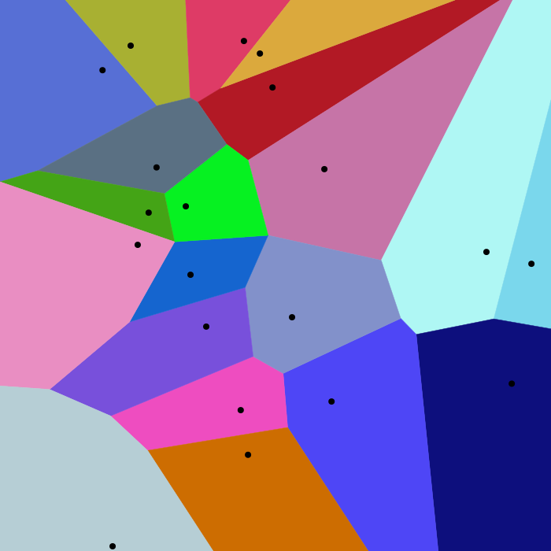
```
  
]

.pull-right[

**Манхэттенское расстояние**

$d_{12} = |x_1-x_2| + |y_1 - y_2|$
  
```{r, out.width = "60%", fig.cap=""}
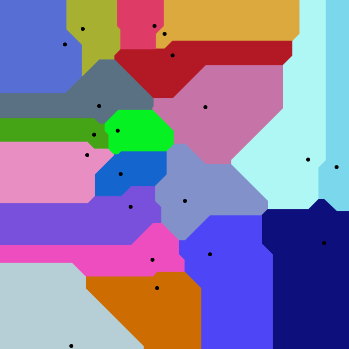
```

]

---

## Отбор точек

.pull-left[
.red[**Алгоритмы отбора:**]

1. Разделения населенных пунктов (*settlement-spacing*)

1. Растущей окружности (*circle-growth*)

1. Взвешенной эффективной площади (*effective area*)

]

.pull-right[
.blue[__Критерии важности:__]

- значение показателя в точке

- статус (ранг) точки

- расстояние до ближайшей точки

- эффективная площадь точки (ячейка Вороного)
]

---

## Алгоритм Settlement-spacing

Вокруг каждой точки строится окружность радиуса $R_i = C/W_i$, где $W_i$ — вес точки, а $С$ — константа. Точки сортируются в порядке уменьшения $W_i$.

1. Выбирается первая точка. Добавляется в результат.
1. Выбирается следующая точка. Если она содержит в окружности ранее добавленную точку, она исключается. Если нет, то добавляется в результат.
1. Шаг 2 повторяется, пока не будет достигнут требуемый процент отбора точек, либо не исчерпается множество точек.

```{r, out.width = "80%", fig.cap=""}
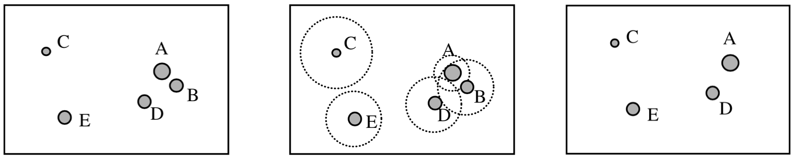
```

<!-- .small[**Langran C. E. and Poiker T. K.** *Integration of name selection and name placement* // Proceedings of II International Symposium on Spatial Data Handling, 1986, pp. 50–64.] -->

---

## Алгоритм Circle-growth

Радиус окружности $R = C \times W_i$ прямо пропорционален весу точки $W_i$.

1. Начальное значение $С$ выбирается таким образом, чтобы окружность наиболее важной точки не накрывала ни одну соседнюю точку.
1. Значение $С$ увеличивается, при этом удаляются те точки, окружности которых оказались целиком внутри окружности точки более высокого ранга.
1. Процедура продолжается до тех пор пока, не будет достигнут требуемый процент удаляемых точек.
```{r, out.width = "100%", fig.cap=""}
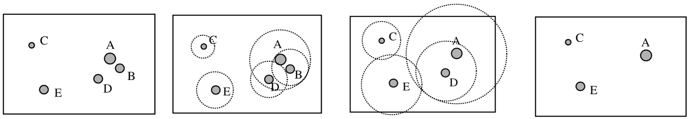
```

<!-- **van Kreveld, M., van Oosterom, R., and Snoeyink, J.** *Efficient settlement selection for interactive display*, in Proceedings of AutoCarto 12, Bethesda, MD, 1995, pp. 287–296. -->

---

## Алгоритм эффективной площади

2. Построить диаграмму Вороного точек в пределах минимальной оболочки.

3. Вычислить веса каждой точки обратно пропорционально площади ее ячейки Вороного $W_i = A_i^{-1}$. Пометить все точки как активные.

4. Удалить активную точку с наименьшим весом.

5. Перестроить локально диаграмму Вороного для соседей точки первого порядка. Деактивировать соседей (запретить их удаление).

6. Повторять шаги 4-5 для оставшихся точек, пока не будут деактивированы все точки или пока не будет достигнут требуемый процент отбора.

7. Если не достигнут требуемый процент отбора точек, активировать все точки и перейти к шагу 4. В противном случае завершить обработку

<!-- **Ai T., Liu Y.**  *A method of point cluster simplification with spatial distribution properties preserved*, Acta Geodaetica et Cartographica Sinica, 25(1), 35–41, 2002. -->

---

## Алгоритм эффективной площади

.pull-left[
**До:**
```{r, out.width = "90%", fig.cap=""}
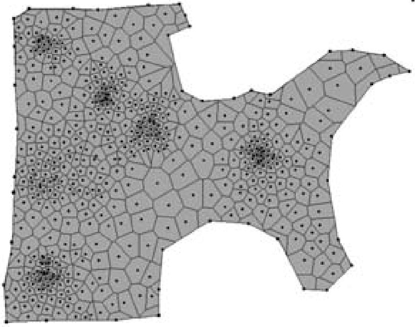
```
]

.pull-right[
**После:**
```{r, out.width = "90%", fig.cap=""}
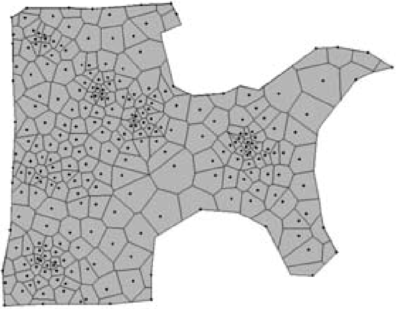
```
]

.small[**Ai T., Liu Y.**  *A method of point cluster simplification with spatial distribution properties preserved*, Acta Geodaetica et Cartographica Sinica, 25(1), 35–41, 2002.]

---

## Локальное перестроение диаграммы Вороного

```{r, out.width = "80%", fig.cap=""}
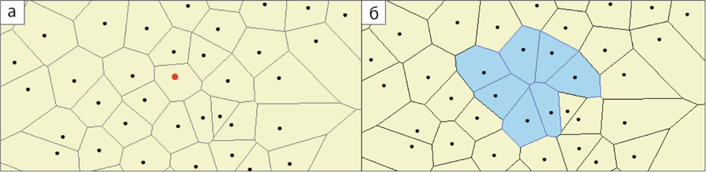
```

1. Выбрать соседей первого и второго порядка, построить для них диаграмму Вороного
2. Выбрать полигоны Вороного соседей первого порядка и заменить ими полигоны Вороного в исходной диаграмме

**Деактивация** соседей первого порядка позволяет избежать прореживания множества точек в местах их значительного скопления

---

## Алгоритм взвешенной эффективной площади

Вес точки масштабируется пропорционально ее значимости, а не только эффективной площади: $W_i = С_i \times A_i^{-1}$, где параметр $С_i$ можно представить как средневзвешенную сумму баллов за факторы:

$$С_i = \frac{\sum w_j f_{ij}}{\sum w_j}$$

где $w_j$ – вес $j$-го фактора, $f_{ij}$ — значение $j$-го фактора в $i$-й точке.

.small[**Yan, H. W and Li, Z. L.**, *A Voronoi-based algorithm for point cluster generalization* // Proceedings of 11th International Conference on Geometry and Graphics, August 2004, Guangzhou, 2004.]

<!-- .small[**Samsonov T., Krivosheina A.**  *Joint generalization of city points and road network for small-scale mapping* // Proceedings of Seventh International Conference on Geographic Information Science GIScience, September 18-21, 2012. — Columbus, Ohio, 2012. — P. 1–7.] -->
---

## Районирование по густоте

Позволяет дифференцировать допуски и критерии генерализации
```{r, out.width = "50%", fig.cap=""}
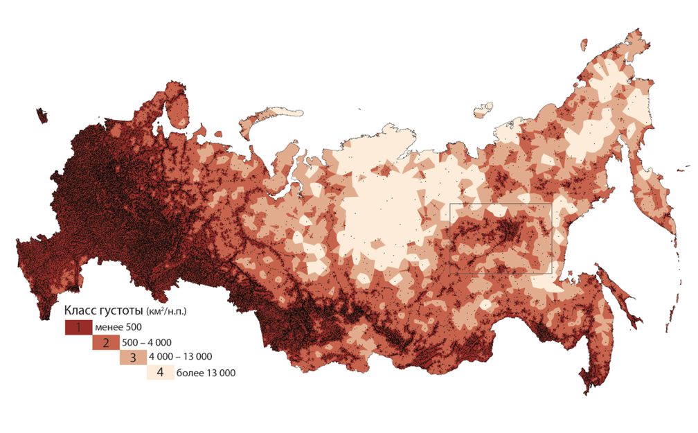
```

.small[**Samsonov T., Krivosheina A.**  *Joint generalization of city points and road network for small-scale mapping* // Proceedings of Seventh International Conference on Geographic Information Science GIScience, September 18-21, 2012. — Columbus, Ohio, 2012. — P. 1–7.]

---

## Районирование по густоте

Можно выполнить районирование территории по густоте размещения и для каждого района устанавливать свои допуски и критерии генерализации

```{r, out.width = "60%", fig.cap=""}
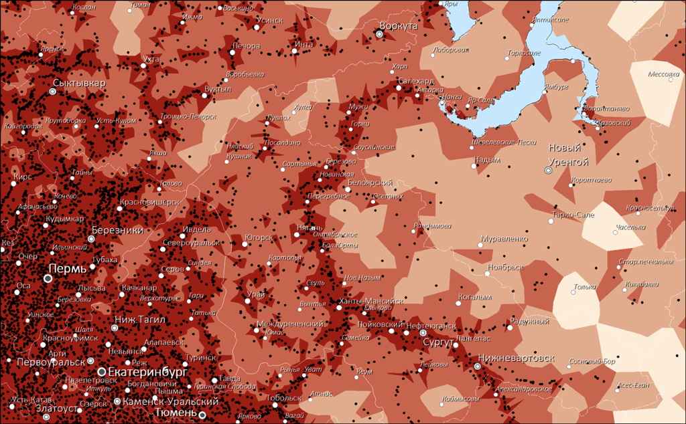
```

---

## Графическая оценка результатов

**До генерализации:**

```{r, out.width = "60%", fig.cap=""}
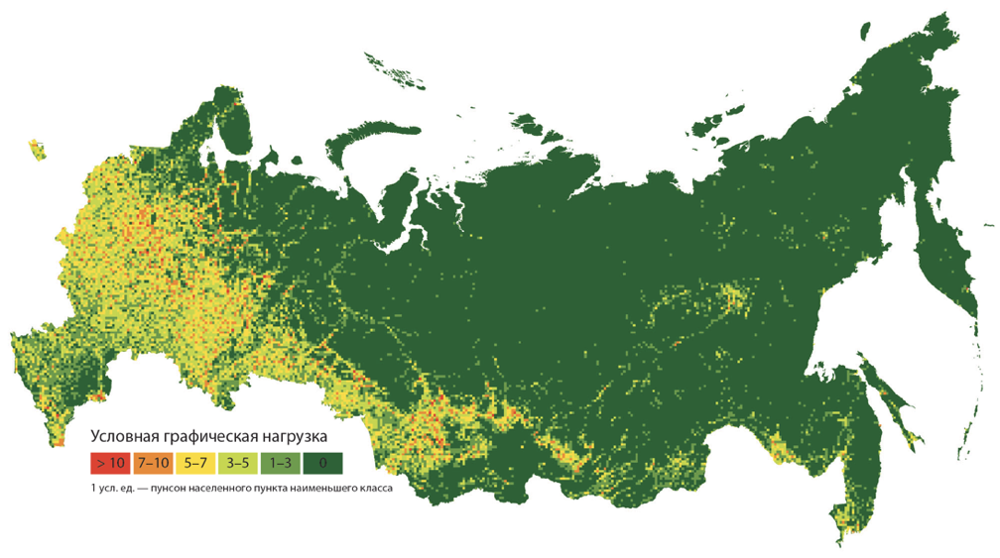
```

1 у.е. — пунсон населенного пункта наименьшего класса

---

## Графическая оценка результатов

**После генерализации:**

```{r, out.width = "60%", fig.cap=""}
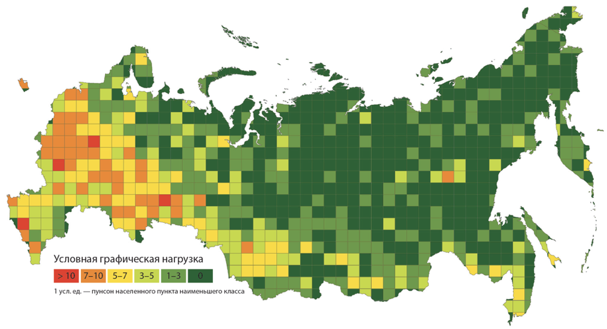
```

1 у.е. — пунсон населенного пункта наименьшего класса

---

## Численная оценка результатов

**Закон квадратного корня [Топфера]:**  *количество объектов уменьшается пропорционально квадратному корню отношения исходного и результирующего масштабов*:

$$
N_T = N_S \sqrt {\frac{S_S}{S_T}}
$$

где $N_T$ — количество объектов в целевом масштабе, $N_S$ — количество объектов в исходном масштабе, $S_T$ — целевой масштаб, $S_S$ — исходный масштаб. 

**Topfer, F. and Pillewizer, W.** (1966) *The Principles of Selection*. The Cartographic Journal, 3, 10-16. http://dx.doi.org/10.1179/caj.1966.3.1.10

---

## Обобщенный закон Топфера

Закон Топфера можно обобщить, чтобы получать оценку результатов генерализации:
$$
N_T = N_S \sqrt {\left(\frac{S_S}{S_T}\right)^x}
$$

Параметр $x$ определяет степень отбора при генерализации и принимает следующие характерные значения:

- $0$ — нет отбора
- $(0, 4)$ — *увеличение* густоты
- $4$ — *сохранение* густоты
- $>4$ — *уменьшение* густоты

---

## Численная оценка результатов

Оценка по закону Топфера показывает, что, как правило, при уменьшении масштаба наблюдается выравнивание плотности объектов по различным районам, а также общее уплотнение объектов:

.pull-left[

Класс | Значение параметра $x$
--|--
1  | 4,2
2  | 3,0
3  | 2,0
4  | 1,2
Всего  | 3,8

]

.pull-right[

```{r, out.width = "100%", fig.cap=""}

```

]