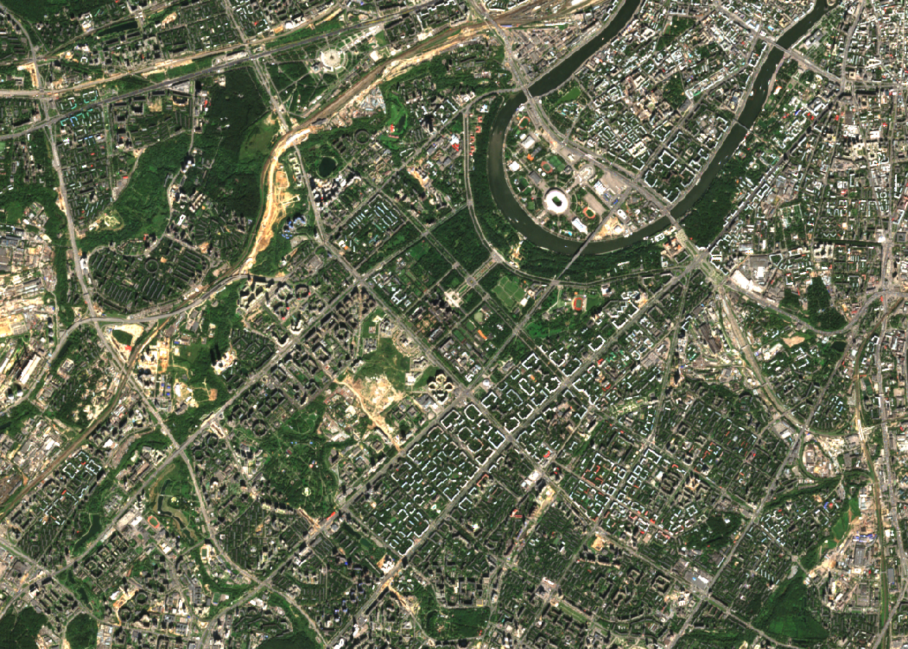
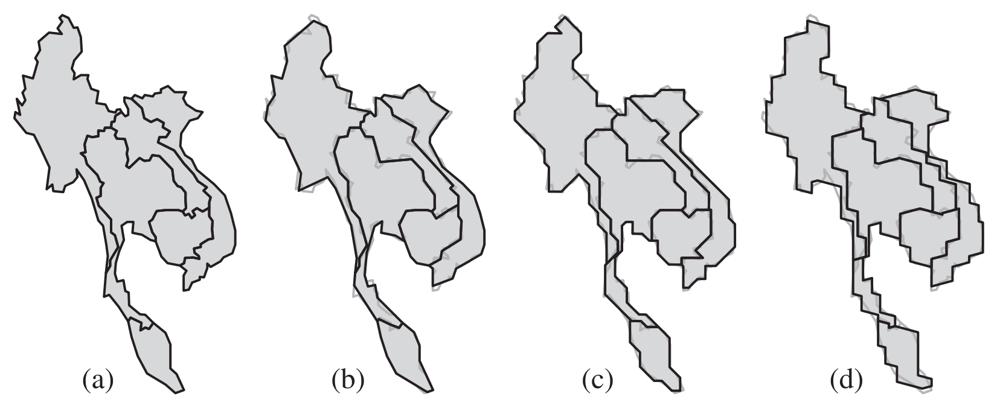
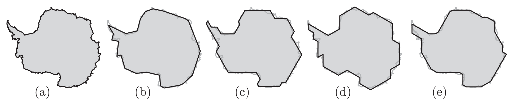
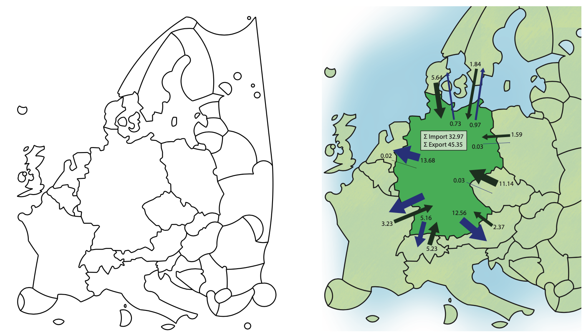

```{r setup, include=FALSE}
knitr::opts_chunk$set(echo = FALSE)
```

## Геоизображение

.large[__Геоизображение__ — это модель земных (планетных) объектов или процессов, представленная в графической образной форме.] 

Модель геоизображения должна быть:

- .red[_пространственно-временная_]: рассматривает изображаемые объекты и явления в географической среде
- .green[_масштабная_]: позволяет выполнять оценки местоположения, размеров и т.д.
- .blue[_генерализованная_]: показывает не всё, что _можно_, а всё, что _нужно_

---

## Картографические геоизображения

```{r, out.width = "95%", fig.cap=""}
knitr::include_graphics("img/talkxx/runoff_1.png")
```

---

## Картографические геоизображения

```{r, out.width = "95%", fig.cap=""}
knitr::include_graphics("img/talkxx/runoff_2.png")
```

---

## Дистанционные геоизображения

```{r, out.width = "90%", fig.cap=""}

```

---

## Трехмерные геоизображения

```{r, out.width = "120%", fig.cap=""}
knitr::include_graphics("img/talkxx/3d.png")
```

---

## Динамические геоизображения

<video width="640" height="480">
<source src="img/talkxx/carbon.mp4" type="video/mp4">
</video>

---

## Виртуальные геоизображения

<video width="640" height="480">
<source src="img/talkxx/vr.mp4" type="video/mp4">
</video>

---

## Картографические геоизображения

__.red[Карта]__ — это математически определенное, уменьшенное, генерализованное изображение поверхности Земли, другого небесного тела или космического пространства, показывающее расположенные или спроецированне на них объекты в принятой системе условных знаков.

- карты и планы местности
- схематизированные карты
- анаморфированные карты
- схемы
- картоиды

---

## Схематизация

__Схематизация__ — это геометрическое упрощение объектов карты, при котором местоположение, форма или направление объектов ограничиваются допустимыми вариантами. 

```{r, out.width = "80%", fig.cap=""}

```

.vsmall[Buchin, K., Meulemans, W., Renssen, A.V., Speckmann, B., 2016. Area-Preserving Simplification and Schematization of Polygonal Subdivisions. ACM Transactions on Spatial Algorithms and Systems 2, 1–36. https://doi.org/10.1145/2818373]

---

## Схематизация

```{r, out.width = "100%", fig.cap=""}
knitr::include_graphics("img/talkxx/staircases.png")
```

```{r, out.width = "100%", fig.cap=""}

```

.vsmall[Buchin, K., Meulemans, W., Renssen, A.V., Speckmann, B., 2016. Area-Preserving Simplification and Schematization of Polygonal Subdivisions. ACM Transactions on Spatial Algorithms and Systems 2, 1–36. https://doi.org/10.1145/2818373]

---

## Схематизация

```{r, out.width = "100%", fig.cap=""}

```

.vsmall[Buchin, K., Meulemans, W., Renssen, A.V., Speckmann, B., 2016. Area-Preserving Simplification and Schematization of Polygonal Subdivisions. ACM Transactions on Spatial Algorithms and Systems 2, 1–36. https://doi.org/10.1145/2818373]

---

## Фокус-контекст

Схематизация может использоваться для выделения самых важных объектов (фокуса) на карте
```{r, out.width = "95%", fig.cap=""}
knitr::include_graphics("img/talkxx/iberian_focus.png")
```
.vsmall[van Dijk, T., van Goethem, A., Haunert, J.-H., Meulemans, W., Speckmann, B., 2013. Accentuating focus maps via partial schematization, in: Proceedings of the 21st ACM SIGSPATIAL International Conference on Advances in Geographic Information Systems - SIGSPATIAL’13, pp. 428–431. https://doi.org/10.1145/2525314.2525452]

---

## Фокус-контекст

Степень схематизации может увеличиваится при удалении от объекта-фокуса
```{r, out.width = "90%", fig.cap=""}

```
.vsmall[van Dijk, T., van Goethem, A., Haunert, J.-H., Meulemans, W., Speckmann, B., 2013. Accentuating focus maps via partial schematization, in: Proceedings of the 21st ACM SIGSPATIAL International Conference on Advances in Geographic Information Systems - SIGSPATIAL’13, pp. 428–431. https://doi.org/10.1145/2525314.2525452]